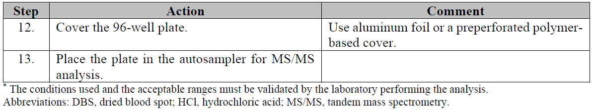

## 2장: 탠덤 질량분석법을 통한 신생아 선별 검사의 개요

>MS/MS에 의한 NBS 요약
>
>순차적 워크플로우

### 2.1 탠덤 질량분석 과정을 통한 신생아 선별검사

간단하게는, MS/MS에 의해 NBS를 수행하는데 사용되는 샘플은 아기로부터 수집된 DBS 표본으로부터 제출된 샘플의 분취량으로 이루어진다. 이러한 DBS 검체는 각각의 관심대상인 분석물에 대해 이미 양을 알고 있는 내부 표준물질을 함유하는 용매에서 추출된다. 내부 표준을 사용하는 것은 테스트 결과가 검체의 정확한 부피를 맞추는 것에 종속되지 않으며, 이온 억제 또는 향상에 대해 복원력이 있음을 의미합니다. 적절한 추출 시간 후에, 추출물은 제거되고 잔류 DBS 검체는 폐기될 수 있다.

상기 추출물은 직접적으로 분석되거나 유도체화되어 일부 화합물의 민감성을 개선시킬 수 있다. 추출물은 유동 주입(flow injection)에 의해 질량 분석기 내로 도입되고, 샘플 추출물 성분의 크로마토그래피 분리 없이 직접적으로 분석된다. 탠덤 (tandem) 질량 분광계 기기는 2개의 사중극 질량 필터를 조합함으로써 관심있는 분석물 (예를 들어, 아미노산, 아실카르니틴) 을 검출한다. 제1사중극 질량 필터는 관심대상인 분석물을 분류한다. 이어서, 이들 분석물은 단편화되고, 관심 단편은 제2사중극 질량 필터에 의해 다시 정렬된다. 이는 초당 여러 번 수행되며 전체 분석은 샘플링 후 검출까지 2분 미만이 소요된다.

샘플에서의 분석물 농도는 각각의 분석물로부터의 신호 대 내부 표준물의 공지된 양으로부터의 신호의 비를 계산함으로써 결정된다. 결과는 분석물 농도를 대사 장애에 상관시키기 위한 일련의 규칙에 의해 평가되고, 평가 결과 보고서가 준비된다. 다른 NBS 시험과 마찬가지로, 보고서는 적절한 시기에 쉽게 이해되고 제공되어야 한다. NBS 에서 MS/MS의 이러한 두 가지 측면 모두는 아래에서 기술된다.

### 2.2 작업 순서

이러한 지침은 분석 및 분석 후 단계를 통해 DBS 표본을 입수하는 것으로부터 MS/MS에 의한 NBS에 대한 실험실 워크플로우를 따른다. 각 장 및 하위 장에 포함된 주제는 그림 1에 순차적으로 표시되어 있다. 테스트를 시작하기 전에 기기 선택 및 메소드 유효성 검증과 같은 단계를 고려해야 한다.

## 3장: 시약, 내부 표준 및 샘플 준비
> 이 장은 다음을 포함한다
>
> * 시약 준비
> * 내부 표준 선택
> * 샘플 준비

### 3.1 시약 준비

MS/MS에 사용되는 가장 일반적인 시약은 다음과 같다:

* 추출 솔루션 (extraction solution)
* 이동상 (mobile phase)
* 유도체화 시약 (derivatization reagent)
* 재구성 솔루션 (reconstitution solution)

인-하우스 시약 제조는 적용가능한 표준 및 가이드라인을 따라야 하며, 실험실에 의해 입증되어야 한다. NBS에 사용되는 모든 시약 및 용매는 고성능 액체 크로마토그래피 (HPLC) - 등급 이상이어야 한다. 또한, 시약 용기에는 로트 번호, 권장 스토리지 조건 및 안정성 (만료 날짜) 을 포함하여 필요한 정보로 레이블을 지정해야 한다.

이들 시약의 준비 및 사용은 유해 물질을 취급하는 것을 포함한다. 적절한 안전 데이터 시트는 보건 및 안전 지침, 개인 보호 장비에 대한 권고, 환경 제어 및 적절한 처분을 위해 참고되어야 한다.

### 3.1.1 추출 솔루션

DBS 시료로부터의 아미노산 및 아실카르니틴 추출용 용액은 일반적으로 메탄올을 기초로 하며, 순수한 메탄올 또는 메탄올과 물의 혼합물 (예, 80/20) 으로 이루어진다. 때때로, 유기 산 (예를 들어, 아세트산 또는 포름산) 의 작은 백분율 (< 1%) 이 분석물 이온화를 보조하기 위해 첨가된다. 아세토니트릴/물 혼합물이 또한 사용될 수 있다.

추출 용액은 내부 표준을 포함한다. 내부 표준은 스톡 용액으로부터 제조되며, 이들은 검사실에서 제조되거나 상업적으로 수득될 수 있다. 이어서, 내부 표준 스톡 용액을 추출 용액의 제조에 사용한다.

스톡 표준 용액이 상업적인 공급원으로부터 수득되는 경우, 제품 삽입물에 제공된 제조 지침을 따라야 한다. 제조된 추출 용액의 부피는 희석되는 스톡의 양을 결정한다.

실험실에서 제조된 스톡 표준 용액의 경우, 개별 내부 표준을 상업적 공급원으로부터 얻을 수 있다. 스톡 표준을 제조하기 위해, 각각의 내부 표준의 충분한 양 (최소 10 mg) 을 정확하게 0.1 mg 내지 0.1 mg의 균형을 측정하여야 한다. 이어서, 개별 내부 표준을 적절한 용매에 용해시킨다. 제조된 추출 용액의 부피에 따라, 공통 스톡 표준의 적절한 부피를 측정한다. 사내 추출 솔루션 준비 절차의 예는 부록 D를 참조한다.

추출 용액에서 내부 표준 농도의 유효성을 확인하는 것은 통상적인 분석 대조군과 같은 상응하는 비표지된 분석물을 분석함으로써 달성될 수 있다. 비표지된 분석물의 관찰된 농도는 추출 용액이 허용될 수 있도록 설정된 범위 (전형적으로 10% 이다) 내에 있어야 한다.

추출 용액의 안정성 및 임의의 실험-준비된 스톡 표준이 결정되어야 한다 (CLSI 문서 EP2516 참조). 스토리지 조건 및 만기 날짜는 컨테이너에 표기되어야 한다.

### 3.1.2 이동상

가장 통상적으로 사용되는 이동상은 아세토니트릴 또는 메탄올을 베이스로 한 용액이다. 상업용 시약 키트를 사용하는 경우 제조업체는 이동상을 준비하기 위한 가이드라인을 제공해야 한다. 대부분의 경우, 이동상이 제조된 실험실이라면, 유기 용매는 물과 일정 비율 (예를 들어, 20%) 및 아세트산 또는 포름산과 같은 유기 산의 작은 백분율 (< 1%) 로 혼합된다. 실험실은 최소한의 잔효, 관심대상인 분석물의 최소 이온 억제, 및 용액 내의 오염물의 부재를 입증하기 위해 이동상을 검증해야 한다.

### 3.1.3 유도체화 시약

3N의 농도의 부틸산 염산 (HCl) 은 아미노산 및 아실카르니틴 분석을 위한 가장 일반적인 유도체화제이고, 시판되고 있다.

### 3.1.4 재구성 솔루션

유도체화 및 건식 down step 후에, 유도체화 방법에 기초한 검정은 또한 이동상을 DBS 대사물질을 재구성하기 위한 시약으로서 사용한다. 따라서, DBS 용출물이 유도체화되고 건조된 후에 관심있는 분석물을 효율적으로 재구성할 수 있는 능력에 대해 모바일 상을 검증하는 것이 바람직하다.

### 3.2 안정한 동위원소 선택: 표지된 내부 표준

이상적으로, 내부 표준은 그들의 화학적 구조 내의 2개 이상의 원자를 대응하는 안정한 동위원소 (예를 들어, 옥타노일카르니틴 [C8] 측정을 위한 내부 표준으로서 d3-C8) 로 대체함으로써 개질된 관심있는 분석물이어야 한다.

일부 예에서, 관심있는 분석물이 그의 동위원소-표지된 형태로 이용가능하지 않을 때, 적절하게 표지된 밀착 유사체가 "대리 내부 표준 (surrogate internal standard)" 으로서 사용될 수 있다. 대리 내부 표준은 잠재적인 피크 오버랩 (예를 들어, 관심있는 분석물의 강도에 대한 표준 강도의 첨가를 초래하는 오버랩) 을 피하기 위해 관심있는 분석물 위 또는 아래에 적어도 2개의 질량 단위가 있어야 한다. 표 1은 대리 표준의 몇 가지 일반적인 예를 제공한다.

내부 표준을 선택할 때, 불안정한 부위 (예를 들어, −OH 또는 −NH2) 에 배치되는 중수소-표지된 내부 표준을 사용하는 것은 피해야 한다. 이들 부위는 일단 표준이 수용액에 포함되면 쉽게 교환된다.

MS/MS 기기의 내부 표준 및 상응하는 분석물 단편이 동일한 질량 변이 (mass transitions)를 생성하는지를 아는 것이 중요하다. 이는 내부 표준에 대한 레이블의 위치 및 레이블이 단편화에서 유실되는지 여부에 따라 다르다. 각각의 내부 표준 및 그의 대응하는 분석물의 생성물 이온 스캔 (부록 E 참조) 을 사용하여 단편화 특성을 결정할 수 있다.

내부 표준의 순도는 비표지된 종이 최소로 존재하도록 하는 것이어야 한다. 표지되지 않은 종의 존재는 관심있는 대사물질의 측정으로 간섭 (즉, 잘못된 높은 결과를 제공) 할 수 있다.

### 3.3 샘플 준비

샘플은 아기로부터 수집되어 DBS 로서 제출된 표본의 분취액 (CLSI 문서 NBS0115 참조) 으로 구성된다. 이 샘플 (1또는 2개의 3.2 mm DBS 펀치) 을 96-웰 플레이트에 옮기고, 각각의 관심대상인 분석물에 대해 공지된 양의 내부 표준물을 함유하는 용매 중에서 추출한다. 대안적으로, 추출 플레이트가 더 큰 샘플을 수용할 수 있다면, 하나의 6.4 mm DBS 펀치가 사용될 수 있다. 내부 표준을 사용하면 볼륨 전송, 이온 억제 또는 이온 강화와 같은 테스트 변수의 작은 변동으로 인해 발생할 수 있는 부정확한 테스트 결과를 방지할 수 있다. 적절한 추출 시간 후에, 추출물은 제거되고 잔류 DBS 펀치는 폐기될 수 있다.

MS/MS는 종종 정량적으로 정확하고, 민감하고, 선택적인 방법으로 기술되지만, DBS의 고유한 손상은 시험 결과의 정확성 및 재현성에 상당한 영향을 미친다. 결과는 DBS의 혈액 부피의 정확성, 분석에 사용된 내부 표준, 및 샘플 제조 방법 (즉, 유도체화되거나 유도체화되지 않음) 에 의해 영향을 받는다.

### 3.3.1 96-웰 샘플 플레이트

샘플 제조에 사용되는 96-웰 플레이트 (8 × 12구성) 는 샘플 제조에 사용되는 용매에 내성이 있는 물질로 구성되어야 한다. 96-웰 플레이트는 상이한 디자인 (평평한 바닥, 원추형 바닥 [V-바닥], 또는 둥근 바닥), 웰 용량, 및 조성물 (폴리프로필렌 또는 폴리스티렌) 을 이용가능하다. 96-웰 플레이트를 선택할 때 몇 가지 인자를 고려해야 한다.

96-웰 플레이트 물질은 완전히 불활성이 아닐 수 있으며, 관심있는 일부 대사물질에 결합할 수 있다. 플라스틱에 결합하는 대사물은, 플레이트가 DBS 로부터의 추출과, 탠덤 (tandem) 질량 분광계 기기로의 추출물 간의 수 시간 동안 저장될 때 가장 우려되는 것이다. DBS 추출물이 주입되기 몇 시간 전에 저장되는 경우, 실험실은 분석물 회복시 유의한 감소 (> 10%) 없이 저장될 수 있는 시간의 길이를 확립해야 한다. 

임의의 특정 실험실에 가장 적합한 웰 설계는 실험실 내의 자동화 정도에 따라 좌우된다. 실험실에서 추출 용액 또는 전달 용출물을 첨가하기 위해 휴대용 멀티채널 피펫을 사용하는 경우, 임의의 플레이트 디자인이 사용될 수 있다. 핸드-헬드 피펫을 사용하는 분석가는 피펫 및 플레이트를 조작하여 거의 모든 추출물이 웰로부터 전달되고 피펫 팁은 DBS에 의해 막히지 않는다. 또한 분석가들은 어떤 어려움도 관찰하고 고칠 수 있다. DBS 추출 후 단계에서 플랫-바닥 웰을 사용하는 것에는 문제가 없으며, 그 이유는 추출물이 혈액 스팟으로부터 분리되기 때문이다. 실험실이 자동 피펫팅 장치를 사용하는 경우, 원뿔형 바닥 또는 둥근-바닥 웰이 더 적절할 수 있다.

평평한 바닥 웰로부터의 용출물 이동을 위해 자동 피펫팅 장비를 사용하는 것은 원래의 DBS 추출물의 15% 정도가 뒤에 남겨질 수 있는데, 그 이유는 프로브가 바닥에 놓인 혈액 점 때문에 웰의 바닥에 도달할 수 없기 때문이다. DBS 추출물의 양을 감소시키면 민감도가 감소될 수 있다. 둥근 바닥-바닥 웰은 남은 용매의 양을 최소화한다. 자동화된 피펫팅 장비 및 원뿔형 또는 둥근 바닥 플레이트 웰을 이용하여, 90% 이상의 추출물을 전달하는 것이 가능하다. 또한, 혈액 스팟이 웰의 바로 아래에 놓이지 않는 경우, 종종 평평한 바닥 웰에서 발생하는 경우, 많은 자동 피펫팅 장치는 피펫 팁이 막히지 않도록 혈액 스팟을 옆으로 밀어내거나 플레이트를 흔들도록 프로그래밍될 수 있다.

### 3.3.2 96-웰 샘플 플레이트 커버

플레이트 커버는 전부는 아니지만, 샘플 제조 동안 대부분의 단계에 사용된다. 각각의 단계에 사용되는 휘발성 시약으로 인해, 적절한 커버를 선택하는 것은 유도체화 절차를 사용하는 분석에 특히 중요하다. 일반적으로, 사용된 플레이트 커버 물질은 각각의 검정 단계에서 생성된 증기에 노출될 때 가능한 한 불활성이어야 한다. 또한, MS/MS 분석을 위해 샘플링될 플레이트의 최종 커버는 오토샘플러 니들에 의한 효율적인 피어싱을 제공해야 한다. 표 2는 각각의 검정 단계와의 통상적으로 사용되는 커버 및 그의 상용성의 요약을 제공한다.

각 실험실에서 사용되는 커버가 시험 결과를 방해하지 않도록 해야 한다. 커버를 결합하는 것을 주저하는 것은 피해야 한다. 재사용할 수 있는 일부 재료 (예를 들어, 천공된 중합체 커버) 를 사용하여, 교차-오염이 없도록 하기 위해 세정 절차를 검증할 필요가 있다.

### 3.3.3 유도체화 샘플 준비 절차

아실카르니틴 및 아미노산에 대한 샘플 제조 기술은 적용가능한 규정 및 우수 검사실 및 측정 관행에 따라 검증되어야 한다. 바람직하게는, 시료 준비 영역은 오염을 피하기 위하여 기기 영역으로부터 물리적으로 분리되어야 한다 (CLSI 문서 M298 참조).

기본적으로 유도체화된 샘플 제조 및 분석 방법은 하기와 같이 요약되어 있고, 일반적인 단계는 다음과 같다:

### 3.3.4 비유도제화 샘플 준비 절차

유도체화된 샘플 제조 절차의 단순화 (서브챕터 3.3.3참조) 는 산성화된 부탄올, 증발 및 재구성 단계를 회피하여, 아실카르니틴 및 아미노산의 상응하는 유리 산으로서의 측정을 가능하게 한다.

비유도체화된 조건 하에 아미노산 및 아실카르니틴에 대한 표본 제조 및 분석의 기본 방법은 전형적으로 다음의 일반적 단계를 포함한다:

### 3.3.5 비유도체화 및 유도체화 방법의 비교

아실카르니틴 및 아미노산은 유도체화된 (에스테르화, 주로 부틸 에스테르) 또는 유도체화되지 않은 (비에스테르화, 유리 산) 종으로서 MS/MS에 의해 분석될 수 있다. 유도체화는 수성 또는 극성 용액, 예컨대 아세토니트릴/물 또는 아세토니트릴/메탄올 혼합물에서 카르복실산 작용기로부터 생성된 잠재적인 음전하를 제거함으로써 양이온 모드에서 이온화를 향상시킨다. 추가로, 잠재적인 용매-관련 또는 다른 간섭 물질은 에스테르화에 의해 최소화될 수 있다. 그러나 그 반대도 사실이다. 에스테르화는 아실카르니틴 및 아미노산을 유리 산으로서 측정함으로써 검출되지 않는 일부 간섭을 또한 도입할 수 있다.

유도체화된 방법 및 유도체화되지 않은 방법 모두는 장단점을 갖는다. 유도체화된 워크플로는 전형적으로 더 많은 단계를 가지며, 부식성 화학물질, 증발 장치 및 흄 후드 (fume hood) 를 사용한다. 그러나, 유도체화 공정 및 후속 전달 단계 모두가 오염물 및 잠재적인 간섭을 제거하기 때문에, 유도체화는 이온화 효율을 향상시키고 분석 전에 보다 깨끗한 샘플을 생성한다. 이러한 워크플로는 또한 동일한 추출 및 분석을 이용하여 1형 타이로신혈증 (TYR I) 에 대한 마커로서 숙시닐아세톤 (SUAC, succinylacetone) 을 분석하는 능력을 제공한다.

유도체화되지 않은 워크플로우는 더 적은 단계를 가지며 부식성 화학물질, 증발 단계, 흄 후드 (fume hood) 또는 건식 (dry down) 장비의 필요성을 제거한다. 유도체화되지 않은 방법은 또한 유도체화의 산성 조건 하에서 분해가 일어날 수 있는 추가적인 장애에 대한 마커를 추가하는 것을 단순화한다. 유도체화되지 않은 방법을 사용하는 시판 키트는 또한 아미노산 및 아실카르니틴과 함께 SUAC를 분석하는 능력을 제공한다.

"플러깅" 은 유도체화되지 않은 방법을 사용할 때 발생하는 잠재적인 기계적 문제이다. 오토샘플러로부터 MS/MS로의 튜빙 (Tubing) 을 종이 섬유가 차단할 수 있는데, 그 이유는 상기 추출물이 MS/MS에 주입될 때 혈액 스팟펀치가 여전히 웰 안에 있기 때문이다. 이러한 "플러깅" 문제를 방지하기 위한 방법은 다음과 같다:

* DBS 용출물을 깨끗한 96-웰 플레이트로 옮겨 DBS 펀치와 파편을 제거한다.
* 플레이트를 오토샘플러 상에 위치시키기 전에 플레이트를 원심분리한다.
* 주입 후 섬유를 포획하고 막힘을 방지하기 위한 인라인 필터를 설치한다.

유도체화되지 않은 방법은 또한 전형적으로 선택된 반응 모니터링 (SRM) 모드 대 중성 손실(neutral loss) 또는 풀-스캔 획득(full-scan acquisition) 모드를 사용하여 아미노산 또는 아실카르니틴과 관련된 각각의 이온의 abundance를 측정한다. SRM 모드를 이용하면 특이성이 개선되고, 간섭을 감소시키고, 민감성을 증가시키고, 재현성을 개선시킨다.

그러나, 최종 샘플은 유도체화된 방법의 것만큼 깨끗하지 않다. 이를 보상하기 위해, 실험실들은 보다 민감하고, 최첨단 직렬 질량 분광계 기기를 획득할 수 있다. 샘플 추출물을 희석시키거나, 또는 프로브의 스프레이를 추가로 검출기 내로 향하게 하는 것은 탠덤 (tandem) 질량 분광계로 유입되는 외부 물질의 양을 감소시킨다. 비록 이것이 분석물로부터의 총 신호를 감소시킬 수 있지만, 기기의 개선된 감도는 이러한 손실을 보상한다. 실험실은 전반적으로 향상된 기기 성능 및 감소된 세척을 위해 얼마간의 신호를 교환할 수 있다.

또한, 어떠한 샘플 제조 방법도 각각의 아미노산 또는 아실카르니틴을 개별적으로 정량하는 능력을 제공하지 않는데, 그 이유는 특정 분석물이 동일한 질량 변이를 공유하고, 어느 하나의 접근법에 의해 구별될 수 없기 때문이다. 표 3에 나타낸 분석물에 대한 농도 결과는 그룹 내의 2개의 분석물의 누적 농도로서 보고된다. 분석물을 구별하지 못하는 것의 중요성은 다른 1차 및 2차 마커 및/또는 2차 시험을 사용하여 이들 분석물과 관련된 특정 장애를 확인하는 능력에 의존한다.

비록 NBS 연구소들이 전통적으로 유도체화된 방법을 사용하고 있지만, 많은 실험실들은 이제 비유도체화된 워크플로로 변경하고 효율성을 향상시키기 위해 개선된 장비 및 시약 성능을 이용하고 있다. 각 실험실에 가장 적합한 접근 방법을 결정하기 전에 각 방법의 장단점을 검토해야 한다.

## 4장: 질량 분석 장비의 고려사항

>이 장은 다음을 포함한다:
>
>* 기기, 소프트웨어 및 데이터 획득 모드 선택
>* 질량 분광계 보정 및 검증
>* 결과 계산 (정량)
>* 기기 작동 및 유지
>* 메소드 확인 및 유효성 검증

NBS에 사용되는 MS/MS 탠덤 질량 분광계 계기는 일반적으로 강건하고 상대적으로 작동이 용이하다. 데이터가 계산되는 방식 및 데이터가 획득되는 방법 (전체 스캔 획득 모드 또는 SRM) 뿐만 아니라 일부 화합물에 대한 민감성의 차이가 보고된 농도에 영향을 미칠 수 있다.

### 4.1 기기, 프로세스, 소프트웨어의 선택

다른 탠덤 (tandem) 질량 분광계 기기가 이용가능하다. 모든 NBS 기기에 대해서는, 사용자들은 의료 테스트를 위해 사용되는 장비에 적용되는 로컬 규칙들 및 규정들을 준수해야 한다. NBS 목적으로, 3중 4중극자 기기가 바람직한 설계이다. 이들 시스템은 사용자 친화적이고 정확하고 재현 가능한 결과를 제공하는 구성으로 full scanning (neutral loss 및 precursor ion detection) 또는 SRM (product ion detection) 을 가능하게 한다. MS/MS가 단순화되었기 때문에, 기구들 사이의 선택은 NBS에 대한 MS/MS를 성공적으로 구현하는데 있어서 중요한 문제가 되지 않는다. 탠덤 질량 분광기 장치를 선택하기 위한 몇 가지 중요한 기준은 4.1.1~4.1.3에서 설명된다.

몇몇 벤더들이 NBS에 대해 충분한 민감도를 갖는 신뢰성있는 삼중 사중극자 기기를 제조하고 판매하기 때문에, 기기 제조업체는 주요 고려사항이 되어서는 안 된다. 그러나, 데이터 감소, 분석 및 해석을 용이하게 하기 위해 제공되는 소프트웨어는 매우 중요하다. NBS용의 특수 소프트웨어는 이러한 태스크들을 단순화한다. 일반적으로, 시스템 소프트웨어는 다음을 수행해야 한다.

* 분석 기기 (즉, 자동시료주입기, 펌프 및 MS/MS) 를 제어하고, 샘플 데이터를 수집하고, 다중 분석물의 샘플 농도 (또는 의사-농도) 를 계산한다.
* 계산된 분석물 농도를 허용 규칙 세트와 비교한다.
* 범위 밖의 결과를 식별한다.
* 결과를 환자 정보가 포함된 데이터베이스와 통합한다.

일부 데이터 감소(reduction) 작업은 실험실 정보 시스템이 이러한 작업을 수행할 수 없는 경우 오프라인 소프트웨어에 의해 달성될 수 있다. 데이터 감소 소프트웨어는 반드시 아래를 만족하여야 한다:

* 사용자에게 익숙하고 쉽게 배울 수 있다.
* 개별 샘플뿐만 아니라 대량의 샘플에 대한 결과의 빠른 계산이 가능하다.
* 모든 샘플 결과에 대한 결과 파일을 포함하는 출력 및 범위를 벗어난 결과가 있는 샘플의 서브세트를 생성한다.

### 4.1.1. 전자분무이온화 (ESI)

상이한 제조자들이 상이한 전자분무이온화 (ESI) 공급원 구성 뿐만 아니라 유량(flow rate) 또는 가열된 분무기(heated nebulizer)와 같은 최적의 작동 조건을 갖는다. 이들은 전자분무가 액체 시스템 (CLSI 문서 C6225 참조) 이기 때문에 중요한 고려사항이며, 유량은 다음과 같은 영향을 미칠 수 있다:

* 피크 모양
* Ionization 효율
* 데이터 획득 시간
* 검출 효율성
* 민감도

용출 프로파일을 관찰하기 위해, 전체 이온 크로마토그램 ([TIC, total ion chromatogram], 모든 이온 강도의 합) 또는 선택된 이온 크로마토그램 (혼합물 중에 항상 존재하는 분석 성분의 특정 질량에 대해 설정됨) 을 선택하고, 크로마토그래픽 플롯을 생성하여야 한다. 그 자체로는 크로마토그래피가 존재하지 않지만, 오토샘플러를 ESI 공급원에 연결하는 튜브를 따라 시료 추출물이 이동함에 따라 피크의 일부 확장을 야기한다. 용출 프로파일의 예는 그림2에 도시되어 있다.

**그림 2**. 용출 프로파일의 예. 용출 프로파일에는 더 좁은 선두적인 피크 및 꼬리가 있는 약간 경사진 벨 모양의 모양이 있어야 한다. 꼬리는 전형적으로 2분 떨어져 있는 샘플 용출물 주입 사이의 기준선에 도달해야 한다. 피크는 상대적으로 좁고 매끄럽고 스파이크가 없고 예기치 않은 신호 손실이 없어야 한다. 2분 동안의 분석을 위해, 피크의 중심은 전형적으로 분석의 처음 30초 내에 발생하고, 1분 내 기준선의 20% 이내로 떨어진다. 다음 1분 동안 기준선은 다음 주입 전에 0으로 돌아가야 한다.

양호한 용출 프로파일을 보장하기 위해 종종 2개의 전략이 사용된다.

피크 프로파일의 확장을 최소화하기 위해 먼저, 적절하게 연결된 낮은 사강(dead volume) 피팅 및 직경이 좁은 비반응성 튜빙을 사용하여야 한다. 튜브의 접속은 서브챕터 4.5.3에 설명되어 있다. 사용되는 실리카 또는 피크 튜빙은 충분히 비활성일 것이 권장된다. 오토샘플러로부터 질량 분석기로의 배관의 길이 및 내경은 LC 펌프의 체크 밸브가 올바르게 작동하기에 충분한 액체 크로마토그래피 (LC) 펌프 역압을 발생시킬 수 있어야 한다. 배관은 질량 분석기에서 샘플 플러그의 모양을 지연시키는 정도로 그렇게 길지 않아야 한다.

두 번째 전략은 가변 유량 프로그램을 사용하는 것이다. 주입 직후의 더 빠른 유속은 샘플 플러그를 질량 분석기에 밀어넣을 수 있다. 플러그가 질량 분석기에 진입함에 따라, 더 느린 유속은 질량 분석기에서 피크의 체류 시간(residence time)을 증가시킬 수 있다. 마지막으로, 샘플 플러그의 끝에서의 더 빠른 유속은 다음 주입이 이루어지기 전에 시스템으로부터 샘플을 완전히 비우는 것을 도울 수 있다. 항상 그렇듯이, 이와 같은 권고 사항들이 기기와 이온원들 사이에서 상이할 수 있기 때문에 최적의 유동 주입 분석 (FIA, flow injection analysis) 에 대한 제조자의 권고들이 제공된다.

### 4.1.2 기기의 처리 능력

시스템의 처리 능력은 실험실의 표본 작업량에 상응해야 한다. 하나의 탠덤 (tandem) 질량 분광계 기기가 하루에 400내지 500개의 샘플 (연간 100 000개의 샘플) 을 분석할 수 있다는 것이 일반적인 규칙이다. 실험실은 필요한 경우 시험을 수행하기 위해 추가의 MS/MS 기기 또는 다른 실험실과의 합의를 포함할 수 있는 백업 프로세스를 가져야 한다.

### 4.1.3 기타 검사 고려사항

고려할 기타 기기 테스트 요인들은 다음과 같다:

* 실험실 선호도: 특정 벤더를 갖춘 실험실 직원의 소프트웨어, 지원 및 전문 지식이 잘 확립되어야 한다.
* 비용 고려사항들: 기기 선택은 벤더 계약들 및/또는 입찰 프로세스에 의해 결정될 수 있다.

### 4.2 데이터 획득 모드 선택 (full-scan acquisition mode vs. selected rection monitoring)

탠덤 (tandem) 질량 분석기는 2개의 데이터 획득 모드 (스캐닝 (full-scan acquisition mode) 또는 SRM) 로 동작될 수 있다. 이는 이온이 충돌-유도 해리 (collision-induced dissociation (CID), 충돌-활성 해리 (collasion-activated dissociation으로도 지칭됨) 를 겪는 충돌 영역에 연결된 독립적으로 제어되는 두 개의 m/z 분석기로 구성된다. 전구체 이온의 해리(단편화)는 생성물 이온 및/또는 중성 화학종을 생성한다. 이러한 모드 사이의 기본적인 차이점은 기본 장 4.2.1~4.2.3에 설명되어 있다.

### 4.2.1 전체 스캔 획득 모드 (full-scan acquisition mode)

전-스캔 획득 모드에서, 탠덤 (tandem) 질량 분석기는 주어진 질량 범위 내의 모든 질량을 검출한다. FAO및 유기 아세트산혈증 장애와 관련된 분석물에 대해, 이러한 질량 범위는 C18-OH에 대한 유리(free) 카르니틴을 포함해야 한다. 아미노산의 경우, 스캔 범위는 글리신부터 글루탐산을 포함해야 한다.

카르니틴 및 아실카르니틴은 m/z 85에서 공통 생성물 이온을 공유한다. 이것은 유리(free) 산 및 에스테르화된 유도체에 대해서는 사실이다. 제1질량 분석기는 정의된 m/z 범위를 스캔하고, 제2질량 분석기는 m/z가 85인 생성물 이온만이 검출기에 도달할 수 있도록 설정된다. 결과는 m/z가 85인 생성물 이온을 갖는 이러한 아실카르니틴 전구체 이온의 질량 스펙트럼이다.

부틸화된 (유도체화된) 아미노산은 부틸 포르메이트 (102 Da) 의 중성 손실을 겪는다. m/z 분석기 모두는 정의된 m/z 범위를 동시에 스캔하지만, 제 2 m/z 분석기에서는 제 1 m/z 분석기보다 더 작은 상수 (102 Da) 만큼 차이난다. 그 결과, CID 동안 102 Da를 잃는 아미노산이 검출된다. 아미노산이 부틸화되지 않은 경우, 중성 손실은 46 Da 이다.

단일 DBS 용출물 중의 카르니틴, 아실카르니틴 및 아미노산을 검출하기 위해, 질량 분광계는 전구체 이온과 중성 손실 모드 사이를 전환하여야 하며, 이온화된 분석물이 탠덤 (tandem) 질량 분광계를 통해 이동할 때 각 유형으로 몇몇 스캔을 수집한다. 시스템의 스캔 속도는 초당 100개의 m/z 단위보다 빠른 안 된다.  중성 손실 모드에서의 질량 해상도에 스캔 속도가 미치는 영향은 적으나, 전구체 이온 스캐닝 모드에서 질량 스펙트럼 해상도에 영향을 미친다 (부록 E 참조). 생성물 이온 모드에서의 해상도 손실은 주로 구형 기기에서 두드러진다. 2개의 질량 분광계를 스캔할 때, 표준 쿼드러플 충돌 셀을 사용하는 기구보다 충돌 셀 내의 이온의 능동 추진을 사용하는 기기에 에서 질량 분해능이 현저하게 떨어진다.

특정한 생성물 이온을 측정하는 데 소요되는 시간의 양은 적절한 감도를 보장하고, 각각의 분석물에 대한 신호로서 평균화될 수 있는, 50% 피크 강도에서 적어도 8개의 스캔 (또는 데이터 포인트) 을 생성하기에 충분할 필요가 있다. 스캔이 8개 미만이면 허용할 수 없는 메소드 정밀도가 발생할 수 있다. 충분한 데이터 포인트가 획득되도록 스캔 시간을 조정하는 것이 필요하다.

### 4.2.2 선택된 반응 모니터링 (SRM)

SRM 모드 (다중 반응 모니터링 모드로도 알려져 있음) 는 특정 분석물에 상응하는 생성물 이온의 강도를 정량화한다. 일반적으로, 각각의 질환에 대해 검출되는 분석물이 결정되고, 탠덤 질량 분석기 소프트웨어가 분석물과 관련된 생성물 이온 (질량) 만을 검출하도록 설정된다.

특정 생성물 이온 (체류 시간) 을 측정의 충분한 민감도를 보장하기 위해서 이온을 측정하는 데 소요되는 시간의 양을 충분히 보장햐여야 필요가 있다. 너무 짧은 체류 시간은 민감도 및 신호-대-잡음의 손실을 초래할 수 있다. 너무 긴 체류 시간은 샘플 내의 각각의 분석물로부터 수집되는 데이터 포인트의 수를 감소시킬 수 있다. 스캐닝 방법과 마찬가지로, 피크 최대 강도의 50% 이상인 최소 8개의 데이터 포인트가 권장된다. 모니터링되는 과량의 분석물은 각각의 분석물에 대해 충분하지 않은 데이터 점을 초래할 수 있다. 보다 짧은 체류 시간은 민감도 손실을 초래할 수 있다. 검사실은 모니터링되는 분석물의 수에 대한 허용 가능한 조건을 결정할 필요가 있다.

SRM의 장점은 다음과 같다.
* 측정되는 피분석물에 매우 특이적이다.
* 감도 및 신호대 잡음비를 개선할 수 있다.
* 관심 대상 이외의 장애와 관련된 분석대상물을 측정하는 것을 방지한다.

SRM의 주요 단점은 특정 질환의 해석에 유용한 분석물이나, 오염에 의한 간섭이 확인되지 않을 수 있다는 점이다.

### 4.2.3 전체 스캔 획득 모드와 선택된 반응 모니터링의 비교

데이터 획득을 위해 탠덤 질량 분석기를 운영하는 모드는 단일 모드로 제한되지 않으며, 이들 모드 중 어느 하나 또는 두 모드가 데이터 획득 동안 사용될 수 있다. 이러한 선택들로 인해, 분석 목표에 따라 어떤 데이터 획득 모드들이 더 적절한지에 관한 많은 논의가 있었다.

전체 스캔 획득 모드는 명시된 범위 내의 모든 질량 값의 검출을 가능하게 하는데, 이는 정수 (예를 들어, m/z당 단일 포인트) 또는 분수 (예를 들어, 연속체. 모든 0.1 m/z는 피크를 의미) 이다. 전체 스캔 획득 모드는 아실카르니틴 또는 아미노산인 것으로 알려지지 않은 질량에서 간섭 피크를 식별한다. 이러한 간섭은 고농도의 화합물, 예를 들어 EDTA, TPN, 및 부적절한 수집 또는 제조로 인하여 혈액을 오염시키는 항균제에 기인할 수 있다. 종종, DBS 분해의 결과로서 비정상적인 피크가 나타난다. 상호작용 물질은 관심 분석물의 질량과 1 m/z 차이나는 질량에서 발생할 수 있다. 이 경우, M+1동위원소의 자연 존재비는 중요한 대사물질의 이온 강도가 인공적으로 증가되었는지를 확인하기에 충분할 수 있다. 전체-스캔 분석을 사용하여 정량적 정보를 시각적으로 검사하는 것은 위양성 (false-positive) 을 초래하기보다는 문제를 드러낼 수 있다. SRM 모드에서는 간섭성 대사물질의 SRM 값을 구체적으로 측정하지 않는 한 이러한 문제를 검출할 수 없다.

SRM 분석은 데이터 획득을 위한 효율의 개선 및 및 MS/MS내의 체류 시간이 충분히 길면 가능한 경우 민감도 및/또는 정밀도의 개선을 제공한다. 혼합 모드 획득은 각각의 모드 (전체-스캔 획득 모드 및 SRM) 를 이상적으로 사용하여, 데이터 획득에 있어서의 각각의 모드의 장점을 활용한다. SRM을 단독으로 이용하는 것은 NBS 규제 요건의 일부가 아닌 화합물에 대한 데이터 획득을 원하지 않는 선별 프로그램의 운영에 가장 도움이 된다. 오늘날, SRM 분석을 사용하는 대부분의 선별 검사실은 m/z값의 수를 50이상으로 확장하였으며, 이와 같은 확장은 전체 스캔 획득 모드 분석에서 관찰되는 것이다. 시간이 지나면, 획득 모드의 차이에서 비롯되는 차이점들 사이이 관련성은 점차 낮아질 것이다. 데이터를보고할 때 주의를 기울여야 한다. 소프트웨어는 전체 스캔 획득 모드 프로파일의 프로파일과 유사하게 보이도록 SRM 프로파일을 재구성(획득되지 않은 질량이 x-축에 추가되는)할 수 있지만, 이들은 상당히 다르다. 재구성된 SRM 스캔 수집에서 특정 m/z값에 있는 데이터의 부재는 전체 스캔 데이터에서의 검출가능한 피크의 부재외는 다른 것이다. 전자에서는 데이터가 획득되지 않으며 해석에 혼란을 일으킬 수 있다.

### 4.3 질량분석기 보정 및 검증

생략

### 4.4 결과 계산 (정량)

생략

### 4.5 기기 운영 및 유지 보수

생략

### 4.6 검사법 verification 및 validation

## 5장: 신생아 선별 질환에 대한 검체 분석

### 5.1 한계치(cutoffs) 확립 및 검증

* 다음은 분석물의 한계치를 확립할 때 고려되어야 한다.
  * 방법 및 기기 매개변수
  * 선별 대상으로 예상되는 모집단의 연령 범위
  * 선별된 질환과 관련된 프로그램 정책
  * 허용되는 위양성 결과의 수

분석물 값 및 새로운 지식 (예를 들어, 바이오마커, 2nd tier 검사, 임상 정보) 에 영향을 미치는 기기 및 검사법 변경 후에 반드시 한계치를 검토해야 한다.

### 5.1.1 검사법 및 검증

한계치를 확립하는 과정의 제1단계는 MS/MS 검사의 프로토콜을 결정하고, 소챕터 4.6에 약술된 바와 같이 검증을 수행하는 것이다. 유효성 검증 데이터가 허용 가능한 경우에만 계속해야 한다.

### 5.1.2 신생아 선별 검체의 분석

한계치를 확립하는 다음 단계는 "정상으로 여겨지는" DBS 검체를 분석하는 것이다. 분석할 샘플의 수는 수집된 데이터가 런 간의(run-to-run) 대표적 변동성이라는 신뢰에 기초하여 검사실에 의해 결정된다. 종종, 이것은 수백 또는 심지어 수천 개의 샘플을 포함할 수 있다. 참고로, 일부 분석물 농도는 수집 연령에 따라 변화한다. 프로그램이 신생아 주기 (> 7일) 가 지난 후 수집된 검체를 분석하는 경우 별도의 한계치 범위 세트에 대한 유효성 검증이 필요하다.

### 5.1.3 분석물 또는 ratio의 한계치 계산

얻은 데이터 (서브챕터 5.1.2참조)에서 일부 통계적 평가를 수행해야 한다. 전형적으로, 각각의 분석물에 대해 평균 값 및 SD를 계산하고, 한계치는 계산된 평균값으로부터 일부 SD (3회 내지 6회) 에서 결정된다. 대부분의 피분석물에 대해, 데이터는 가우스 분포를 갖지 않으므로, 표준편차 보다는 백분위수를 사용하는 것이 더 적합할 수 있다.

초기 한계치 범위를 설정하는 데 사용되는 백분위수의 예는 99.0% 에서 99.99% 까지이다. 이 백분율은 마커 질병의 분포 및 정상 분포의 중첩에 의존한다. DBS내 분석물 농도의 가변성으로 인하여, 몇몇 실험실은 통계적으로 유도된 한계치보다 예비 한계치를 더 유연하게 설정하고, 그 후 분석을 반복한다. 통계적으로 설정된 컷오프보다 큰 반복 결과가 비정상으로 보고된다.

### 5.1.4 한계치의 초기 검증

계산된 한계치가 적합한지 판별하려면, 문헌에 공개된 항목 (제조업체 패키지 삽입 포함) 또는 유사한 기기 및 검사법 사용하는 다른 연구소에 사용된 것과 비교해야 합니다. 포괄적인 PT 프로그램 (PT program) 은 각각의 분석물에 사용되는 한계치 (cutoff) 에 관하여 전 세계의 연구소들을 계속 조사하고 있으며, 이는 좋은 비교 도구일 수 있다. 한계치 비교를 위한 또 다른 출처는 Laboratory Quality Improvement of Newborn Screening 데이터베이스이다. 한계치는 겁사법의 차이로 인해 실험실마다 다를 수 있다. 가능하다면, 초기 한계치가 적절한지를 확인하기 위해 다른 프로그램으로부터 참양성인 DBS 잔여 검체를 얻는 것이 도움이 될 수 있다 (서브챕터 5.3.1 참조).

### 5.1.5 위양성률

양성률을 결정하기 위해, 정상 DBS 표본의 또 다른 세트 (최소 1000개) 를 분석해야 한다. 이들 데이터와 해석 가이드라인 (Subchapter 6.1참조)을 조합하여, 생성가능한 양성 결과들의 수가 추정될 수 있다. 양성 결과의 수가 과도한 것으로 고려되거나 (한계치의 상향하는 것), 또는 양성 결과가 없는 경우 (한계치를 낮추는 것), 분석물 한계치의 일부 조정이 적절하다. 즉각적인 확인 테스트가 필요한 우선순위 한계치 외에, 반복적인 신생아 선별 검사를 추천하기 위한 (경계선 상의) 두 번째 한계치를 확립할 수도 있다.

### 5.1.6 한계치의 재평가

다음 하위 장은 한계치를 재평가해야 하는 특정 상황에 대한 것입니다.

### 5.1.6.1 위양성률의 결정

분석물 한계치가 적절한 지 결정하는 주요 인자는 생성된 위양성 결과의 수이다. 첫 몇 달간의 일상적인 시험을 면밀히 주시해야 한다. 통계적 소프트웨어를 사용하여, 분석물 한계치는 서브챕터 5.1.3에 약술된 바와 같이 재계산되어야 한다. 위양성 결과의 수가 예상보다 높은 경우에는 한계치의 조정을 고려해야 한다. 위양성률을 낮추기 위해 한계치를 갱신하는 경우, 위음성 결과의 수를 증가시키는 잠재적 효과를 고려해야 한다. 별도의 접근법을 사용하여, 예를 들어 비(ratio)를 포함하거나 연령 관련 컷오프를 사용하는 것을 이용하여 위양성 수를 감소시킬 수 있는 경우, 한계치를 변경할 필요는 없을 수 있다.

### 5.1.6.2 기기, 방법론, 내부대조의 변경

분석물을 측정하기 위해 사용되는 기기, 방법 또는 내부 표준에서의 임의의 변화가 있는 경우 한계치의 재평가를 반드시 실시해야 한다. 소챕터 5.1.1에서 5.1.3까지 자세히 설명된 프로세스를 수행해야 한다.

### 5.1.6.3 새로운 임상 정보

MS/MS를 사용하는 NBS의 증가는 아이가 한동안 앓았을 때에만 나타나는 임상적 증상에 의해 확인가능하였던 많은 질환을 검출할 수 있게 하였다. 충분한 사례가 확인되고 임상적 결과가 결정될 때까지, 증상 발현 이전 (presymptomatic) 상태에서의 분석물 농도는 잘 정의되지 않을 수 있다. 한계치 조정은 특정 질환을 확인하거나 또는 양성 검출을 최소화하기 위해 필요할 수 있다. 비검출된 장애 (위음성 결과) 의 확인 후에, 적절한 경우 분석물 한계치의 재평가를 포함하는 (적절한 시간 및 허용 가능한 방식으로 수집된 표본) 검사 프로세스의 검토가 뒤따라야 한다.

### 5.2 정도 관리 및 질 보증

QA는 분석 결과에 충분한 신뢰를 확보하기 위해 전체 NBS 공정에서 각 단계에 필요한 성능의 품질을 유지하기 위한 기준을 설정하는 능동적인 시스템이다. NBS 검사실에서 MS/MS의 사용과 관련된 특정 QA 모니터는 다음을 포함하지만, 이에 제한되지는 않는다:
* 샘플 품질
* 기기 성능 모니터링 (예: 펌프 압력, 온도, 진공, 가스 압력)
* 내부 QC 기준
* 결과 허용 규칙
* 턴어라운드 시간
* 비정상 결과의 추적관찰

각 실험실에서는 테스트 시스템의 전반적인 정확성과 신뢰성에 중요한 활동을 결정하고 이러한 매개변수를 정기적으로 모니터해야 한다 (예: 매일, 매주, 매월). QA 시스템의 활성화는 검사실이 그 성능의 유효성 및 신뢰성을 정성 및 정량적으로 평가할 수 있게 한다.

### 5.2.1 정도 관리 물질

MS/MS 분석법에 사용되는 QC 물질은 상업적 공급원으로부터 수득하거나 또는 검사실에서 제조할 수 있다. 어느 경우든, 대조군 물질은 환자 DBS 샘플과 동일한 매트릭스를 가져야 한다. 상업적으로 공급되는 경우, 공급업체는 정도관리 물질 내의 각각의 분석물에 대해 예상된 농도 및 허용 가능한 범위를 제공해야 한다. 평균 값 및 SD를 계산하기 위해 적절한 수 (20개의 관찰 결과) 가 수득될 때까지 이들 값이 사용될 수 있지만, 피분석물 농도가 판매자 규격 내에 있는지를 확인하기 위해  통상적인 사용 전에 허용 가능한 실행(run)에서 알 수 없는 것으로서 대조군을 분석하는 것이 좋은 방법이다. 대조군이 검사실 내에서 제조되는 경우, 각각의 이용가능한 분석물이 MS/MS에 의해 측정될 수 있도록 기초 혈청 (혈장) 풀(pool)을 제조할 수 있다. 상이한 QC 수준에 대한 적절한 농도는 기본 풀(pool)을 추가의 혈청으로 희석하고, 동일 부피의 적혈구를 첨가하고, 여과지 상에서 점적함으로써 제조될 수 있다. 검사실에서 제조된 QC 재료의 예는 부록 F에 제공되어 있다.

### 5.2.2 96-웰 플레이트 당 필요한 정도 관리 물질의 최소 수량

96-웰 플레이트당 최소 QC 샘플 수는 2개이다. 대조 물질은 관련 결정 시점에서 분석 성능을 검증해야 한다. 하나의 대조군은 한계치를 넘는 분석물 농도를 함유해야 하고, 두 번째 대조군은 한계치 근처에 있어야 한다. 이상적으로, QC 샘플은 96-웰 플레이트의 시작과 끝에 배치되어야 한다. 또한, 각각의 웰은 내부 표준을 포함해야 하며, 따라서 96-웰 플레이트의 시작과 끝 사이의 기기 성능의 임의의 변화가 내부 표준 강도에 의해 확인될 수 있다.

### 5.2.3 정도 관리 물질의 안정성 요구사항

상업적 QC 재료의 경우, 공급자는 안정성 (만기일) 및 저장 조건을 제공한다. 검사실에서 제조되는 대조 물질의 경우, 실험실은 안정성 및 적절한 저장 조건을 확립해야 한다. 그러한 제어 물질은 -20 °C 이하에서 보관되어야 하고 습도는 건조제를 사용하여 30% 미만으로 유지되어야 한다. 실험실은 대조 물질의 안정성을 결정하고, 저장 시간 동안 대조 분석물의 분해가 없도록 하기 위해 대조 물질 성능을 모니터링하기 위한 수단 (예를 들어, 월간 레비-제닝스 (Levey-Jennings plot)) 을 확립하여야 한다.

### 5.2.9 정상 모집단 통계

각 분석물에 대한 매일, 매월 및 누적 모집단 평균 값은 검사법의 성능을 모니터링하기 위한 또 다른 방법으로 추적되어야 한다. 각각의 분석물에 대한 모집단 평균은 각 실행 (예를 들어, 각 96-웰 플레이트) 상에서 계산되어야 하고, 누적 평균 값 및 SD와 비교해야 한다. 분석 집단의 범위 밖에 있다는 것은, 결함이 있는 시약과 같이 분석 상의 문제, 필터 페이퍼 로트 변경, NBS 샘플과 대조군 사이의 펀칭 차이, 또는 검체 수송 동안 검체의 분해를 의미한다. 사전에 정의된 절차에 따라 정정 조치를 취해야 한다.

### 5.3 외부 정도 관리

PT는 이미 알려진 분석물 농도를 가려놓은 샘플을 사용하여 실험실 결과의 정확성 및 타당성을 주기적으로 평가하기 위한 시스템이다. 많은 국가에서, 의료 연구소의 PT 프로그램은 "외부 질 평가" (EQA) 프로그램으로 불린다. 이 가이드라인의 권장사항은 PT및 EQA와 동일하게 관련된다. 그러나, 이러한 지침의 단순화를 위해, 오직 "숙련도 시험" (PT) 이 사용된다. PT는 국제 표준화 기구 (International Organization for Standardization) 에 따른 일반적으로 허용되는 용어이다.

외부 PT 프로그램에 참여하고 이 성능의 기록을 유지하는 것은 실험실이 그들의 품질 성능을 보여줄 수 있는 최상의 수단이다 (CLSI 문서 QMS2448 참조). PT는 측정 프로세스의 품질을 주기적으로 평가한다 (예를 들어, 분기별, 반년마다). 실험실은 외부 과학계가 관리하는 PT 프로그램에 참여해야 한다. PT 샘플은 NBS 검체와 동일한 방식으로 취급되고 분석되어야 하며, 또는 가능한 한 동일하게 분석되어야 한다.

### 5.3.1 외부 정도 관리 프로그램

포괄적 PT 공급원이 NBS MS/MS 피분석물에 대해 이용가능하다. 이 글로벌 PT 프로그램은 일 년에 세 가지 과제를 제공하는데, 이는 테스트 과정뿐만 아니라 테스트 결과에 대한 해석도 포함한다. 분석물은 MS/MS에 의해 확인된 모든 Recommended Uniform Screening Panel (RUSP) 질환을 커버한다. 이 프로그램은 또한 모든 참여자가 사용하는 기기 및 검사법과 관련하여 분기별 및 매년 및 매년 분기별 보고서와 함께 요약 데이터 보고서를 제공한다. 다른 PT 제공자도 사용할 수 있다.

### 5.3.2 추가적인 숙련도 검사 프로그램 참가

외부 PT 프로그램에 추가하여, 실험실은 비정상적인 분석물을 갖는 시편을 검출하는 실험실의 능력을 시험할 수 있는 다른 PT 활동을 확립하는 것을 고려할 수 있다. 이 활동은 외부 PT 프로그램이 사용 가능한 경우 참여를 대체하지 않아야 한다.

### 5.3.2.1 검사실 개발 맹검 정도 관리

검사실은 일상적 작업량 안쪽에서 피분석물 농도 외에 분석물 농도를 갖는 DBS 검체를 검사함으로써 블라인드 QC 프로그램을 확립할 수 있다. 블라인드 QC 결과가 후속 시스템 또는 임상에 보고되지 않도록 하기 위해 보고 알고리즘에 주의가 필요하다.

### 5.3.2.2 숙련도 검사 프로그램 성능 평가의 대안적 방법

검사실 간의 검체 교환은 PT에 대한 대안적인 노력이다. 상기 방법은 다른 NBS 검사실과 참여하여 정상 및 비정상 결과 모두를 갖는 검체 세트를 분석하는 것을 포함한다. 검체 세트 교환 (각 실험실에서 검체 세트를 제공함) 은 적어도 2회 이상이어야 한다. 최종 목표는 실험실이 정상적이고 비정상적인 결과가 있는 표본을 적절히 식별할 수 있음을 증명하는 것이다. 이 과정에서 얻는 추가적인 정보는 측정된 분석물들 사이의 바이어스의 결정을 포함할 수 있다. 실험실은 만족할 만한 성과를 내기 위한 기준을 세워야 한다.

### 5.4 결과 허용 기준

검사실은 각각의 MS/MS 실행의 샘플 결과를 수용하기 위한 기준을 확립해야 한다. 수용 기준은 단일 샘플 분석 배치 내에서 동일한 방식으로 준비되고 분석되는 QC 샘플 및 통상의 NBS 샘플 결과의 평가를 모두 포함해야 한다.

### 5.4.1 정도 관리 결과

실행 내에서의 대조 결과는 MS/MS 실행이 허용되는지 여부를 결정하기 위한 가장 중요한 데이터이다. 이들은 문제의 데이터 세트 내에 포함된 개별 샘플 분석에 특이적이며, 환자 샘플과 유사한 방식으로 거동해야 한다. 또한, 내부 실행 대조 결과를 샘플 결과 품질의 예측변수로 사용할 수 있다. 실행 내에서의 대조 물질은 NBS 검체와 동일한 방식으로 추출되고 분석되기 때문에, 실행 내에서 대조에 대해 관찰된 높은 또는 낮은 경향은 이러한 동일한 분석으로부터의 샘플 결과와 유사할 것으로 예상될 수 있다. 실행 내 대조 데이터에 기초하여 MS/MS 실행을 허용하는 것과 관련하여 확고한 규칙은 없지만, 다음의 척도는 일부 지침을 제공한다. 설정된 기준에도 불구하고, 대조 허용 기준이 충족되지 않을 수 있는 상황이 있을 수 있지만, 실행 (또는 부분 실행) 이 허용될 수 있다. 이러한 경우, 실험실 감독자는 사유를 기록하고 실행을 승인해야 한다.

### 5.4.1.1 실행 허용 기준

가장 보수적인 실행 허용 기준은 모든 대조 피분석물이 지정된 범위 (예를 들어, +/-3SD) 내에 있는 경우에만 실행을 허용하는 것이다. 일반적으로, 실험실에서는 이를 너무 제한적으로 간주하며 보다 실용적인 추가 규칙을 설정한다.

대조 분석물 농도가 허용되는 제한 범위 밖에 있는 경우 (서브챕터 5.2.5참조), 분석 실행을 허용하거나 수용하지 않도록 결정되어야 한다. 웨스트가드 (Westgard) 규칙은 MS/MS 실행 당 생성되는 대조 결과의 수에 따라 적절하지 않을 수 있다. 기기 또는 검사법 문제와 관련될 수 있는 대조 결과의 이동(shift) 및 추이을 조사해야 한다.

### 5.4.1.2 개별 분석물 대조에 대한 허용 기준

실행 허용 기준에 대한 대안은, 대조군 내에 최소 20개의 분석물이 존재하면서, 하나 이상의 분석물이 개별적인 분석물 대조군 중 하나에 대해서만 범위를 벗어나는 경우, 실행이 허용되는 기준을 확립하는 것이다. 허용되는 범위 밖의 분석물의 정확한 수는 실험실에 의존적이지만, 최소한으로 유지되어야 한다 (대조군 당 2내지 5개, 적어도 20개의 분석물이 측정된다고 가정).

### 5.4.1.3 다수의 대조를 포함하는 허용 기준

단일 대조 분석물이 96-웰 플레이트의 모든 대조군에 대해 범위를 벗어난 경우, MS/MS 실행은 "실패" 로 간주되어야 하고 반복되어야 한다. 96-웰 플레이트당 2개 이상의 대조군이 분석되는 경우, 범위 밖의 분석물 관찰이 있는 경우에도 실행이 허용되도록 수용 정책이 확립될 수 있다. 대조군 분석물 당 오직 하나의 범위 밖의 관찰을 허용하는 것이 권장된다. 예를 들어, 실행이 96-웰 플레이트 상의 3개의 제어를 포함하고 3개의 페닐알라닌 (Phe) 관찰 중 하나가 범위를 벗어난다면, 런은 허용될 수 있다.

### 5.4.1.4 허용 기준에 대한 기타 고려사항

고려사항 중 한 가지는 1차 및 2차 분석물을 구별하는 것이다. 허용 기준은 1차 분석물에 대해 보다 엄격하며 (예를 들어, 범위 밖의 제어 결과가 없음), 이차 분석물에 대한 덜 엄격할 (예를 들어, 일부 제어 결과가 범위 밖에 있을 수 있음)  수 있다.

일부 프로그램은 보고 결과를 신속하게 처리하기 위해 범위를 벗어난 대조 결과를 허용할 수 있다. 예를 들어, 대조 분석물 판독치가 높고 한계치를 넘는 환자 결과가 없는 경우, 실행을 허용하기 위한 정당화가 있을 수 있다. 이는 분석 대조군이 하단부에서 범위를 벗어난 경우에는 그렇지 않다. 이상 결과가 한계치 (예를 들어, 유리 카르니틴) 아래에 있는 것으로 간주되면, 그 정당화는 역전된다. 잘못된 결과를 보고하는 결과를 초래할 수 있기 때문에, 검사실은 이러한 관행에 대해 주의해야 한다.

### 5.4.2 탠덤 질량 분석 실행의 실패를 보고하기

대조 허용 기준에 기초하여 허용되지 않는 것으로 판단되는 모든 MS/MS 실행은 모든 분석물에 대해 반복될 필요가 있다. 실패한 실행으로부터 조사 및 해결되어야 하는 기기 조작 및 방법론 상의 문제를 파악할 수 있다.

### 5.4.3 단일 검체 허용 기준

단일 샘플에 대한 허용 기준은 그 주입에 대한 내부 표준의 강도에 기초해야 한다. 측정된 분석물의 각각의 종류 (아실카르니틴 및/또는 아미노산) 에 대한 적어도 하나의 분석 내부 표준이 검토되어야 한다. 내부 표준 강도가 최소 설정된 레벨을 만족하지 않는 개별적인 샘플들은 재검해야 한다 (소챕터 5.2.8참조).

### 5.5 추가 분석

최근에, MS/MS NBS 프로그램에 의해 검출가능한 질환의 종류를 증가시키기 위한 추가 분석이 개발되었다. 이들 새로운 분석들 중 다수는 선택성을 향상시키고 위양성 결과를 감소시키기 위하여 2nd-tier 분석법으로 개발되었다. 이들 2nd-tier 분석의 대부분은 크로마토그래피 분리를 필요로 하기 때문에, 1차 선별 검사로 사용할 수 없다. 그러나, 일부 분석물에 대한 분석 (예를 들어, SUAC, 리소좀 저장 질환 [LSDs]) 은 1차 검사로서 NBS 프로그램에 도입되었다. 추가로, 1차 스크리닝을 위한 신속한 크로마토그래피 방법은 특정 국가 또는 지역에서 더 큰 빈도로 일부 조건 (예를 들어, 호모시스틴뇨증 [HCY]) 에 대해 개발되었다. DBS 검체과 함께 사용하기 위해 개발된 MS/MS 방법 뿐만 아니라 2차 검사를 위해 개발된 MS/MS 방법은 하기에 요약되어 있다. 새로운 치료법이 이미 이용가능하거나 현재 개발되고 있는 희귀 질환을 검출하기 위한 MS/MS 검사를 개선하기 위해 다른 검정 또는 상업 키트가 개발될 것으로 보인다. 중요한 점은, 스크리닝 실험실은 서브챕터 (4) 에 개략된 프로토콜을 사용하여 이러한 새로운 분석을 일상적으로 사용하기 전에 검증해야 한다. 

### 5.5.1. 1차 검사법

### 5.5.1.1 1형 타이로신혈증

TYR I는 fumarylacetoacetate hydrolase (FAH) 효소 결핍에 의해 야기되는 상염색체 열성 장애이다. FAH 효소 결핍은 독성 대사산물인 fumarylacetoacetate 및 maleylacetoacetate 축적을 초래한다. 이들 화합물은 이후에, succinylacetoacetic acid 및 SUAC로 전환된다. TYR I의 표현형적 발견은 매우 가변적이며, 간 질환이 가장 일반적이다. 전형적인 생화학적 발견은 혈액 및 소변에서 증가된 SUAC및 티로신 (Tyr) 대사물질을 포함한다. 특히 신생아기에는 Tyr이 상승하지 않을 수도 있다. TYR의 확인된 사례는 프로그램 모집단 평균 근처의 Tyr의 NBS 수준을 갖는 환자에 대해서도 보고되었다. Tyr 대신 SUAC 측정은 TYR I 검출을 크게 개선한다. 다른 분석물과 함께 SUAC 추출 및 유도체화를 하는 방법이 기재되어 있다. 다른 방법으로는, SUAC를 개별적으로 추출한 다음, 추출물을 단일 MS/MS 분석을 위해 아미노산 및 아실카르니틴으로부터의 추출물과 조합하거나, SUAC 추출물을 별도로 분석한다. SUAC의 이러한 추가 1차 스크리닝은 또한 아미노산 및 아실카르니틴에 대한 공인된 상업적으로 이용 가능한 MS/MS 키트에서 이제 가능하다.

### 5.5.1.2 Lysosomal Storage Disorders

LSDs는 전형적으로 리소좀 중 지질, 당단백질 또는 뮤코다당류의 대사에 필요한 단일 효소의 기능장애에 의해 야기된다. 여러 개의 LSDs에 대한 효소 대체 요법 및 골수 이식의 성공은 단일 분석에서 다수의 LSDs를 검사하는데 사용될 수 있는 다양한 MS-기반 DBS 분석의 개발을 유도하였다. LSDs는 낮거나 존재하지 않는 효소 활성을 특징으로 하기 때문에, 검출은 정해진 시간에 걸쳐 특정 기질과 함께 인큐베이션한 후 형성되는 생성물의 양을 측정하기 위해 MS/MS를 이용하여 소정의 혈액 지점에 존재하는 효소 활성의 양을 결정하는 것에 기초한다. 많은 방법들이 분석 개선들을 상술하고 있다 (예, 더 적은 단계들, 더 용이한 샘플 클린업). 결과적으로, 분석 워크플로우, 민감도, 및 선형 동적 범위는 flow injection-기반 아미노산 및 아실카르니틴 스크리닝에 사용되는 현재의 MS/MS 시스템에서 작동되는 독립형 방법에 적합하다.

### 5.5.1.3 X-linked Adrenoleukodystrophy

X-연관 부신이영양증 (X-ALD) 은 가장 일반적인 인간 퍼옥시좀 질환이다. X-ALD는 ALD 단백질 (ALDP, ABCD164), 퍼옥시좀 막관통(transmembrane) 단백질의 돌연변이에 의해 야기된다. X-ALD와 관련된 생화학적 결함은 퍼옥시좀 내에서의 산화 환원으로 인하여, 매우 긴-사슬 지방산 (VLCFA) (예를 들어, lignoceric acid C24: 0 및 cerotic acid C26: 0) 의 축적이다. C26: 0 VLCFA 축적은 X-ALD 환자에서 C2 6: 0-lysophosphatidylcholine (C26:0-LPC) 의 축적을 초래하는 것으로 나타났다. X-ALD 환자에 대한 치료는 골수 이식에서부터 로렌조 오일과 같은 식이 개입까지의 범위이며, 임의의 X-ALD 요법의 중요한 측면은 증상이 나타나기 전 시작하는 것 (presymptomatic initiation) 이다. 따라서, DBS 샘플에서 C26:0-LPC의 분석 동안 단순성, 속도 및 특이성의 개선은 X-ALD 환자에 대한 시기적절한 후속 진단 및 치료 개시를 가능하게 하는 신생아 DBS 검체에서의 이러한 바이오마커를 검출하기 위한 유망한 접근법을 제공한다. HPLC-ESI-MS/MS를 이용한 2개의 C26:0-LPC 분석 방법이 공개되었을 뿐만 아니라 FIA-ESI-MS/MS를 이용하는 방법이 공개되었다.

### 5.5.1.4 Adenosine Deaminase Severe Combined Immunodeficiency

중증복합면역결핍증 (SCID) 은 심하게 손상된 면역계를 특징으로 하는 질환의 그룹이다 (CLSI 문서 NBS0675 참조). SCID는 DBS 검체로부터 추출된 DNA 에서 T-cell receptor gene excision circles (TREC) 의 부재 또는 매우 적은 수의 측정에 의해 스크리닝될 수 있다. Adenosine deaminase severe combined immunodeficiency (ADA-SCID) 는 효소 아데노신 데아미나제 (ADA) 의 결함에 기인하는 SCID 이다. ADA-SCID의 바이오마커인 2-deoxyadenosine 및 adenosine MS/MS 정량화는 아실카르니틴, 아미노산, 및 SUAC의 측정과 동시에 또는 비정상적인 TREC를 갖는 샘플에서 2nd-tier로 가능하다. TREC 측정에 의해 검출된 SCID의 약 12% 가 ADA-SCID이지만, TREC 분석만으로는 사용하여 늦은 발병형의 ADA 결핍을 놓치게 된다. 그러나, MS/MS ADA-SCID 방법은 또한 늦은 발병형 ADA 결핍을 갖는 신생아를 확인할 수 있다.

### 5.5.1.5 Hemoglobinopathies

Hemoglobinopathies는 글로빈 유전자의 돌연변이 및/또는 잘못된 발현조절에 의해 야기되는 장애이며, 겸상 적혈구 질환과 같은 임상적으로 중요한 상태를 초래할 수 있다. DBS 에서 헤모글로빈 (Hb) 분석을 위한 통상적으로 사용되는 방법은 isoelectric focusing gels, 모세관 전기영동 및 HPLC 자외선 검출을 포함한다. MS및 MS/MS는 변이체 글로빈의 아미노산 서열을 직접적으로 결정하고, SRM 분석을 위한 구조-특이적 생성물 이온을 확인하는 기회를 제공한다. Hb는 ESI 및 MALDI를 이용하여 MS및 MS/MS에 의해 분석 가능하다. 일부 프로토콜은 Hb 단백질을 트립신으로 소화시킨 후, HPLC로 처리시키는 한편, 다른 절차는 소화 후 FIA를 사용하는 것을 포함한다. 트립신 소화 동안 안정한 동위원소-표지된 내부 표준 펩티드의 존재는 겸상 세포-특이적 펩티드의 정량화를 허용하고, 겸상적혈구와 정상 펩티드 사이의 존재비의 비율은 겸상 적혈구 질병으로부터 겸상 적혈구를 구별할 수 있다.

### 5.5.2 2nd-tier 검사

### 5.5.2.1 Maple Syrup Urine Disease

메이플 시럽 소변 질환 (MSUD) 은 branched-chain α-keto acid dehydrogenase에 의한 산화성 탈카르복실화의 결함으로부터 발생하는 장애이다. 정신 및 신체 지체는 비보상성 대사 이후에 진단되는 MSUD 환자에서 가능성이 있다. 분지쇄 아미노산의 NBS에 의한 평균적인 진단 후 식이 단백질 제한은 개선된 결과를 유도하였다. 

또한, MS/MS에 의한 류신 (Leu) 의 1차 분석은 이소류신 이소류신 (Ile) 및 동소이소루신을 포함하므로, MSUD를 이용한 환자의 진단 및 관리를 위해 2nd-tier 측쇄 아미노산 분석이 필요하다. 액체 크로마토그래피-직렬 질량 분광법 (LCMS/MS) 방법의 사용은 Alloisoleucine, Ile, Leu, 및 하이드록시프롤린을 개별적으로 측정할 수 있다. Alloisoleucine은 Val 또는 Leu 보다 MSUD에 대해 더 특이적인 마커이다. Alloisoleucine 농도를 측정하는 것은 비공복 검체 또는 비경구 영양으로 인해 상승된 Leu 결과를 갖는 신생아의 위양성을 감소시킬 수 있다. 이러한 2nd-tier 테스트의 루틴 사용은 통상적인 NBS에 대한 Leu 한계치를 낮게 허용할 수 있으며, 이는 현재의 Leu 한계치를 사용하여 확인되지 않은 간헐적 MSUD를 갖는 아기를 식별하는 결과를 가져올 수 있다.

### 5.5.2.2 호모시스틴뇨증

Cystathionine beta-synthase (CBS) 결핍 또는 메틸화 결함에 의한 Met 농도 상승 또는 감소된 Met 농도의 1차 스크리닝은 제한적이다. 그러나, 전체 호모시스테인 분석 (1차 또는 2차 시험) 및 아실카르니틴 C3 사용에 의해 민감도 및 특이성이 개선된다. 조기 검출 및 치료는 CBS 결핍의 결과를 개선시키고, methylenetetrahydrofolate reductase 결핍의 경우 도움이 되는 것으로 보인다. 이는 MS/MS Met 한계치를 저하시켜 가벼운 형태의 CBS가 검출될 수 있도록 할 수 있지만, 이 경우에는 위양성 결과를 감소시키기 위해 호모시스테인의 2차 시험을 시행할 것을 권장한다. 질병 발병률이 높은 일부 국가에서, 국가 (파일럿) 프로그램은 그들의 국가 스크리닝 프로그램에 호모시스테인 분석을 포함하였다.

### 5.5.2.3 메틸말론산혈증 및 프로피온산혈증

메틸말론산혈증(MMA)은 유전적으로 이형접합성으로 발생하는 methylmalonate 및 cobalamin (cbl) 대사 장애이다. 분리된 MMA는 부분 또는 완전한 효소 결핍을 유발하는 MUT 유전자의 돌연변이를 갖는 환자에서 발견된다. 다양한 형태의 분리된 MMA는 또한 MUT 조효소 adenosylcobalamin 합성의 결함을 갖는 환자의 일부에서 발생하고, 다양한 그룹으로 분류된다: MMAA 유전자에서의 돌연변이에 의해 유발되는 cblA, 및 MMAB 유전자에서의 돌연변이에 의해 유발되는 cblB. MMA및 HCY의 조합은 상보성 그룹 cblC, cblD, 및 cblF 에서 볼 수 있다. MS/MS NBS 검사에서 상승된 C3 농도는 MMA 및 프로피온산 아세디미아 (PROP)를 시사하는 지표이다. 결과적으로, C3 농도의 상승은 위양성 NBS 결과의 빈번한 원인이다. 영향을 받은 아기들은 또한 한계치 미만의 C3값을 가지고 있기도 하다. DBS를 사용한 LC-MS/MS 방법은 C3 상승이 MMA, PROP, 또는 cbl 결함으로 인한 것인지를 결정하는 것을 돕는, methylcitric acid, 3-hydroxypropionic acid, methylmalonic acid 및 total homocysteine을 분리할 수 있는 2nd-tier 시험으로서 개발되었다. C17은 PROP 및 MMA에 대한 새로운 후보 바이오마커이다.

### 5.5.2.4 X-linked Adrenoleukodystrophy

C26:0-LPC 마커에 대한 동일중량물질에 의한 식별되지 않은 간섭이 양성 이온 모드 MS/MS로 시행한 X-ALD에 스크리닝 샘플에서 관찰되었다. 간섭 신호가 제거되지 않는 한, 이는 샘플에서 관찰된 C26:0-LPC의 농도에 기여할 것이다. 간섭의 농도가 충분히 높으면, 위양성이 초래될 수 있다. 위양성 결과를 감소시키거나 제거하기 위한 2가지 방법이 보고되었다. C26:0-LPC 마커로부터의 간섭성을 분리하는 LC를 이용한 2nd-tier 분석이 보고되어 있다. 또한, 네거티브 이온 모드로 C26:0-LPC 분석 시행 시 간섭이 제거되는 것으로 보고되었다. 2nd-tier 분석이 유동 주입 분석(flow injection analysis)-탠덤 질량 분석법 (FIA-MS/MS) (특히, 크로마토그래피 분리를 사용하는 방법) 에 의한 1차 스크리닝보다 더 긴 분석 시간이 소요될 수 있지만, 1st-tier 선별 검사가 잠재적으로 양싱인 검체들의 수를 유의미하게 감소기키므로 2nd-tier 선별건사는 제한된 수의 검체로 시행하는 것이 바람직하다. 다른 방법을 사용하여 C26:0-LPC 농도를 결정하고, 1st-tier 스크리닝 동안 검출된 위양성 결과를 감소시키거나 제거할 수 있다.

### 5.5.2.5 Congenital Adrenal Hyperplasia: Steroid Profiling

선천성 부신 과형성 (CAH) 은 스테로이드 생합성의 유전적 결함에 의해 야기된다. 90% 이상의 경우에, 21-hydroxylation에 결함이 있으며, 이는 감소된 코티졸 생성 및 17-alpha-hydroxyprogesterone (17-OHP) 및 androstenedione의 축적 증가를 초래한다. 또한, 영향을 받은 유아의 약 75% 가 염분 소모, 남성화, 및 25% 가 간단한 단순한 남성화 형태를 갖는다. 전세계의 NBS 연구소들은 흔히 CAH를 위한 1단계 스크린으로서 17-OHP에 대한 시간-분해 형광 면역검정(time-resolved fluorescence immunoassay)을 사용한다. CAH 스크리닝은 낮은 민감도 및 특이도을 특징으로 하여, 높은 recall rate (대략 1% 내지 3%)를 보이며, 특히 미숙아에서의 높은 recall rate를 초래한다. 제태령, 출생중량, 또는 나이+출생중량에 따라 한계치 농도를 조정함으로써 위양성 비율을 감소시키는 여러 전략이 확인되었다. LC-MS/MS 분석은 CAH 스크리닝을 위한 2단계 검사로서 개발되었고 17-OHP, 코르티솔, 및 안드로스텐디온을 측정한다. 이들 스테로이드의 농도 비율을 계산함으로써, 위양성 결과의 수를 현저하게 감소시킬 수 있다. 또 다른 LC-MS/MS 방법은 11-deoxycortisol 및 21-deoxycortisol과 같은 스테로이드도 포함하며, 이는 검출 민감성을 개선시킨다.

### 5.5.3 단일 선별 패널 질환으로 권장되지 않는 경우

단일 분석 방법을 이용하여 여러 상이한 장애에 대한 다수의 생화학적 마커를 모니터링하는 능력은 MS/MS 분석의 주요 장점이다. 이러한 다중화 능력은 RUSP에 존재하지 않는 질환도 선별 가능하게 하였다. MS/MS에 의해 검출가능한 RUSP 상에 있지 않은 추가 질환이 부록 J의 표 J1에 열거되어 있고, MS/MS에 의한 NBS로 권장되지 않는 질환이 표 J2에 열거되어 있다.

MS/MS에 의해 검출가능한 하나의 비-RUSP 장애는 ornithine transcarbamylase (OTC) 결핍이다. 현재의 RUSP는 2가지 요소 사이클 결함: argininosuccinic acid synthase 결핍 및 argininosuccinic acid lyase (ASL) 결핍증을 포함한다. 요소 사이클의 가장 흔한 및 심각한 결함 중 하나인 OTC 결핍은 패널에 포함되는 것으로 간주되었지만, 일반적인 신생아 집단을 대상으로 검증된 선별 검사의 결여로 인해 평가 기준을 충족시키지는 않았다. OTC 결핍은 X-연관 질환으로, 광범위한 임상적 가변성을 가지며, 출생 후 처음 며칠 이내에 생명을 위협하는 중증 신생아-발병 형태로 존재할 수 있고, 또는 전형적으로는 질환의 후기-발병, 전형적으로는 더 온건한 형태로 존재할 수 있다. 여성 보인자는 또한 암모니아 농도의 상승과 관련된 증상을 경험할 수 있다. OTC 결핍에 대한 검사실 징후는 상승된 농도의 글루타민과 암모니아, 낮은 시트룰린, 및 현저히 상승된 소변 내 오로트산의 배출이다. NBS 검사실들은 OTC 결핍에 대한 위험이 있는 유아를 확인하기 위해서 관련 비율과 함께 글루타민 및 시트룰린을 사용하려고 시도했지만, 제한적인 성공만을 거뒀다.

Orotic acid은 OTC 결핍에 대한 우수한 마커이다. Orotic acid은 carbamoyl phosphate synthetase  및 요소 사이클 단계를 통해 플럭스(회로출입) 사이에 불일치가 존재하는 경우에 carbamoyl phosphate의 축적으로 인한 요소 주기 장애에서 증가한다. carbamoyl phosphate는 요산의 농도를 현저하게 증가시키는 피리미딘 뉴클레오티드 합성 경로로 들어간다. Orotic acid은 샘플당 짧은 분석 시간으로 유도체화를 요구하지 않는, 용이한 추출을 조합하는 LC-MS/MS 방법을 사용하여 소변 또는 혈장 중에서 정량화될 수 있다. 2010년에, 친수성 상호작용 LC-MS/MS 방법을 이용하여 소변, 혈장 및 DBS 에서 오로트산 (orotic acid quantitation) 을 위한 방법이 공개되었다. 이는 요소 사이클 결함 검출을 위한 orotic acid 농도를 측정하기 위해 DBS 검체를 사용한 최초의 보고였다. 또한, FIA-MS/MS를 이용하여 샘플 당 보다 짧은 분석 시간 (< 2분) 이 가능하며, 이는 현재의 NBS 검사에서 상승된 orotic acid를 다중 검출하는 방법이다.

## 6장: 결과 해석 및 보고

### 6.1 결과 해석

결과를 해석하기 위한 시스템은 가장 단순한 형태로, 주로 특정 장애에 대한 주요 바이오마커로 간주되는 대사물에 대한 확립된 컷오프에 기초한다 (서브챕터 1.2및 부록 A 내지 C 참조). 전형적으로, 각각의 MS/MS 분석에서 몇 가지의 대사물 (아미노산 및 아실카르니틴)이 정량된다. 이들 화합물 중 다수는 동일한 대사 경로의 일부이거나 기질 및 생성물이다 (예를 들어, Phe은 페닐알라닌 히드록실라제에 의해 Tyr로 전환된다). 관련 대사물과 함께, 이들의 농도는 또한 비율 (Phe/Tyr) 로서 표현될 수 있으며, 그렇지 않은 경우 몰비로 표현된다. 몰비는 DBS 혈액 부피의 변동에 의해 영향을 받지 않기 때문에, 몰비는 스크리닝 결과의 정밀도 및 정확도를 향상시킨다. 또한, 몰비는 PKU, HCY및 다른 장애에 대해 입증된 바와 같이, 질환 검출 민감성을 개선시킬 수 있다.

일반적인 원리로서, 결과 및 해석은 질병의 가능성에 관한 정보를 제공하며, 정량적 (농도 및 대사산물 비율) 및 정성적 정보 (특정 대사 프로파일, 즉, 미숙아에서 PKU vs TPN에 연결된 패턴 해석) 를 제공해야 한다. 이는 또한 "긴급 추적 관철" 알고리즘을 확립할 수 있다. 예를 들어, TPN을 공급밥은 미숙아에서 고도로 증가된 농도의 아미노산은 신생아에서 단일의 고도로 상승된 분석물보다 더 낮은 긴급성을 가질 것이다.

### 6.1.1. 결과 프로파일 확립

MS/MS에 의한 NBS는 하나 이상의 대사물이 하나 이상의 유전적 장애를 나타낼 수 있는 정량적 대사 프로파일링 방법이다. 다중 대사물의 대사 프로파일은 종종 단일 마커의 상승보다 더 중요하다. NBS 검사실은 데이터 해석을 위한 가이드, 규칙, 흐름도, 의사결정 트리를 개발하고 있다. 해석 접근법과는 무관하게, NBS 연구소 소장이 단기 추적 관찰 인력 및 신진대사 전문가들과 협력하여 프로그램의 패널 상에서 질환을 선별하기 위해 어떤 분석물이 사용될 것인지를 결정하고, 선별 양성 결과 시 의료진에게 제공될 메시지 (해석) 를 결정하고, 컷오프 (cutoff) 를 설정하는 것이 최선이다. 동료 검토 문헌에 대한 참조는 귀중한 정보와 통찰력을 제공할 수도 있다. 표준 분석물을 통해 질환에 특이적인 가이드가 개발되어야 한다. 해석은 일차 분석물 농도, 이차 분석물 농도, 비 (적절한 경우) 및 임의의 관련 임상 정보 (예를 들어, TPN, 수혈, 항생제) 에 기초해야 한다. 지침은 신생아와 나이가 많은 아기 (예: 72시간 이상) 가 구별되는 정도까지 연령별 컷오프를 고려해야 한다.

선별 음성이거나 양성인 경우, 모든 보고서는 일반적인 기준을 충족해야 한다. 보고서에는 다음이 포함되어야 한다.
* 환자 이름 또는 기타 식별 정보
* 검사실의 이름과 주소
* 검체 수집 날짜 및 시간
* 검사를 위해 검체를 받은 날짜
* 보고서 배포 날짜 및 시간
* 검사 결과 및 단위
* 추적 관찰에 대한 적절한 지시사항 (해당되는 경우)

적용되는 지역적 규제들을 참조하여야 한다.

### 6.1.2 해석 체계

검사실에서 사용하는 많은 상이한 해석 체계가 있는데, 이는 간단한 농도 및 컷오프 보고로부터 다수의 대사산물 농도 및 비율에 이르기까지 다양하다. 많은 접근법들은 검체 수집 시의 나이, 영양 상태, 수혈력, 출생 체중, 검체 수집 시의 체중, 제태연령 및 검체의 상태와 같은 다른 요인들을 고려하여, 해석에 대한 검사 후 조정을 수행한다. 표 4는 1, 2, 및 다중 대사산물 측정을 위한 단순한 방법으로부터 복잡한 방법에 이르는 가능한 해석 방식을 예시한다.

### 6.1.2.1 단일 분석물

해석 및 후속 보고에 대한 가장 기본적인 접근법은 표 4에 나타낸 바와 같이 컷오프 농도와 함께 주요 바이오마커의 단일 분석물 농도를 제공하는 것이다. PKU 스크리닝을 예로 들고, Phe를 대사산물 "X"로 간주할 때, X에 대한 200-μM 결과는 컷오프 농도의 2배임을 알 수 있다. 결과는 PKU에 양성을 시사하고, 기준선에 비해 충분히 높은 값이다. 일부 검사실에서는 이 증례를 적정 수준의 Phe 으로 보고할 것이다. 다른 연구소들은 특정 결과를 설명 (예를 들어, 만삭 신생아에서의 Phe의 중등도 상승) 하는 코드 또는 점수를 할당할 수 있다. 샘플 품질, 수집, 영양 상태, 임신나이 또는 다른 특징에 기초하여 해석이 조정될 수 있다.

### 6.1.2.2 두 분석물

이중 대사산물 분석은 MS/MS에 대해 더 일반적이다. PKU를 모델로 사용하여 설명하면, X는 Phe이고, Y는 Tyr이다. 이들 대사물은 PKU내의 결함 효소인 효소 PAH의 기질 (Phe) 및 생성물 (Tyr) 과 대사적으로 관련된다. 감소된 PAH 활성을 갖는, Phe의 농도는 식이 유입 및 단백질 이화작용으로 인해 시간 경과에 따라 혈액에서 증가할 것이다. Tyr은 시간이 지났지만 더 천천히 감소할 것이다. 이 감소는 식이 Tyr의 유입 및 단백질 이화작용으로 인한 Phe의 증가보다 더 느리다. 이중 대사물을 이용하여, Phe/Tyr의 몰 비가 결정될 수 있다. 이 비율은 상승된 Phe과 쌍을 이룰 때 PKU의 더욱 특정한 지표이다. 이중 대사물을 사용하면 모든 보고서 레벨 및 유형에서 자세한 정보를 얻을 수 있습. 일반적으로, 이중 대사산물은 MS/MS에 의한 NBS의 민감도 및 특이도 둘 다를 개선시킨다.

### 6.1.2.3 다중 분석물

다중 대사산물 분석은 또한 MS/MS에 대해 일반적이다. 각각의 분석에서 측정된 수십 개의 아미노산 및 아실카르니틴으로, 대사물질 농도 및 비율의 조합은 바이오마커 정보의 목록을 유의하게 확장시킨다. PKU를 예제로 사용하여 (표 4참조), X는 Phe이고, Y는 Tyr이고, Z는 Leu/Ile 이다. 상기 해석 가이드에 몰 비 Phe/Leu (X/Z) 의 첨가는 TPN의 존재에 기인하여 참양성을 위양성 결과로부터 구별하는 능력을 개선시킨다. TPN의 많은 제제는 Phe및 Leu을 포함하지만, Tyr은 함유하지 않으며 (Tyr은 아세틸 티로신으로 존재함), 이는 Phe및 Leu에 비해 더 낮은 Tyr 농도를 초래한다. 결과적으로, TPN의 존재 하에, Phe/Tyr 비율이 높을 것이다 (즉, 추정 PKU 해석). 그러나, 이러한 위양성 결과는 이 경우에 정상적인 Phe/Leu 비율을 검사함으로써 감소될 것이다.

### 6.1.2.4 지역 및 국제 협력 네트워크

대사성 질환에 걸린 환자에 대한 아미노산 및 아실카르니틴 프로파일 데이터베이스는 전 세계적인 협력 프로젝트에 의해 생성되었다. 이러한 노력은 위음성 및 위양성 결과를 가장 적게 산출하는 피분석물 및 컷오프를 규정하도록 설계된다.

승인된 NBS 연구소 직원 및 신진대사 임상의들을 위해 웹 사이트에서 자유롭게 이용할 수 있는 것은 이 협업 프로젝트의 특징이며, 현재 NBS 관련 연구에 참여하고 있는 연구자들의 온라인 리소스로 통합되었다.

60개의 대사 장애에 이환된 12077명의 환자 및 12개의 조건에 대한 644명의 이형접합 보인자의 MS/MS 프로파일을 데이터베이스에서 수집하였다. 이와 같은 확인된 사례로부터의 데이터를 이용하여, 64개 조건에 대한 아미노산, 아실카르니틴 및 관련 비율에 대한 컷오프 표적 범위가 생성되었다. 분석 질병 범위는 각각의 유전적 장애에 대해 이용가능하다. 마커 및 비율의 유효성은 정상 및 질병 범위 사이의 분리 또는 중첩 정도에 기초하여 평가되었고, 사용자가 그들 자신의 마커 및 컷오프를 조사하기 위한 도구가 생성되었다.

분석 비교 도구 (그림 7참조) 는 Phe에 대한 누적 정상 백분위수, 각 프로그램에 대한 정상 백분위수, Phe 컷오프 값에 대한 권장 목표 범위, 및 Phe과 관련된 상태에 대한 질환 범위를 나타낸다. 원하는 경우 참여자의 일반 백분위수 및 절사를 강조 표시할 수 있다. 이 도구를 사용하여, NBS 연구소는 그의 컷오프가 Phe에 대해 권장되는 목표 범위와 어떻게 비교되는지를 평가할 수 있고, 다른 실험실은 전 세계적인 협력 및 PKU및 상승된 Phe과 관련된 다른 조건에 대한 질병 범위와 어떻게 비교할 수 있는지를 평가할 수 있다. 또한 사용자는 자신의 정상 백분위수를 다른 검사실과 비교하는 방법을 볼 수 있다.

조건에 의한 플롯 툴 (Plot by Condition tool) 은 TYR I에 대해 그림 8에 도시되어 있다. 이 도구를 사용하면 마커의 효율성을 평가할 수 있다. 보다 양호한 마커는 질환과 정상 범위 사이의 더 많은 분리를 나타낸다. 이 예에서, SUAC는 정상 범위로부터 상당한 분리를 나타내는 반면, Tyr은 질환과 정상 범위 사이에 상당한 중복을 나타낸다.

조건 특이적 분석 후 도구는 단일 증례의 분석물 프로파일을 해석하도록 설계되었다. 모든 MS/MS에서 검출된 장애에 대해 이용가능한 이들 도구는, 확인된 사례와 정보 분석대상물에 대한 질환 범위의 중첩 정도에 기초하여 복합 점수를 생성한다. 이 보고서는 또한 이 점수에 대한 해석 지침을 제공한다. ASL 결핍의 참양성 사례에 대한 시도 분석 도구 보고서의 예는 그림 9.44에 도시되어 있으며, 여기서 R4S 검사 후 도구를 사용하는 것은 매우 긴 사슬 아실 -CoA 탈수소효소 결핍에 대한 위양성 사례의 수를 감소시키는 잠재성을 갖도록 후향적으로 도시되어 있다.

런너 도구(Tool Runner)는 실험실에서 샘플의 배치로부터 데이터를 업로드하고 처리할 수 있도록 한다. 각 케이스의 복합 점수는 각 분석 후 도구에 대해 계산된다. 2012년 1월 1일부터 6월 30일 사이에 태어난 176186명의 유아에 대한 후향적 검토 결과, R4S 도구 러너의 사용은 NBS 프로그램의 긍정적인 예측 값을 향상시킬 수 있다는 것을 보여주었다.

### 6.2 외부 요인에 의한 오류 평가

MS/MS법을 이용한 NBS는 특정 아미노산, 카르니틴 및 아실카르니틴의 비정상적 (과량 또는 결여 중 어느 하나) 농도를 발견함으로써 유전된 대사 장애가 있는 유아를 확인한다. 종종, 외부 인자들은 이러한 농도들에 영향을 줄 수 있고 부정확한 해석을 초래할 수 있다. 다른 인자에 의해 야기되는 대사 장애 및 질환에 의해 야기되는 진정한 이상을 구별할 수 있는 것이 중요하다. 이러한 다른 인자들 중에서, 가장 빈번하게 마주치는 것은 TPN, 약물 및 특별 식이다. 비정상적인 스크린 값을 초래할 수 있는 모계 질환 또한 외부 인자이다. 이들 효과를 평가하기 위해 사용되는 전략은 특정 비정상적인 분석물 패턴을 인식하고, 적절한 컷오프를 사용하고, 분석물의 비를 사용하고, 2nd-tier 검사를 사용하는 것을 포함한다. 이러한 전략은 이상이 장애 또는 외부 인자로 인한 것인지 여부를 구별하는 데 중요한 역할을 한다.

### 6.2.1 Total Parenteral Nutrition

TPN은 생후 1주 동안 미숙아에게 영양 공급원으로서 투여되며, 소화관을 통해 영양분을 흡수할 수 없기 때문이다 (참조: CLSI 문서 NBS03109 참조). NBS의 DBS는 태어난 첫 날에 수집되어야 하지만, TPN을 받는 유아는 흔히 비정상적인 아미노산과 영양성분의 조성을 반영하는 아실카르니틴 프로필을 갖고 있기 때문에 특별한 해석이 필요하다. 많은 경우에, DBS는 부적절한 수집으로 인해 TPN 용액으로 오염되고, 결과는 다수의 아미노산의 현저한 상승을 나타낸다 (예를 들어, Met, Phe, Val, Leu, Arg). TPN 오염은 아실카르니틴 프로파일 내의 dextrose 피크의 존재에 의해 입증된다. 일부 TPN 용액은 분지쇄 아미노산에서만 강화되어, MSUD를 연상시킬 수 있는 패턴을 생성한다. 아미노산 (예를 들어, Phe/Tyr, Met/Phe, Leu/Ala) 사이의 비를 사용하는 것은 많은 경우에 도움이 되지만 참양성 및 위양성 비율은 특정 질환에 더욱 특이적이 표적 대사물질을 검사하는 2nd-tier 검사에 의해 구분될 수 있다. Alloisoleucine (MSUD의 경우) 또는 총 호모시스테인 (HCY의 경우) 을 정량하는 것이 그 예이다.

TPN은 종종 카르니틴을 함유하지 않으므로, 투여가 지속되는 경우, 아기의 혈액 중 낮은 자유 카르니틴 농도를 초래할 수 있다. 이는 아기가 TPN 투여를 지속하는 경우에 반복적 선별검사 시 종종 눈에 띄게 된다.

정맥혈 내의 다른 성분들은 특정 장애를 검출하기 위해 사용되는 한 단위 또는 2개의 아실카르니틴 내에 질량을 가질 수 있다. 성분 농도가 충분히 높은 경우, 아실카르니틴과 간섭(피크 중첩)으로 인한 농도 상승을 일으켜 위양성을 초래할 수 있다. 허위로 상승된 C8 (m/z 344.1) 및 C12 (m/z 400.1) 를 각각 야기하는 m/z 343및 m/z 399에서의 간섭 피크가 있는 것으로 보고되었다. 경험을 통해, MS/MS 운영 요원은 비정상적인 결과를 갖는 샘플의 전체 스캔(full-scan) 프로파일을 검토함으로써 잠재적 간섭 피크를 인식하는 것을 학습한다.

### 6.2.2 약물

발프로산과 같은 특정 약물 치료는 혈액 내 8-탄소 아실카르니틴을 생성한다. 발프로산 요법에 기인하는 C8의 증가와 medium chain acyl-CoA dehydrogenase (MCAD) 결핍에 기인하는 것 사이의 구별되는 인자는 C8 내지 C10의 비이고, 이는 MCAD-결핍 환자에서는 유의하게 증가되지만, 발프로에이트를 투여하는 환자에서는 그렇지 않다. 다행히도, 발프로에이트는 신생아에게 일반적으로 투여되지 않으므로, 이것은 통상적으로 NBS 프로그램에서 문제가 되지 않는다.

카르니틴 투여는 단쇄 및 중간-사슬 아실카르니틴을 증가시킬 것이다.

모체 또는 신생아에 대한 외인성 pivalate 투여 (즉, 항생제 또는 코르티코스테로이드의 pivalate-ester) 는 피발로일카르니틴 (pivaloylcarnitine) 의 형성으로 인해 허위로 상승된 C5-카르니틴의 가장 일반적인 원인으로 보고되었고, 카르니틴 고갈을 야기할 수 있다. 최근에, nipplefissure unguent 내의 neopentanoate esters가 C5-카르니틴에 대한 위양성 결과의 잠재적인 원인으로 확인되었다.

세포탁심의 투여는 비정상적인 농도의 C16:1-OH를 유도할 수 있다.

### 6.2.3 특별한 조성의 첨가제

NBS 결과에 영향을 미치는 첨가제는 중간 사슬 트리글리세리드 (MCT) 오일을 포함한다. 이 첨가제는 특히 저체중 유아의 경우에 널리 사용된다. MCT 첨가제는 6, 8, 10, 및 12개의 탄소 원자의 사슬 길이를 갖는 지방산을 함유한다. 개별 종의 비율은 대부분이 C8 및 C10이나 다양하다. 이들의 사용은 DBS 에서 C6, C8, C10및 C12의 농도를 증가시킬 수 있다. full-scan acquisition 프로파일을 분석하고 분석물 비를 사용하는 것은 이러한 간섭을 검출하기 위한 유용한 도구이다.

### 6.2.4 모성 질환

MS/MS NBS검사에서, 아기 샘플에서 비정상적인 분석물이 확인되기 때문에 어머니에게 무증상 또는 진단받지 않은 대사성 질환이 있다는 것을 알게되는 경우가 있다. 확인되는 가장 일반적인 모계 질환은 카르니틴 흡수 결함(carnitine update defect), 3-methylcrotonyl-CoA carboxylase deficiency, glutaric acidemia type I, 및 비타민 B12 결핍이다. 더 많은 아기들이 MS/MS로 선별됨에 따라 추가적인 모성 질환을 발견할 가능성이 존재한다.

### 6.2.5 환경 영향

DBS의 부적절한 취급은 잘못된 결과를 초래할 수도 있다. 과도한 열 또는 습기에 노출된 시료는 분석물 농도 값을 거짓으로 상승 또는 감소시킬 수 있었다. 많은 경우에, 전체 스캔 획득 모드 프로파일의 분석 또는 비의 사용은 결과의 해석에 도움이 될 수 있다.

### 6.3 결과 보고

### 6.3.1 정상 (선별 결과 음성)

선별 음성 결과(정상 결과)의 보고는 종종 프로그램 컨설턴트 및/또는 LIS 보고 기능에 의해 지시된다. 의료진은 메일로 발송되거나 팩스로 전송되거나 전자적으로 전송되며 로컬 규정을 준수하는 서면 보고서를 통해 알림을 받아야 한다.

### 6.3.2 양성이 예측되는 결과

선별 양성 보고서에는 최소한 선별 결과, 해석 및 수행할 후속 조치에 대한 권장사항이 포함되어야 한다. 후속 조치들, NBS 프로그램 콘택트 정보, 및 스크리닝된 장애들의 리스트가 종종 필요하다. 대부분의 NBS 프로그램들은 비정상 결과들에 대해 상이한 권고조치들을 갖는 2개의 보고 범주들을 갖는다.

첫 번째 범주는 경계선 결과를 보고하기 위한 것으로, 결과가 장애에 대한 높은 위험을 나타내지 않을 수 있다. 이 경우 권장사항은 신생아 선별 검사를 반복하는 것이다. 두 번째 검사에서 아실카르니틴 이 정상화될 수 있기 때문에 경계선 범주의 FAO 결함을 포함하는 경우에는 주의해야 한다.

두 번째 범주는 질환에 대한 높은 위험을 제기하는 결과를 보고하기 위한 것이다. 이 경우, 추천은 가능한 한 빨리 확진 검사를 수행하는 것일 수 있다. NBS 상태 및 확진을 돕기 위한 알고리즘에 대한 정보가 개발되었고 공개적으로 이용가능하다. 이러한 정보는 MS/MS에 의해 검출된 다수의 장애에 대한 비정상적인 결과와 직면할 때 의사가 취해야 하는 즉각적인 행동들을 포함한다. 많은 NBS 프로그램들도 프로그램별 지시사항과 알고리즘을 개발했다.

담당 의료진은 잠재적 장애의 위험성이 높음을 나타내는 선별 양성 결과 시 전화로 즉시 연락해야 합니다. 이러한 상황에서는 컨택한 날짜 및 시간, 담당자를 보고서에 기재하는 것이 적절할 수 있다.

6.4 단기 추적 관찰의 시작

MS/MS를 사용한 유전성 장애의 실험실 확인은 NBS 시스템 중 단지 하나의 구성요소이다. 선별 양성 결과를 가진 아기들은 단기적인 추적 관찰이 요구된다. 단기 추적 관찰은 선별 양성 결과를 갖는 아기가 적절한 확진 시험 및 진단을 받을 수 있도록 하기 위해 의료진 또는 대사 전문가에게 결과를 신속하게 전달하기 위한 인프라이다 (참조: CLSI 문서 NBS02 참조).

비정상적인 결과가 보고될 때 의료진에게 어떤 권고 (예를 들어, 반복 테스트, 상담) 가 제공될 필요가 있는지를 결정하기 위해 대사 전문가와 긴밀히 협력할 필요가 있다. 확진 검사의 유형 및 긴급성은 예상되는 장애 (들) 뿐만 아니라 구체적인 양성 결과 따라 차이날 수 있다.

## 7장: 결론

MS/MS는 대부분의 NBS 연구소에서 이전에 사용한 시스템보다 더 복잡한 시험 플랫폼이다. 이는 MS/MS에 의한 NBS의 많은 변형을 초래하였다. 따라서 실험실 간의 결과를 비교하는 것이 과제가 되었다. MS/MS 스크리닝 프로그램 사이에 더 많은 일관성을 제공하기 위해 컨센서스 (consensus) 용액을 개발할 필요성이 인식되어 있다. MS/MS를 사용하는 NBS가 전 세계적으로 실험실에 의해 스크리닝되는 가장 많은 선천 대사 이상의 검출을 가능하게 하는 것을 고려하면, MS/MS 분석의 기본적인 측면을 설명하는 공통 가이드라인이 존재하는 것이 필수적이다.
