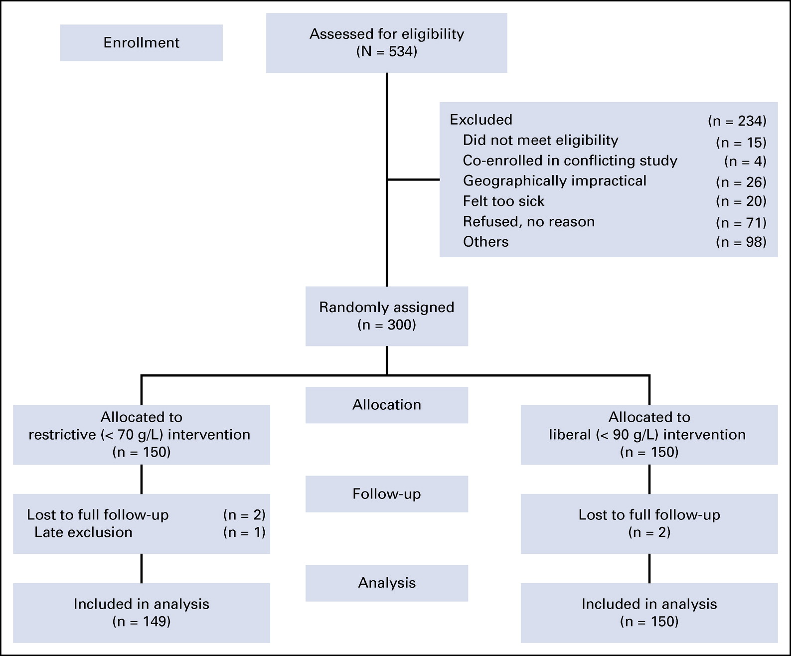
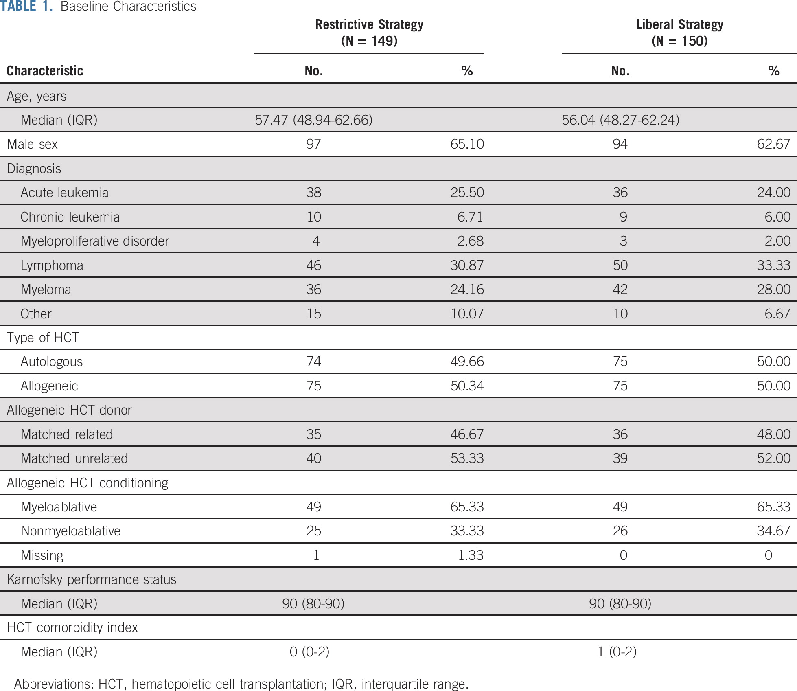
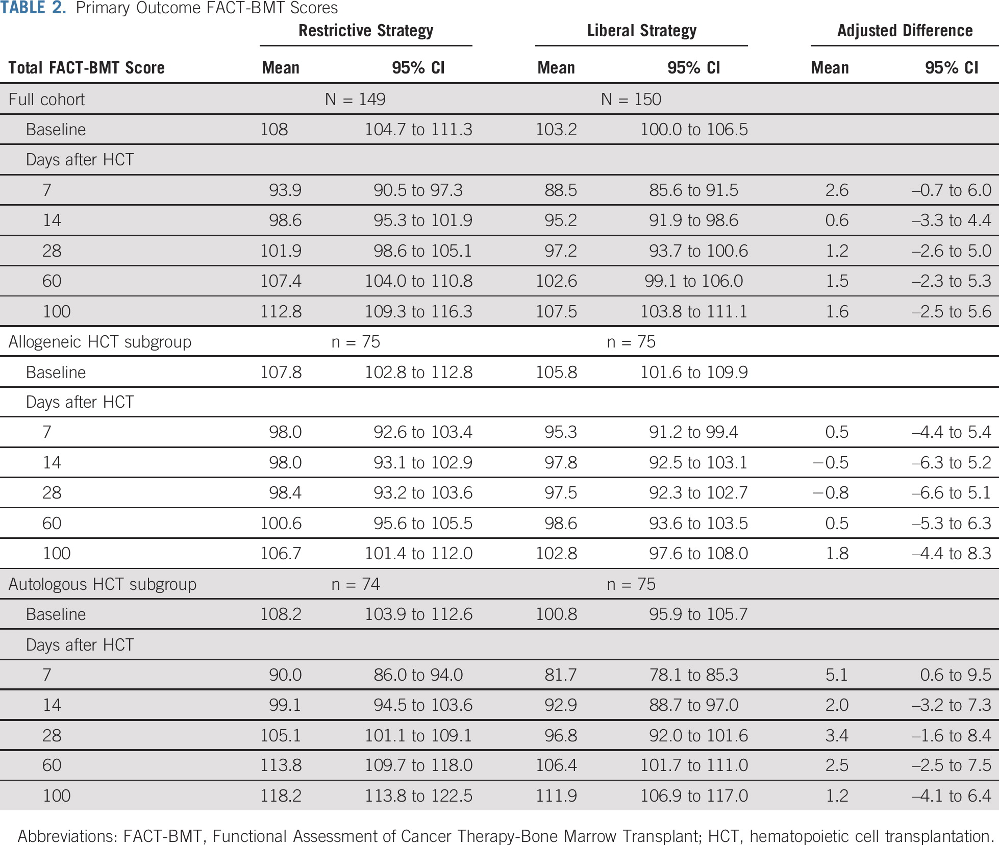
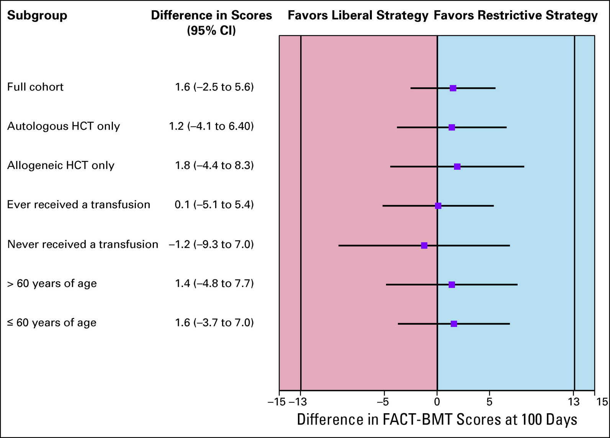
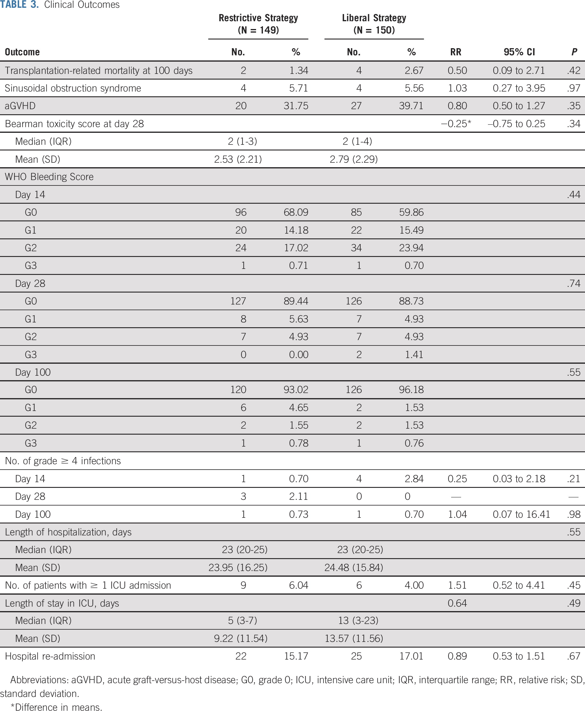
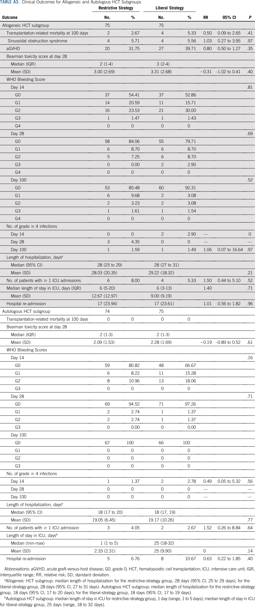
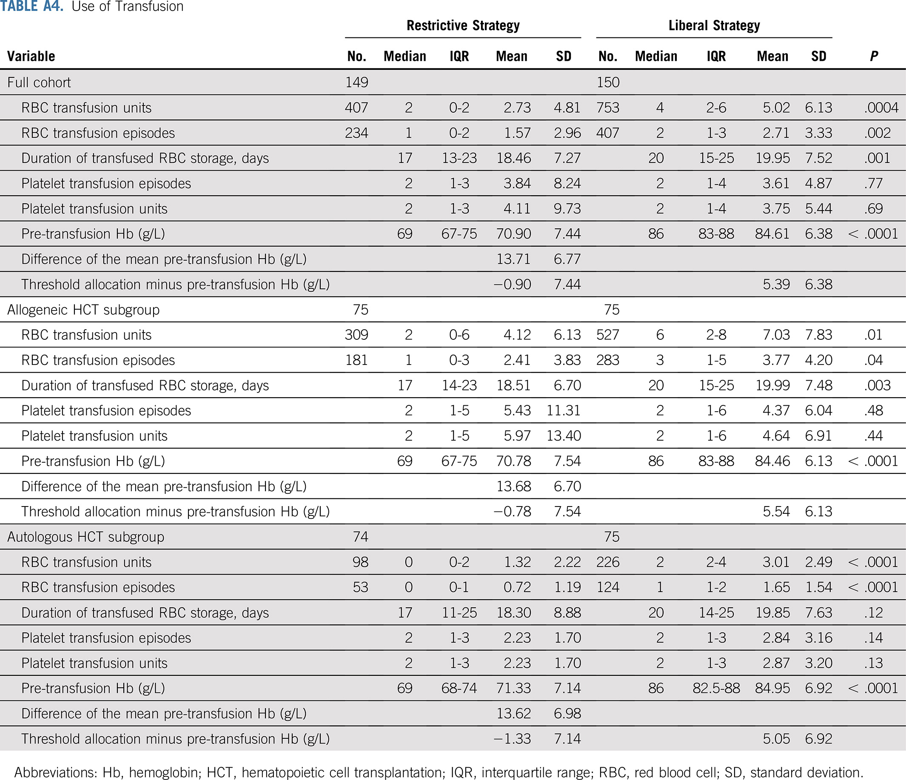
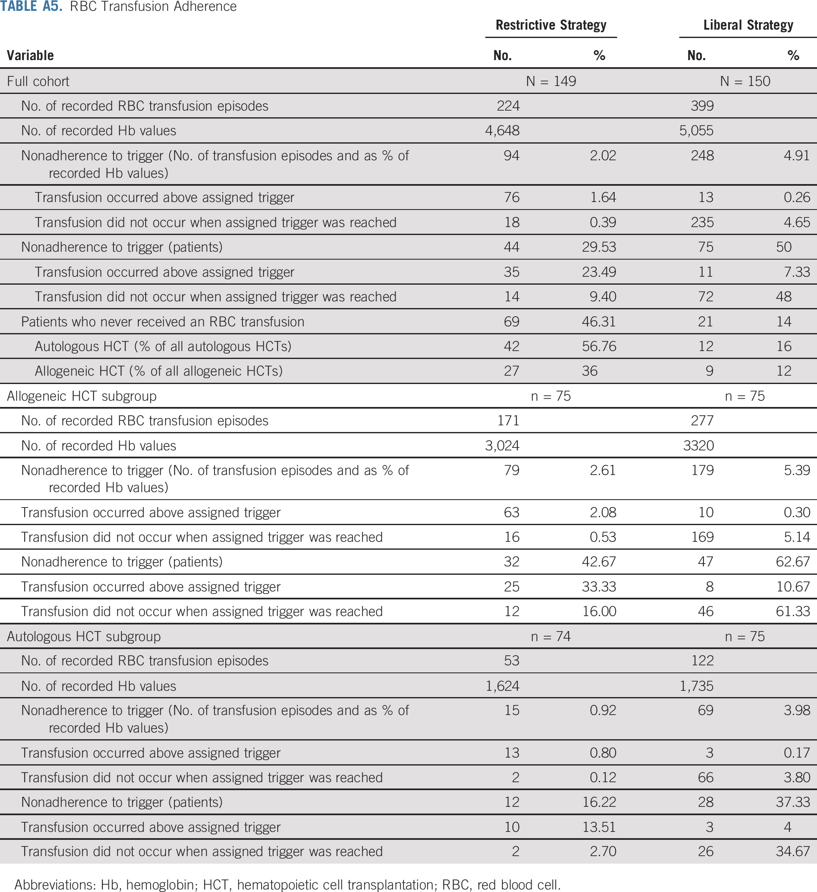
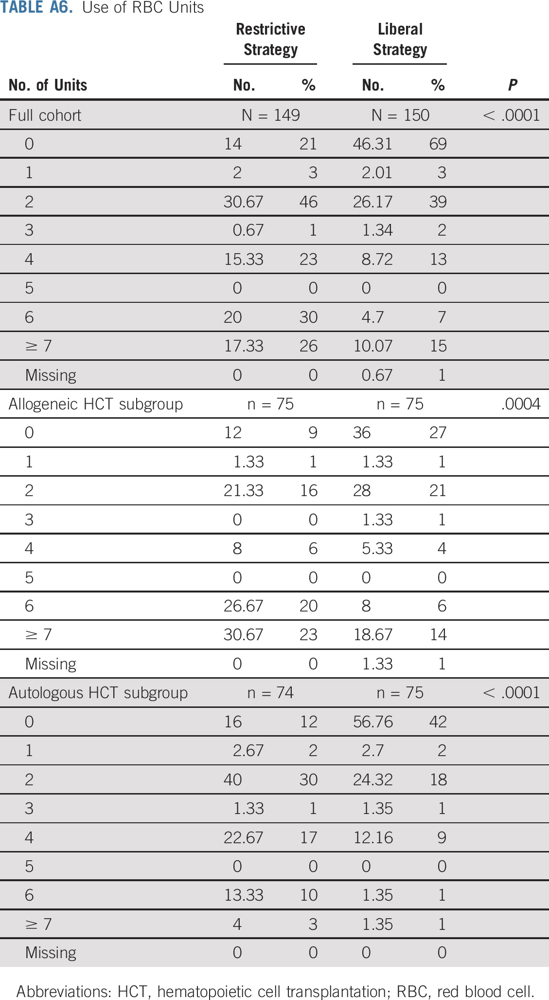

조혈모세포 이식 시 제한적 수혈 vs. 자유 수혈: A Randomized, Open Label, Phase III, Noninferiority Trial

> Tay J, Allan DS, Chatelain E, Coyle D,  Elemary M, Fulford A, Petrcich W, Ramsay T, Walker I, Xenocostas A,  Tinmouth A, Fergusson D. Liberal Versus Restrictive Red Blood Cell  Transfusion Thresholds in Hematopoietic Cell Transplantation: A  Randomized, Open Label, Phase III, Noninferiority Trial. J Clin Oncol.  2020 May 1;38(13):1463-1473. doi: 10.1200/JCO.19.01836. Epub 2020 Feb  21. PMID: 32083994.

## Abstract

### 목적

적혈구 수혈 관행이 조혈모세포 이식 결과에 영향을 미친다는 증거는 잘 알려져 있지 않다.

### 환자 및 방법

우리는 HCT를 필요로 하는 혈액암 환자를 평가하는 4개의 상이한 센터에서 비열등성 RTC를 수행하였고, 환자들은 0~100일 사이에 제한적 (헤모글로빈 [Hb] 역치 < 70 g/L) 또는 자유로운 (Hb 역치 < 90 g/L) RBC 수혈 전략에 무작위로 할당되었다. 비열등성의 범위는 FACT-BMT (Functional Assessment of Cancer Therapy-Bone Marrow Transplant) 스코어의 기능성 평가에서의 기준선과 비교하여 군 사이에서의 12% 이내의 절대 차이이다. 1차 결과는 100일째에 FACT-BMT 점수로 측정된 HRQOL (health-related quality of life) 이었다. 추가의 엔드 포인트들을 수집하였다: 기준선 및 7일, 14일, 28일, 60일 및 100일에서 FACT-BMT 점수에 따른 HRQOL, 이식-관련 사망률; 입원 기간, 중환자실 입원, 급성 GVHD; Bearman 독성 스코어, 정맥폐쇄병(sinusoidal  obstruction syndrome), 중증 감염, WHO 출혈 척도, 수혈 요구, 치료에 대한 반응.

###  결과

2011년부터 2016년까지 4개의 캐나다 성인 HCT 센터에서 총 300명의 환자가 임의로 제한적 자유적 치료 그룹에 배정되었다. HCT 후, 평균-수혈 Hb 수준은 제한적 군에서 70.9 g/L였고, 자유적 그룹에서는 84.6 g/L였다 (P< .0001). 수혈된 RBC 유닛의 수는 자유적 그룹 보다 제한적 그룹에서 더 낮았다(평균 2.73 units [SD, 4.81 units] vs. 5.02 units [SD, 6.13 units]; P = .0004). 수혈의 종류 및 기준선 FACT-BMT 스코어를 조절 한 후, 제한적 그룹은 100일에 더 높은 FACT-BMT 점수 (1.6점 차, 95% CI, −2.5 ~ 5.6점) 를 보였고, 이는 자유적 그룹과 비교하여 열등하지 않았다. 수혈 전략 사이의 임상적 결과에는 유의한 차이가 없었다.

### 결론

HCT를 시행받는 환자에서, 70 g/L의 제한적인 RBC 수혈 전략 역치의 사용은 90 g/L의 역치만큼 효과적이었고, 더 적은 수혈로 유사한 HRQOL및 HCT 결과를 보였다.

## 개요

조혈 세포 이식 (HCT) 환자에서의 적혈구 (RBC) 수혈은 화학요법-관련 빈혈증을 관리하기 위해 시행하는 필수적인 지지 요법이다. 그러나, 일반적 종류의 혈액학적 악성종양 또는 HCT 환자에서 RBC 수혈의 적절한 사용이 임상적 결과에 영향을 미찬다는 근거는 거의 없다.

빈혈 치료 시 RBC 수혈의 명백한 이점이 있지만, 몇몇 환자 그룹에서 잠재적인 위해가 있음이 알려져 있다. 수많은 관찰 연구에서 RBC 수혈과 더 나쁜 임상 결과의 연관성이 입증되었다. HCT의 경우, 관찰 연구는 HCT 전 낮은 헤모글로빈 (Hb) 수준 및 RBC 수혈은 HCT 후의 불량한 결과와 관련이 있음을 시사한다. 자유 수혈 전략 (Hb threshold < 90 g/L) 과 비교하여 제한 수혈 전략 (Hb threshold < 70 g/L) 이 집중 치료, 패혈증, 정형외과적 수술, 위장관 출혈, 심장 수술과 같은 다양한 임상 상황에서 사망률을 증가하기지 않으며, 질환 이환률을 심각하게 증가시키지 않는 다는 증거가 증가하고 있다. 그러나, 더 높은 임계값이 유리할 수 있는 상황들이 존재한다. 화학 요법을 받는 혈액 종양 환자들이 RBC 수혈을 받는 전체 환자들 중 유의한 비중을 차지한다는 점에도 불구하고, 이들 환자에서 RBC 수혈에 대해 평가한 것은 3개의 소규모 RCT 밖에 없다.

상기 언급된 급성 세팅에서의 환자와는 달리, 혈액암 및 HCT 환자는 전형적으로 지속적인 빈혈을 경험하며, 지속적인 수혈을 필요로 한다. RBC 수혈의 목표 중 하나는 건강 관련 삶의 질(HRQOL, health-related quality of life)을 촉진하고 유지하는 것이며, 이는 환자 중심 접근법에 부합한다. HRQOL의 평가는 화학요법으로 인해 발생한 저증식성 빈혈 환자에서 특히 두드러진다. 이러한 환자 그룹이 직면하는 HRQOL과 수혈의 잠재적인 독성의 균형 조절의 어려움에도 불구하고, 최적의 RBC 수혈을 안내하는 RCT는 없었다. 가이드에 대한 증거가 부족하기 때문에, 본 저자들은 HRQOL및 HCT 결과에 대해 제한 및 자유 RBC 수혈 전략의 영향을 비교하는 비열등성 RCT (부록 표 A1, 온라인 전용) 를 설계하였다.

## 환자 및 연구방법

### 연구 관리

각 센터의 지역 윤리 위원회의 승인을 받은 후, 4개의 캐나다 HCT 센터를 선별하여 2011년 3월 28일과 2016년 2월 3일 사이에 환자들을 무작위로 할당했다. 모든 참가자들로부터 동의를 얻었으며, 우리의 피어-리뷰 파일럿 연구 프로토콜은 온라인으로 공개되었다. 기금 모금 기관인 캐나다 보건연구소 및 캐나다 혈액 서비스 센터는 프로토콜 설계, 연구 관리, 분석 또는 보고에 아무런 역할을 하지 않았다. 본 연구의 결과는 American Society of Hematology 58th Annual Meeting and Exposition (San Diego, CA, December 3-6, 2016) 에서 제시되었다.

### 환자 선택

18세 이상의 모든 환자는 임의의 혈액학적 악성 종양에 적합한 자가 또는 동종이계 HCT를 받았다. 우리는 등록 당시에 임신 또는 수유 중이었던 환자, 이미 HCT 후에 RBC 수혈을 받은 경우, 동의서를 작성할 수 없거나 거절한 경우, 비종양성 질환으로 HCT를 받는 경우는 제외하였다.

### 연구 설계

우리는 제한적 RBC 수혈 전략이 자유 RBC 수혈 전략보다 열등하지 않은지를 평가하기 위해 RCT를 수행하였다. 우리는 안전한 온라인 전자 랜덤화 플랫폼을 사용하였고, 환자들은 컴퓨터로 생성된 무작위 서열을 이용하여 무작위로 할당되었다. 1:1비에서의 단순 무작위화는 가변적인 순열 블록 크기를 기준으로 하였고, 이식 센터 및 HCT의 유형에 의해 계층화되었다. 본 연구의 중재적인 특성 상, 환자 또는 간병인을 맹검 상태로 유지하는 것은 불가능하였다. 그러나, FACT-BMT 점수의 기준선을 무작위 배정 전에 수집하였다.

### 중재 및 추적관찰

자유 그룹에 무작위로 배정된 참가자들은, Hb 수준이 90 g/L 미만으로 떨어지면 (90내지 110 g/L의 수준을 유지하는 것을 목표로 하는) RBCs의 2 단위를 수혈받았고, 반면, 제한적 그룹에 무작위로 배정된 참가자들은 Hb 레벨이 70 g/L 미만으로 떨어지면 (70내지 90 g/L의 수준을 유지하는 것을 목표로 하는) RBC의 2 단위를 수혈받았다. 2개의 RBC 수혈 전략의 선택은 RBC 수혈 역치를 평가하는 이전에 공개된 실험으로부터 얻은 데이터에 기초하였고, 지역 전문가 의견을 평가하였으며, 캐나다 HCT 센터의 실제 패턴을 조사하였다. 이 전략을 벗어난 수혈은 임상의가 임상적으로 필요하다고 판단한 경우 허용되었으며, 환자가 증상성 빈혈을 보이는 경우 등이 해당하였다. 마찬가지로, 수혈은 혈액 부피 과부하와 같은 임상적인 이유로 보류될 수 있다. 수혈 전략은 HCT 시행일(0일)에 시작되고, HCT 이후 100일까지 유지되었다. 모든 RBC는 캐나다 혈액 서비스에 의해 공급되었다. 모든 RBC 단위는 citrate phosphate dextrose anticoagulant를 이용해 수집한 전혈로부터 공급되었으며, 저장하기 전에 백혈구 제거를 시행하였고, saline-adenine-glucose-mannitol 첨가제 용액에 현탁시켰다. HCT 이전의 컨디셔닝 화학요법 및 강도는 Center for International Blood and Marrow Transplant Research에 따라 분류되는 지역 표준을 따른다. 다른 모든 HCT 이후 돌봄은 각 지역 기관의 관행에 따라 제공되었다.

### 결과 측정

#### HRQOL

HRQOL과 관련된 문제들은 일반적으로 암 환자들이 가장 큰 관심사로 언급되고 있다. 치료의 중증도 및 강도 및 그에 따른 즉각적이고 장기적인 부작용 (AE) 의 위험을 고려하면, HCT 설정에서 환자 HRQOL을 측정하는 것이 중요하다. Liberal Versus Restrictive Red Cell Transfusion Thresholds in Hematopoietic Cell Transplantation (TRIST) 파일럿 연구에서 이식 관련 사망률 (TRM, transplantation-related mortality)에 대한 우리의 초기 강조에도 불구하고, HCT 상황에서 환자 중심적 결과를 통합하고자 하는 요구의 증가 이외에, 우리의 프로토콜에 대한 피어-리뷰 피드백을 받았다. 따라서, TRIST 결정 시험을 위해, 제1차 결과로서 100일째 FACT-BMT 척도에 의해 측정된 HRQOL을 선택하였다.

FACT-BMT 스케일은 5개의 영역에서 5점의 Likert 척도를 사용하는 검증된 자체-보고 질문지이다. FACT는 신체적 웰빙, 기능적 웰빙, 사회적, 가족적 웰빙, 정서적 안녕을 측정하는 4개의 서브스케일로 구성되어 있다. BMT 서브스케일은 HRQOL 및 HCT에 특이적인 증상을 시험하기 위해 특별히 설계된 추가의 항목을 포함한다. 점수 범위는 0-148 이다. 점수가 높을수록 HRQOL이 우수하다. 우리는 또한 FACT-BMT 점수를 기준선에서 및 7일, 14일, 28일 및 60일째에 측정하였다. FACT-Anemia (FACT-An) 및 EuroQol-5 차원 (EQ-5D) 또한 동일한 시점에서 측정하였다.

#### 임상적 결과

우리는 HCT 및 안전 결과 (safety outcome)을 포함하였다.

1. 100일째 TRM 
2. 입원 기간, 중환자실 입원
3. 입원 수
4. 급성 GVHD
5. 중증 감염 (3점 이상)
6. 수혈 요구
7. WHO 출혈 척도에 따른 출혈
8. 유해 수혈 반응
9. Bearman 독성 점수
10. SOS(정맥폐쇄병)
11. National Cancer Institute Common Toxicity Index에 의거한 부작용. 중증 부작용은 International Council for Harmonisation of Technical Requirements for Pharmaceuticals for Human Use 표준을 이용하여 정의 및 기록되었다.

### 통계 분석

#### 표본 크기 및 비열등성 범위

우리 연구는 HCT 후 100일째 측정한 HRQOL의 12% 차이의 비열등성 범위를 배제하기 위해 80%의 검정력을 가진다(?).  비열등성 범위의 결정은 파일럿 연구의 데이터를 기반으로 하는 검정력 계산에 대한 전문가의 의견과 연구자들의 일치된 의견에 따른 것이었다. 표준 편차(SD)가 20% 이고, 15% 중도탈락을 고려하여 조정 시, 100일째  FACT-BMT 점수의 차이가 평균 점수의 12% 이상일 것이라는 가설을 기각하기 위해 300명의 표본 크기가 80% 검정력을 제공할 것이라는 것을 계산하였다.

#### 일차 분석

FACT-BMT 점수는 각 측정 시점별로 평균 및 표준편차로 요약하였다. % 변화를 나타내기 위해, 1차 결과를 로그-변환시키고, 기준선 FACT-BMT 점수, HCT 유형 (동종이형 v자가), 및 처리군에 대한 3개의 계수를 갖는 선형 모델을 사용하여 분석하였다. 1차 분석은 100일째 FACT-BMT 점수를 종속 변수로 하고, 치료 배정을 1차 독립 변수로 하여 HCT 종류 및 기준선 FACT-BMT 점수를 조정한 1차 선형 회귀 모델을 사용하였다. 100일째 평균 점수가 110점이었다는 점을 감안하면 12% 의 비열등감은 13점의 절대적 차이에 해당한다. 따라서, 차이에 대한 95% CI가 자유적 그룹에 비하여 제한적 그룹에서 13점의 감소를 포함하지 않는 경우, 치료는 열등하지 않은 것으로 판단되었다.

#### 이차 분석

기준 특성 및 2차 및 수혈 결과는 평균과 표준편차, 중앙값 (사분위수 범위 [IQR]), 또는 빈도수 및 백분율(%)을 사용하여 적절히 요약하였다. 그룹간 차이는 95% 신뢰구간을 보이는 상대적 위험(RR)을 이용함으로써 요약되었고, 카이-제곱 (chi-square) 또는 피셔 (Fisher) 검정을 사용하여 적절하게 시험하였다. 연속적 결과는 t 검정으로 시험하였고, 95% 신뢰구간에서 평균 차이로서 요약하였다. 초기 시점에서의 FACT-BMT 점수를 100일 측정과 동일한 방식으로 분석하였다. 시간-대-이벤트 결과를 중앙값 (IQR) 으로 요약하고, 로그-랭크 (log-rank) 검정을 사용하여 시험하였다. 모든 시험은 0.05수준의 유의성에서 수행되었다.

## 결과

### 연구 집단

우리는 연구 기간 동안 534명의 참가자에게 접근했다. 이들 중, 234명은 배제되었는데, 자격기준을 충족하지 않았기 때문 (n = 15), 상반된 연구에 참여 (n = 4), 지리적 이유 (n = 26), 너무 상태가 좋지 않은 경우 (n = 20), 거부 (n = 71), 또는 공개하지 않는 이유 (n = 98)로 배제되었다. 총 300명의 참가자가 무작위로 배정되었고, 1명이 무작위 배정 후 부적격으로(다발성 경화증에 대한 자가 HCT) 제외되었다. 총 149명의 환자가 제한적 전략 그룹에 배정되었고, 150명의 환자가 자유 전략 그룹에 배정되었으며, (그림 1) 기저 환자 및 질병 특성은 2개의 랜덤하게 할당된 군에서 유사하였다 (표 1).

그림1. CONSORT 다이어그램

표1. Baseline Characteristics

### 1차 결과: HRQOL

기저선에서의 평균 FACT-BMT 점수는 제한적 군에서 108.0 (95% CI, 104.7-111.3) 및 자유적 군에서 103.2 (95% CI, 100.0-106.5) 였다. 이들의 평균 점수는 HCT 조사 후 100일이 지난 후에는 제한적 그룹에서 112.8 (95% CI, 109.3-116.3), 자유적 그룹에서 107.5 (95% CI, 103.8-111.1) 였다. 기저선 점수 및 HCT 유형에 대해 보정한 후, 제 한적 군에 대한 평균 100일쨰 점수는 자유적 그룹에 대한 점수보다 1.6 (95% CI, -2.5-5.6)점 더 높았다 (표 2). 전체 CI가 -13 의 비열등차를 초과하기 때문에, 이는 제한적 전략이 통계적으로 열등하지 않다는 것을 의미한다. 사전 분류된 자가 및 동종이계 HCT 그룹의 하위군 분석은 두 그룹 모두에서 제한적 전략이 통계적으로 열등하지 않다는 점을 확인하였다 (그림 2).

표2. 1차 결과. FACT-BMT 점수.

그림 2. 100일째 FACT-BMT에 의해 측정된 1차 결과 (HRQOL)에 대한 하위 그룹 분석

### 2차 및 임상 결과

제7일, 제14일, 제28일 및 제60일에 FACT-BMT 점수가 표 2에 제시되어 있다. 모든 시점에서 제한적 전략은 HCT 유형과 기저선 점수를 보정한 후 자유 전략에 비해 점수가 높았으며, 통계적으로 열등하지 않았다. FACT-An 점수에 대해서도 유사한 결과가 확인되었다 (부록 표 A2, 온라인 전용). 제 2 임상 결과 중 제한 전략 그룹과 자유 전략 그룹 사이에는 어느 한 항목에서도 차이가 없었다 (표 3). 자유 그룹(n=6)과 비교하였을 때, 제한 그룹의 환자(n=9)들이 ICU에 입원하는 경우가 약간 많았다. 병원 재입원 수는 제한 전력 그룹(n=22)와 자유 전략 그룹(n=25) 사이에 유의미한 차이를 나타내지 않았다. 사전 정의된 자가 및 동종이계 HCT 하위그룹에 대한 분석에서 제 2 임상 결과간의 차이는 확인되지 않았다 (부록 표 A3, 온라인 전용).

표3. 임상 결과

표 A3. 자가 및 동종이계 HCT 하위그룹에 대한 임상 결과 비교

### Hb 농도, 수혈, 자원 사용 변수

부록 표 A4 (온라인 전용) 는 평균 수혈 경험을 제시하며, 이는 제한적인 전략이 실질적으로 적은 수의 수혈을 유도하였음을 입증한다. 연구 과정에서, 제한 전략 그룹의 환자들은 평균 2.73개의 RBC units (SD, 4.81 RBC units) 을 수혈받았고, 각각은 1.57개의 수혈 에피소드 (SD, 2.96개의 수혈 에피소드) 를 가졌다. 수혈된 RBC의 평균 보관 기간은 제한-전략 그룹에 대해 18.46일 (SD, 7.27일) 이었고, 자유-전략 그룹 (P = .001) 에 대해 19.95일 (SD, 7.52일) 이었다. 이와는 대조적으로, 자유-전략 그룹의 환자들은 평균 5.02 RBC units (SD, 6.13 units)을 수혈받았고, 평균 2.71 units (SD, 3.33 units)의 수혈 에피소드를 가졌으며, 이는 공개된 문헌과 일치한다. 혈소판 수혈의 경우 군 사이에는 차이가 거의 없었지만, RBC 수혈을 받은 환자들의 수에는 뚜렷한 차이가 있었다: 최소한 1회의 수혈을 받은 환자가 제한적 그룹에서 80명, 자유 그룹에서는 129명 이었다.

표 A4. 수혈의 사용

대부분의 수혈은 프로토콜에 따라 투여되었지만, 일부는 그렇지 않았다 (부록 표 A5및 표 A6, 온라인 전용). 제한 전략 그룹에서 규칙을 따르지 않고 RBC 수혈을 한 경우가 76회(모든 기록된 Hb 값의 1.64%)였으며, 18회 (모든 기록된 Hb 값의 0.39%)는 (규칙을 따르지 않고) RBC 수혈을 하지 않았다. 반면 자유 전략 그룹에서는 13회(모든 기록된 Hb 값의 0.26%)와 235회 (모든 기록된 Hb 값의 4.65%)였다. 종합하면, 이는 95%를 초과하는 전반적인 RBC 수혈 adherence rate를 제안한다. 3일째에 제한 그룹의 환자들은 통계적으로 유의하게 낮은 Hb 농도의 중앙값을 보였으며, 이는 우리의 수혈 전략이 성공적으로 실행되었고, 연구 결과의 충실도를 보장한다는 것을 시사한다. 이는 연구 기간의 대부분 동안 유지되었지만, 13주(그림 3)에는 통계적으로 유의하지 않았다.

그림 3. 0-100일 사이 그룹 간 Hb 중앙값의 차이

표 A5. RBC 수혈 adherence

표 A6. RBC unit의 사용

### 수혈 관련 부작용

제한 전략 그룹과 관련된 7건(2.34%)의 RBC 수혈 반응과 자유 전략 그룹과 관련된 5건(1.67%)의 RBC 수혈 반응이  있었다. AE에는 8건의 열성 비용혈성 반응, 3건의 수혈 관련 심장 과부하 및 2건의 두드러기 반응이 포함되었다.

## 토의

우리는 70g/L의 제한적 RBC 수혈 전략이 HCT 후 100일째의 HRQOL과 관련하여 90g/L의 자유주의 전략보다 열등하지  않음을 입증했다. 흥미롭게도, HCT 유형과 기준선 점수를 조정한 후 모든 연구 시점에서 우리는 제한적 전략 그룹에 할당된 참가자의 FACT-BMT 점수가 자유주의 전략 그룹에 비해 더 높은 것을 관찰했지만 이 차이는 통계적으로나 임상적으로 유의하지  않았다.  EQ-5D(데이터는 표시되지 않음) 또는 증상 특이적(FACT-An) HRQOL 점수는 제한 전략과 자유주의 전략 RBC 수혈 그룹 간에 유의한 차이가 없었다.

우리는 TRM, SOS, 동종이계 HCT 수혜자 간의 aGVHD, Bearman 독성, 출혈, 입원 기간, ICU 입원 및 병원 재입원을 포함한 2차 결과에서 제한적 RBC 수혈 전략과 자유적 RBC 수혈 전략 간에 유의미한 차이를 관찰하지 못했다. GVHD의 비율과 ICU 재원 기간은 통계적으로 유의하지는 않았지만 자유주의 전략 그룹에서 더 높았다. 아마도 이 미묘한 차이에 기여하는 면역 조절 효과가 있을 것이다. 그러나 우리의 연구는 이러한 가능성을 다루도록 설계되지 않았다. 종합하면, 이러한 결과는 제한적 RBC 수혈 역치가 자유주의 RBC 수혈 역치와 동등함을 입증하는 출판된 문헌을 보완하며, 일치하는 결과이다.

중요한 것은, 100일 이내에 제한적인 RBC 수혈 전략을 사용함으로써 본 저자들의 연구에서의 RBC 수혈을 필요로 하지 않은 환자의 비율이 HCT  14% 에서 46.31% 로 증가하였으며, 이는 중요한 비용 절감을 나타낸다. 본 발명자들의 센터에서 수행된 이전의 회고적 연구에서, HCT (pre-HCT) Hb, 골수종에 대한 자가 HCT, 및 초기-단계 질환은 수혈이 필요하지 않은 환자의 전체 비율이 10%인 RBC 수혈의 회피와 관련이 있었다(?).

우리의 연구는 화학 요법을 받고 있는 암 환자에서 제한적 수혈 역치를 평가한 최초의 대규모 RCT이다. 이전에는 156명의 환자를 대표하는 3개의 소규모 RCT만이 상이한 RBC 수혈 역치의 효과를 평가했으며 오직 한 연구만이 성인 환자에서의 제한적 수혈 역치가 90g/L인 것으로 구체적으로 평가했다.  HCT를 받은 혈액암 환자에 대한 우리의 결과는 공개된 문헌에 추가되었으며, 이는 제한적 RBC 수혈 역치가 자유 수혈 역치만큼 효과적임을 보여준다. HCT를 받는 환자는 제한적 적혈구 수혈 전략을 평가한 이전의 큰 연구에서와는 상이한 집단을 나타낸다: 이들은 골수 제거 화학 요법 후 손상된 적혈구 생성 때문에 장기간 동안 적혈구 수혈이 필요하다. 중요한 것은, 이 환자들은 Hb 값의 차이에도 불구하고 유의미한 임상 문제 및 HRQOL의 차이 없이 최대 100일 동안 입원 환자 및 후속적으로 외래 환자로 치료되었다는 것이다.

제한적인 수혈 전략을 평가하는 이전의 큰 RCT는 급성 자기-제한된 빈혈 (주요 수술, 외상, 또는 GI 혈액 손실) 및 비보행 환자 (집중 치료) 를 갖는 환자를 포함하였으며, 이들 모두는 급성 질환을 앓고 있었다. 흥미롭게도, 몇몇 메타-분석은 자유적 수혈 전략이 수술 전후 상황과 노인들에게는 유리할 수 있다는 것을 시사한다. 결과가 흥미롭기는 하지만 연구 집단은 급성 설정으로 제한된다. 흥미롭게도, 우리의 하위군 분석에서, 나이든 환자들은 자유적 수혈 전략 (그림 2) 의 이점을 얻지 못하였으며, 다른 급성 세팅들로부터의 데이터가 종양학 및 HCT 집단에 적용될 수 없다는 우리의 주장을 더욱 강화시켰다.

RBC 수혈의 목표는 다면적이다. 그것은 조직에 산소를 안전하게 운반하도록 개선하고, 사망률과 이환율을 감소시키고, HRQOL을 개선하는 것을 목표로 한다. 이전의 큰 RCT를 평가한 후, 우리는 제한적인 수혈 전략에서 사망률 또는 주요 이환율의 차이를 보지 못했다. 따라서, HRQOL은, 환자가 자각하는 건강과 경험이 최우선이라고 주장되어 왔던, 수혈 연구의 초석이 되고 있다. 역사적 연구는 HRQOL에 거의 또는 전혀 주의하지 않고 사망률 및 이환율 결과에 초점을 맞추었다. 실제로, 수혈 의학에서 다른 두 개의 RCT만이 기능적 결과를 평가하였고, 이것은 단지 단일 시점에 대한 것이었다.

우리가 아는 한, 이것은 환자 중심의 결과를 1차 종료점으로 사용하여 RBC 수혈 역치를 평가하기 위한 혈액 종양학 환경의 HCT 환자에 대한 최초의 대규모 RCT이다. 또한 HCT 관련 독성에 주의하면서 환자 경험을 더 잘 평가하기 위해 여러 시점에 걸쳐 HRQOL의 여러 측정값을 사용하였다. 고형 종양이 있는 환자는 일반적으로 혈액암 환자에서 볼 수 있는 골수 침윤성 질환이 없다. 그러나 고형 종양이 있는 환자는 골수 억제가 될 수 있고 적혈구 수혈 지원이 필요한 빈혈을 유발할 수 있는 화학 면역 요법으로 치료한다. 종합하면, 종양학 전반에서 상대적으로 덜 집중적인 화학 요법이 시행되는 것을 고려할 때 우리 연구의 결과를 일반화할 수 있다고 믿는다.

### 제한점

우리 연구에는 한계가 있다. 첫째, 우리 연구는 비맹검으로 진행되어 잠재적으로 편향이 발생할 수 있다.  불행히도, Hb 수준에 대해 환자와 의료 전문가를 맹검하는 것은 이 집단에서 실용적이지 않다.  둘째, FACT-BMT 척도는 환자의 빈혈 및 적혈구 수혈 경험의 결과를 완전히 평가하지 못할 수 있다. 그럼에도 불구하고 여전히 널리 사용되고 검증된 척도이다. 빈혈의 결과적로 나타나는 증상은 RBC 수혈 보충과 관련하여 HRQOL에 영향을 미치는 것으로 일반적으로 가정된다. 그러나 HCT의 더 큰 맥락에서 수혈을 받지 않은 경험과 빈혈의 상대적인 중요성은 불명확하다. 따라서 빈혈 증상만 포착하는 HRQOL 측정에 의존하는 것은 너무 좁을 수 있다. 우리가 아는 한, 더 큰 맥락의 HCT에서 RBC 수혈을 받은 경험을 설명하는 간결하고 포괄적인 HRQOL 측정은 없다. 우리는 FACT-BMT 점수가 HCT의 더 큰 맥락 내에서 빈혈과 관련된 증상을 뛰어넘어 RBC 수혈의 경험을 포함한다고 제안한다. 중요하게도, 우리는 FACT-An 척도(증상별 HRQOL 척도)에서 어떤 차이도 발견하지 못했다. 셋째, 많은 임상의들은 한 번에 두 단위를 사용하는 것과는 반대로 한 단위 수혈을 사용하고 있다. 관찰 연구는 (우리 연구와)결과가 불일치하지만, RBC의 사용이 감소하는 이러한 안전한 전략을 뒷받침한다. 넷째, 무작위 배정에도 불구하고 수혈 적혈구의 보관 기간은 두 연구 그룹 간에 통계적으로 달랐지만 RBC 보관 기간 1일 차이는 임상적으로 의미가 없다. 여러 RCT가 이러한 우려를 완화했으며, 우리는 이전에 수혈된 RBC의 보관 기간이 HCT 또는 암 결과에 부정적인 영향을 미치지 않는다는 것을 입증했다. 다섯째, 두 연구 그룹 간의 외래 환자 방문 횟수를 문서화하지 않았다. 그러나 비교 가능한 임상 및 HRQOL 결과를 고려할 때 의료 사용에 차이가 있을 것 같지 않다.

연구결과의 일반화가 가능한가라는 관점에서, 우리의 시험은 HCT를 받는 환자의 다양한 하위 그룹을 살펴보기에 적절하지 않았다. 또한, 우리 연구에서 HCT CI 중앙값은 0(IQR, 0~2)으로, 캐나다 HCT 센터가 올바른 환자를 선택한다는 정신에서 TRM에 반영된 바와 같이 HCT를 통해 안전하게 진행하기 위해 낮은 동반 질환을 가진 개인을 선택했음을 시사한다. 그럼에도 불구하고, 우리는 고위험 환자 (HCT CI가 높은 사람)에서 HCT를 수행하고자 하는 기관과 관련성이 있다고 제안한다. 적격 참가자의 44%가 우리 연구에 등록하지 않았다. 이 비율이 높아 보일 수 있지만 RBC 수혈 유발 요인을 평가하고 배제율이 57%에서 86% 사이인 대규모 RCT와 일치한다. 환자의 참여(또는 비참여)에 대한 동기는 우리 연구의 범위를 벗어난다. 자신을 허약하다고 인식한(즉, HCT CI 점수가 더 높은) 환자가 연구 참여를 거부했을 가능성이 있다. 마지막으로, 배정 RBC 수혈 규칙이 100일 이상의 장기적인 건강 결과에 영향을 미칠지 여부는 불확실하다.  그러나 우리는 다른 질병 관련 요인과 그 개입이 장기적으로 건강상의 결과를 주도하는 주요 요인이 될 것으로 예상한다.

우리는 FACT-BMT 점수에서 13점의 차이가 임상적으로 중요한 차이를 최소화하기 위한 합리적인 선택이라고 생각했다. 더욱이, 예상 평균 점수 사이의 최종 조정된 비율에 대한 95% CI는 -2.5 내지 5.6이므로, 우리의 시험은 3포인트 이상의 비열등성 범위에 대해 비열등성을 입증한다. 142점 HRQOL 척도에서 3점의 차이가 임상적으로 중요하다고 판단하는 임상의와 환자는 거의 없을 것으로 예상한다. 무작위 배정에도 불구하고 제한 전략 그룹과 자유 전략 그룹은 기준선 FACT-BMT 점수에서 불균형을 보였다. 제한 전략 그룹의 평균 점수는 자유 전략 그룹보다 약 5% 더 높았다. 이 차이는 기준선 점수에서 SD의 1/4  미만으로 작지만 FACT-BMT 점수가 측정된 모든 시점에서 유지되었다. 우리의 분석은 기준값에 대한 조정 후 상대적인 차이를 보기 위해 고안되었다. 각 그룹의 기준선으로부터의 상대적 변화는 매 시점마다 거의 동일하였으며, 이는 제한적인 전략이 더 낮은 HRQOL과 연관되지 않았다는 결론을 강화시켰다.

요약하면, 혈액 악성 종양에 대한 HCT를 받는 환자는 90g/L의 RBC 수혈 기준과 비교하여 70g/L의 RBC 수혈 기준을 갖는 경우 더 적은 수의 수혈을 받으면서 유사한 HRQOL 및 이식 관련 결과를 나타낸다. 우리의 결과는 혈액암으로 HCT를 받는 환자에서 Hb 농도가 70g/L 아래로 떨어질 때까지 수혈을 수행하지 않는 전략을 지지한다. 이 제한 전략은 효과적이고 안전하며 잠재적으로 비용 절감 및 수혈 관련 AE 감소와 관련된다.