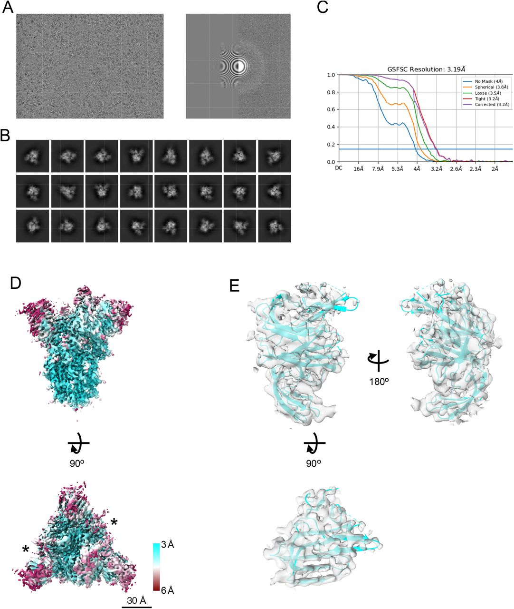

# 1. *In vitro* and *in vivo* functions of SARS-CoV-2 infection-enhancing and neutralizing antibodies

SARS-CoV-2 감염-증강 및 중화 항체의 시험관 내 및 생체 내 기능

> Li D, Edwards RJ, Manne K, et al. In vitro and in vivo functions of SARS-CoV-2 infection-enhancing and neutralizing antibodies. *Cell*. 2021;184(16):4203-4219.e32. doi:10.1016/j.cell.2021.06.021

```
Highlights
* RBD 또는 NTD 항체는 in vitro에서 감염을 촉진시켰으나, in vivo에서는 그렇지 않았다.
* 중화 또는 감염-증진 NTD 항체는 별개의 항원결정기와 결합하였다.
* in vitro 감염-증진 항체는 in vivo SARS-CoV-2로부터 보호된다.
* 교차 반응성 RBD 중화 항체는 보호적이다. DH1047이 가장 강력하다.
```

## 요약

SARS-CoV-2-중화항체 (NAbs)는 COVID-19의 감염으로부터 보호한다. SARS-CoV-2 항체에 대한 우려 중 한 가지는 이들이 감염의 증가를 매개하는지 여부이다. 여기서, 본 저자들은 SARS-CoV-2를 가진 급성 또는 회복 중인 환자 또는 SARS-CoV 감염의 이력이 있는 개체로부터 SARS-CoV-2 스파이크의 수용체 결합 도메인 (RBD) 또는 N-말단 도메인 (NTD)에 대한 NAbs를 분리하였다. RBD 및 NTD 항체에 대해 Cryo-electron microscopy를 통하여 기능-특이적 방식의 결합을 확인하였다. 또한 RBD NAb의 경우 시험관 내에서 Fc 수용체-γ (FcγR)을 매개로 하는 바이러스 감염의 증진이 확인되었다. 한편, 5개의 비-중화성 NTD 항체는 FcγR를 매개하지 않는 시험관내 감염 증진을 일으켰다. 그러나 이 두 가지의 감염 증진 항체는 원숭이 및 마우스에서 SARS-CoV-2 복제를 억제하였다. 감염 증진 항체를 주입받은 46 마리의 원숭이 중 3마리는 대조군과 비고하여 더 높은 폐 염증 점수를 보였다. 한 마리는 폐포 부종 및 BAL에서 염증성 사이토카인의 증가가 확인되었다. 따라서 시험관 내 항체 증진 감염이 반드시 생체 내 감염 증진을 의미하는 것은 아니지만, SARS-CoV-2 항체 주입된 원숭이에서 폐 염증의 증가가 드물게 발생할 수 있다.

## 이미지 초록


## 개요

중증 급성 호흡기 증후군 바이러스 2 (SARS-CoV-2)는 전세계적으로 1억 5천 5백만 건의 감염 및 300만 명 이상의 사망자를 기록하며 세계쩍인 유행병을 일으켰다. COVID-19 판데믹을 통제하기 위한 궁극의 해결책은 안전하고 효과적인 백신이지만, 중화항체 (NAb) 예방효법 또는 감염의 치료 또한 전염병을 제어하는 데 도움이 될 수 있다. 비 인간 영장류 또는 설치류에서 SARS-CoV-2 NAb의 예방적 혹은 치료적 사용은 SARS-CoV-2 감염을 방어하는 것으로 보고된 바 있다. SARS-CoV-2 NAbs는 주로 RBD 영역을 표적으로 하는 것으로 보고되었다. 대조적으로 SARS-CoV-2 NTD 중화항체는 보다 약한 중화 효능을 나타낸다.

항체의 임상적 사용에 따라 우려되는 안전성 문제는 감염의 항체 의존성 향상 (AED, antibody-dependent enhancement) 이다. 시험관 내 ADE는 호흡기 세포융합 바이러스 백신 접종, 뎅기 바이러스 백신 접종, 뎅기 바이러스 감염에서 보고된 적이 있다. ADE는 보통 IgG에 대한 Fc 수용체(FcγR)나 보체 수용체(CR) 혹은 둘 모두에 의해 매개되며, 단핵구/대식세포 및 B 세포에서 가장 흔히 관찰된다. 시험관 내 연구를 통하여 ACE2-음성 세포에서 SARS-CoV의 FcγR-매개 ADE에 의한 감염이 확인되었다. 추가적인 연구는 Vero 세포에서 SARS-CoV의 FcγR-비의존성 감염 증진을 입증하였고, 생체 내에서 폐내 바이러스 양 및 병리를 증가시킬 수 있는 항체를 분리하였다. 생체 내 감염 증진을 매개하는 SARS-CoV-2 항체의 능력은 알려져 있지 않지만, COVID-19 백신 개발에 있어 이론적으로 우려되는 주제이다.

본 논문에서, 저자들은 SARS-CoV 또는 SARS-CoV-2에 감염된 개인으로부터 시험관 내 감염-중화 RBD 및 NTD 항체 뿐만 아니라 시험관 내 감염-증진 RBD 및 NTD 항체를 확인하였다. 음성 염색 전자 현매경 (NSEM) 및 냉동 전자 현미경 (cryo-EM)은 독특한 결합 패턴 및 감염-증진 및 중화 항체의 정확한 항원결정기를 밝혀냈다. 시험관 내 연구에서는 RBD 항체의 선택이 FcγR-의존성 감염 증진을 매개하는 반면, NTD 항체는 FcγR-비의존적 감염 증진을 유도하였다는 것이 입증되었다. 그러나 SARS-CoV-2 감염의 원숭이 및 마우스 모델을 이용하였을 때, 감염 증진 항체 중 어느 것도 SARS-CoV-2 바이러스 복제의 증가 또는 폐에서 감염성 바이러스의 증가를 일으키지 않았다. 46마리의 원중이 중 3마리는 대조군에 비해 높은 수준의 BAL 사이토카인 농도 또는 폐의 병리학적 변화를 보였다. 그러나 시험관 내 감염 증진 항체의 용량의 조절한 반복 연구에서는 시험관 내 감염 증진 항체가 폐의 병리학적 변화를 증가시키지는 않았다. 따라서 시험관 내 감염 증진 RBD 및 NTD 항체는 생체 내에서 바이러스를 통제하였고, 폐 병리학적 변화의 증가와는 드물게 관련되어 있다.

## 결과

### 중화 및 감염-강화 SARS-CoV-2 항체의 분리

SARS-CoV-2에 감염된 개인으로부터 증상 발현 11일, 15일, 36일째에 SARS-CoV-2 반응성 기억 B 세포 또는 형질모세포를 분리하여, SARS-CoV-2 반응성 단일클론항체를 얻었다. SARS-CoV 및 SARS-CoV-2 둘 모두에 대한 중화 항체를 확인하기 위해 샘플 수집 전에 SARS-CoV-2 S-반응성 B 세포를 SARS-CoV ~17년에 감염된 개인으로부터 분리하였다 (그림 1A, 1B 및 S1A-S1D). 총 1737개의 B 세포로부터 SARS-CoV-2 S 또는 nucleocapsid 단백질에 결합된 463개의 항체를 고처리량 결합 스크린(high-throughput binding screen)을 통해 분리시켰다 (그림 1C, 표 S1). 본 저자들은 높은 결합 능력, 인간 CoV와의 교차 반응성, 높은 체세포 돌연변이 빈도 및 긴 HCDR3를 선택 기준으로 사용하여 187개의 항체를 선택하였다. 선택된 항체들은 SARS-CoV-2 pseudovirus 및 replication-competent SARS-CoV-2를 중화할 수 있는지 여부에 대해 조사되었다. 81개의 RBD 항체 중 44개의 항체는 SARS-CoV-2 pseudovirus 또는 replication-competent 바이러스의 중화를 나타내었다 (그림 S1E-S1J, 표 S2). 41개의 NTD 항체 중 10개의 항체는 SARS-CoV-2 293T/ACE2 pseudovirus 및 plaque 감소 분석에서 SARS-COV-2를 39ng/mL까지의 IC50으로 중화시켰다 (그림 S1K-S1M; 표 S2). 또한 5개의 비-중화 NTD 항체는 293T/ACE2에서 SARS-CoV-2 pseudovirus 감염 및 Vero cell의 replication-competent SARS-CoV-2 nano-luciferase 바이러스 감염음을 증가시켰다 (그림 1D, 1E). NTD 항체의 감염 증진은 ACE2 발현에 의존하였다. Pseudovirus 분석에 사용된 ACE-발현 293T 세포 및 Vero 세포는 FcγR 발현이 결여되어 있다. 따라서 NTD 항체에 의한 SARS-CoV-2 감염 증진은 FcγR과는 독립적이다.


> 그림 1. SARS-CoV-2 수용체 결합 도메인 (RBD) 및 N-말단 도메인 (NTD) 항체 매개 감염 증진.
>
> (A 및 B) 혈액 샘플링, 형질모세포 및 항원-특이적 기억 B 세포 (MBC) 분류의 타임라인, 및 회복기 (A) SARS-CoV-2 및 (B) SARS-CoV 공여자로부터의 분리.
>
> (C) 각각의 공여자로부터 분리된 항체의 개수 및 특이성에 대한 요약
>
> (D 및 E) 293T-hACE2 세포에서 (D) pseudotyped SARS-CoV-2 D164G NTD 감염 증진 항체에 대한 시험관 내 중화 곡선, (E) Vero 세포에서 replication-competent nano-luciferase (nLUC) SARS-CoV-2 NTD 감염 증진 항체에 대한 시험관 내 중화 곡선.
>
> (F-J) RBD 항체 또는 모의 배지 대조군이 (F) 인간 FcγR을 stably 발현하는 parental TZM-Bl 세포외 TZM-bl, (G) FcγRI, (H) FcγRIIa, (I) FcγRIIb, (J) FcγRIII에 첨가되었을 때 FcγR-의존성 pseudotyped SARS-CoV-2 감염 증진.
>
> (K 및 L) Pseudotyped SARS-CoV-2 D614G 감염에서 효과적인 RBD 항체 fragment 항체-결합 부위를 (K) FcγRI 발현 TZM-bl 세포, (L) FcγRIIb 발현 TZM-bl 세포에서 실험. 데이터는 평균 ± SEM 으로 나타냈다. 3개 또는 4개의 독립적인 실험을 수행하였고, 대표적인 데이터를 제시하였다.

FcγR-의존성 감염 증진을 평가하기 위해 100개의 S-반응성 IgG1 항체에 대해 다양한 종류의 FcγR를 발현하나 ACE2 및 TMPRSS2가 결여된 TZM-bl 세포에서 SARS-CoV-2 감염을 촉진시키는 능력에 대해 검사하였다 (표 S2). 3개 또는 5개의 항체는 FcγRI 또는 FcγRIIb를 발현하는 TZM-bl 세포 각각에서 SARS-COV-2 감염을 일으켰다 (그림 1F-1J). 이 항체들의 항원 결합 부위 (Fabs)는 FcγRI 또는 FcγRIIb를 발현하는 TZM-bl 세포에서는 감염 증진을 매개하지 않았으며, 감염 증진은 Fc에 의존적임을 확인하였다 (그림 1K, 1L). 따라서 RBD 항체는 ACE2-발현 293T 세포를 중화하고, FcγR-발현 TZM-bl 세포에서 감염 증진을 일으킨다 (그림 2A). NTD 항체는 ACE2+ 293T 세포 또는 VeroE6 세포에서 중화 및 감염 증진을 일으킨다 (그림 2A).


> 그림 2. 감염-증진 및 비-감염-증진 RBD 및 NTD 항체의 구조적 및 표현적 특징 규명.
>
> (A) ACE2-양성/FcγR-음성 세포 또는 ACE-음성/FcγR-양성 세포에서 항체 항원결정기, 결합, 중화 및 감염 증진 활성에 대한 요약. 항체의 기능은 우측 범례에 컬러로 구분되어 있다. MN titer, microneutralization titer; ND, not determined.
>
> (B-E) NSEM 전자 현미경 이미지의 3D 재구성. (B 및 E) 감염-증진, (C 및 E) 비-감염-강화 RBD 또는 NTD 항체의 Fab (다양한 색상) 에 결합된 안정화된 SARS-CoV-2 S ectodomain trimers (S-2P, 회색).
>
> 그림 S2와 S3를 참고하라.

### 감염-증진 스파이크 Ab의 특징화

### 감염-증강 및 비-감염-증진 Abs 사이의 경쟁

### 중화 Ab의 존재 하에서의 FcγR-독립적 감염 증진

### Cryo-EM를 이용한 RBD 및 NTD-유도 Ab 에피토프의 구조 결정

### 마우스 및 원숭이 모델에서 시험관 내 감염-증진 및 중화 NTD Ab의 효과

### FcγR-의존성, 시험관내 감염-증진 RBD Ab는 마우스에서 SARS-CoV-2 감염을 증강시키지 않는다.

### SARS-CoV-2 노출된 비-인간 영장류에서의 시험관 내 감염 증진 RBD Ab

## 토의


# 2. Infection-enhancing anti-SARS-CoV-2 antibodies recognize both the original Wuhan/D614G  strain and Delta variants. A potential risk for mass vaccination?

감염-증진 항-SARS-CoV-2항체는 원래의 Wuhan/D614G 균주 및 델타 변이체 둘 모두를 인식한다. 대량 백신접종의 잠재적 위험은?

> Yahi N, Chahinian H, Fantini J.  Infection-enhancing anti-SARS-CoV-2 antibodies recognize both the  original Wuhan/D614G strain and Delta variants. A potential risk for  mass vaccination? J Infect. 2021 Aug 9:S0163-4453(21)00392-3. doi:  10.1016/j.jinf.2021.08.010. Epub ahead of print. PMID: 34384810; PMCID:  PMC8351274.

```
Highlights
* 감염 증진 항체는 유증상 COVID-19에서 검출되었다.
* 항체 의존성 향상(ADE)는 백신에 대한 잠재적인 관심사이다.
* 증진된 항체는 우한 균주 및 델타 변이체 둘 모두를 인식한다.
* 델타 변이체의 ADE는 현재 백신에 대한 잠재적 위험이다.
* ADE 항원결정기가 없는 백신 제제가 제안된다.
```

## 초록

감염의 항체 의존성 향상(ADE)은 백신 전략에 대한 안정성 문제로 고려되고 있다. 문헌에 보고된 바와 같이 SARS-CoV-2 스파이크 단백질의 NTD에 대해 지시된 감염-증진 항체가 시험관 내에서 바이러스 감염을 촉진하지만 생체 내에서는 그렇지 않음을 보고하였다. 그러나 본 연구는 원래의 Wuhan/D614G strain으로 수행하였다. COVID-19 대유행이 이제 델타 변이체 (Delta variant) 에 의해 지배되고 있기 때문에, 본 저자들은 이들 변이체의 NTD와 감염 증진 항체와의 상호작용을 분석하였다. 분자 모델링 접근법을 이용하여, 본 저자들은 감염 증진 항체가 Wuhan/D614G NTD에 대한 것보다 델타 변이체에 대해 더 높은 친화성을 갖는다는 것을 보여준다. 우리는 NTD를 지질 뗏목 마이크로도메인(lipid raft microdomains)에 클램핑함으로써 숙주 세포 막에 대한 스파이크 삼량체의 결합을 강화시키는 감염 증진 항체를 보여준다. 이러한 안정화 기전은 RBD의 demasking을 유도하는 형태 변화를 촉진할 수 있다. NTD 또한 중화 항체의 표적이기 때문에, 우리 데이터는 백신 접종자에서 중화 및 감염 증진 항체의 밸런스가 원래의 우한/D614G 균주의 중화에 중요하다는 것을 시사한다. 그러나 델타 변이의 경우 중화 항체는 스파이크 단백에 대한 친화성이 감소하였으며, 감염 증진 항체의 친화성은 증가하였다. 따라서 ADE는 원래의 Wuhan strain의 스파이크 서열에 근거한 (mRNA 또는 바이러스 벡터) 백신을 접종받는 사람들에 대한 우려일 수 있다. 이런 상황 속에서는 구조적으로 보존된 ADE-관련 항원결정기가 없는 스파이크 단백질을 갖는 제 2세대 백신이 고려되어야 한다.

본 연구의 목적은 NTD를 표적으로 하는 감염 증진 항체가 SARS-CoV-2 델타 변이를 인식하는 정도를 평가하는 것이다. 연구된 항체는 1052(pdb 파일 #7LAB)이고, 이는 증상이 있는 COVID-19 환자에서 분리되었다. 분자 모델링 시뮬레이션을 앞서 언급한 바와 같이 수행하였다. NTD에서 다음의 돌연변이 패턴을 사용하여 현재 유행하는 2개의 델타 변이를 조사하였다.

* G142D/E154K (B.1.617.1)
* T19R/E156G/del157/del158/A222V (B.1.617.2)

각각의 돌연변이 패턴을 원래의 Wuhan/D614G strain에 도입하고, energy minimization에 submit 한 후 항체 결합에 대해 실험하였다. NTD 영역에서 표준 PDB 파일 #7LAB (Wuhan/D614G strain)의 상호작용 에너지(ΔG)는 -229kJ/mol^-1^ 로 추정된다. 델타 변이의 경우 상호작용 에너지는 -272 kJ/mol^-1^ (B.1.617.1) 및 -246 kJ/mol^-1^ (B1.617.2) 로 상승한다. 따라서 이러한 감염 증진 항체는 여전히 델타 변이를 인식할 뿐만 아니라, 원래의 SARS-CoV-2 strain에 비해 델타 변이에 대해 더 높은 친화성을 나타낸다.

세포와 접하는 측면에서의 B.1.617.1 변이의 삼량체 스파이크의 전체 구조가 그림 1A에 표시되어 있다. 예상한 바와 같이 바이러스-세포 부착을 방해하지 않도록 NTD에 결합된 감염 증진 항체(초록)은 접촉 표면 뒤에 위치한다. 실제로, 미리 형성된 항체-NTD 복합체는 숙주 세포막에 완벽하게 결합할 수 있다. NTD와 지질 뗏목 사이의 상호작용은 그림 1B에 표시되어 있고, 뗏못-스파이크-항체 복합체의 전체는 그림 1C에 표시하였다. 흥미롭게도 항체의 작은 일부분은 지질 뗏목과 상호작용하는 것으로 밝혀졌다 (그림 1D-E). 보다 정확하게는, 아미노산 잔기 28-31 및 72-24를 포함하는 항체 중쇄에 위치한 2개의 루프가 뗏목의 가장자리와 직접적인 상호작용을 하여 복합체를 안정화시킨다 (그림 1F). 전체적으로 볼 때, NTD-뗏목 복합체화의 상호작용 에너지는 항체가 없는 경우 -399 kJ/mol^-1^에서 항체가 있는 경우 -457 kJ/mol^-1^로 상승된다. NTD 및 지질 뗏목을 클림핑함으로서 항체는 세포 표면에 스파이크 단백질의 부착을 강화하고 그 결과 바이러스 감염의 다음 단계인 RBD의 입체형태적 변화를 촉진시킨다.


> 그림1. 감염 증진 항체는 델타 변이의 NTD를 인식한다.
>
> A. 숙주 세포 표면에서 관잘된 것과 같은 델타 B.1.167.1 스파이크 삼량체의 분자 모델 (사슬 A, B, C 각각 하늘색, 노란색, 보라색)로 각 체인의 NTD와 RBD를 표시하였다.
>
> B. 지질 뗏목에 결합된 B 소단위를 스파이크 삼량체 (6개의 ganglioside GM1 분자 포함).
>
> C. 세 분자 (스파이크-항체-뗏목) 복합체.
>
> D. 지질 뗏목에 결합된 NTD-항체 복합체에 초점을 맞춘 그림.
>
> E. 지질 뗏목 ganglioside에 결합된 NTD (노랑) 및 항체 (녹색)의 2차 구조.
>
> F. 1052 항체는 NTD와 지질 뗏못의 가장자리를 클램핑한다.

감염 증진 항체에 의한 이중 NTD-뗏목 인식에 대한 개념은 다른 바이러스와 함께 작용할 수 있는 새로운 형태의 ADE를 나타낼 수 있다. 부수적으로, 본 저자들의 데이터는 항-NTD 항체에 의해 유도된 FcR-독립적 감염 증진에 대한 기전적인 설명을 제공한다. SARS-CoV-2의 ADE에 지질 뗏목을 처음으로 연관짓는 우리의 모델은 뎅기 바이러스 감염의 ADE에 손상되지 않는 지질 뗏목이 필요하다는 것을 보인 이전의 데이터와 일치한다.

NTD에 대한 중화 항체가 COVID-19 환자에서도 검출되었다. 그 중 4A8 항체는 대표적인 항체이다. 이 항체에 의해 인지되는 편평한 NTD 표면에 위치하는 항원결적이는 델타 변이의 NTD에 극적으로 영항을 받았으며, 이는 델타 변이체에 노출된 백신 접종자에서의 활성의 유의한 손실을 시사한다. 보다 일반적으로는, 항체의 중화와 감염 증진의 균형이 바이러스 strain에 따라 크게 상이할 수 있다고 합리적으로 추론할 수 있다 (그림 2).


> 그림 2. SARS-CoV-2 strain에 따른 중화 대 ADE 균형

현재 COVID-19 백신 (mRNA 또는 바이러스 벡트)는 원래의 Wuhan 스파이크 서열을 기초로 한다. 중화 항체가 감염 증진 항체를 압도하기 때문에 ADE는 우려되지 않는다. 그러나 SARS-CoV-2 변이체의 출현은 감염 증진에 유리한 기회를 제공할 수 있으며, 우리의 구조 및 모델링 데이터는 델타 변이의 경우 이와 같은 기회가 실제로 있을 수 있다는 것을 암시한다.

결론적으로 ADE는 원래의 Wuhan starin 스파이크 서열 (mRNA 또는 바이러스 벡터)에 기초한 백신을 접종받은 사람에서 일어날 수 있고, 이어서 델타 변이에 노출될 수 있다. 이러한 잠재적 위함은 COVID-19 백신의 대량 접종 이전에 명확하게 예견되었지만, 생체 내 감염을 매개하는 SARS-CoV-2 항체의 능력은 공식적으로 입증되지 않았다. 그러나 지금까지 얻어진 결과가 다소 안심되지만, 우리가 아는 한 델타 변이에 대한 ADE는 구체적으로 평가되지 않았다. 우리의 데이터는 델타 변이가 NTD를 표적으로 하는 감염 증진 항체에 의해 특히 잘 인식된다는 것을 나타낸다. 따라서, 현재의 델타 변이 대유행 동안 대량 백신 접종에 대한 잠재적인 위험인 ADE의 가능성을 추가로 연구하여야 한다. 이러한 관점에서 구조적으로 보존된 ADE 관련 항원결정기가 없는 스파이크 단백질 제형을 가진 2세대 백진접종이 고려되어야 한다.

# 3. The SARS-CoV-2 Delta variant is poised to acquire complete resistance to wild-type spike vaccines

SARS-CoV-2 델타 변이체는 야생형 스파이크 백신에 대한 완전한 내성을 획득할 준비를 하고 있다.

> Yafei Liu, Noriko Arase, Jun-ichi Kishikawa, Mika Hirose, Songling Li, Asa Tada, Sumiko Matsuoka, Akemi Arakawa, Kanako Akamatsu, Chikako Ono, Hui Jin, Kazuki Kishida, Wataru Nakai, Masako Kohyama, Atsushi Nakagawa, Yoshiaki Yamagishi, Hironori Nakagami, Atsushi Kumanogoh, Yoshiharu Matsuura, Daron M. Standley, Takayuki Kato, Masato Okada, Manabu Fujimoto, Hisashi Arase
>
> doi: https://doi.org/10.1101/2021.08.22.457114 

## 초록

mRNA 기반 백신은 가장 일반적인 SARS-CoV-2 변이체에 대한 효과적인 보호를 제공한다. 그러나, 미래의 백신 개발에 있어서, 가능한 획기적인 변이체들을 식별하는 것이 중요하다. 여기서, 우리는 델타 변이가 항-N-말단 도메인 (NTD) 중화 항체로부터 완전히 탈출하는 한편, 항-NTD 감염-증진 항체에 대한 반응성을 증가시킨다는 것을 발견하였다. Pfizer-BioNTech BNT162b2-immune sera가 델타 변이체를 중화시켰지만, 4가지 공통 돌연변이가 델타 변이체 (Delta 4+) 의 수용체 결합 도메인 (RBD) 에 도입되었을 때, 일부 BNT162b2-면역 혈청은 중화 활성을 잃고, 전염성을 강화시켰다. 델타 NTD의 독특한 돌연변이는 BNT162b2-immune sera에 의한 감염 증진에 관여하였다. 야생형 스파이크가 아닌 델타 스파이크 (Delta spike) 에 의해 면역화된 마우스의 혈청은, 감염성을 향상시키지 않으면서 델타 4+변이체를 일관되게 중화시켰다. GlSAID 데이터베이스에 따르면, 3개의 유사한 RBD 돌연변이를 갖는 델타 변이체가 이미 출현하였다는 사실을 고려할 때, 이러한 완전한 투과 변이체에 대해 보호하는 백신을 개발할 필요가 있다.

## 개요

SARS-CoV-2에 대한 새로운 개발된 mRNA 기반 백신은 중증의 감염 뿐만 아니라 감염을 예방하는데 상당히 효과적인 것으로 입증되었다 (Jackson et al., 2020; Polack et al., 2020). 그러나, 새로운 SARS-CoV-2 변이체들은 인간 집단 내에서 반복적으로 나타나고 확산되었다. 최근 변이체는 게놈 전체에 걸쳐 수많은 돌연변이를 획득하였고, 원래의 SARS-CoV-2와 비교하여 고도로 감염성이다. 현재 승인된 mRNA-기초 백신에 사용되는 스파이크 단백질은 돌연변이가 없는 원래의 스파이크 단백질로 구성되지만, 그럼에도 불구하고, 이들 백신은 우려의 변이체 (VOC) 에 효과적이다. 스파이크 단백질의 수용체 결합 도메인 (RBD) 은 숙주 세포 수용체 ACE2에 결합하고, 상호작용은 SARS-CoV-2 감염 동안 막 융합을 매개한다. SARS-CoV-2에 대한 중화 항체는 주로 RBD에 관한 것이며 RBD와 ACE2 사이의 상호작용을 차단한다. 대부분의 SARS-CoV-2 변이체는 RBD의 중화 항체 항원결정기에 돌연변이를 획득하여, 중화 항체로부터의 이탈을 일으킨다. 그러나 RBD 에서의 돌연변이 또한 ACE2에 대한 결합에 영향을 주는 경향이 있다. 따라서, 중화 항체에 의한 인식을 피하면서 ACE2 결합을 유지하는 돌연변이 사이에 RBD의 진화에 있어서의 트레이드오프가 존재한다. 또한, mRNA 백신-면역 혈청은 스파이크 단백질의 상이한 부분의 항원결정기를 인식하는 다양한 중화 항체를 함유한다. SARS-CoV-2 변이체가 현재 mRNA 기반 백신에 의해 유도되는 면역성에 완전히 내성이 있는 것으로 나타날 가능성이 있는지 확인하는 것이 중요하다. 이러한 내성 변종에 대한 감시는 차세대 백신 개발에 필수적이다.

SARS-CoV-2 델타 변이체 (B.1.617.2) 는 전염성이 강하고 빠르게 퍼지고 있다. 백신접종된 개체로부터의 혈청 뿐만 아니라, 회복기 COVID-19 환자 혈청의 중화 활성은 야생형과 비교하여 델타 변이체에 대해 감소한다. 델타 변이체는 N-말단 도메인 (NTD) 및 RBD 둘 다에서 몇 가지 돌연변이를 갖는다. 델타 변이체의 RBD 에서 L452R및 T478K 돌연변이는 델타 변이체만큼 감염성이 아닌 다른 변이체에서도 관찰된다. 따라서, RBD 단독에서의 돌연변이는 델타 변이체의 높은 감염성을 설명하지 못한다. 대조적으로, 델타 돌연변이 중에서, NTD-T19R, G142D, E156G, F157del및 R158del 에서의 여러 치환 또는 결실은 다른 주요 변이체에서 관찰되지 않았다. 이는 NTD내의 돌연변이가 델타 변이체의 높은 감염성에서 중요한 역할을 할 수 있음을 시사한다. 항 -RBD 항체가 SARS-CoV-2에 대한 백신-유도 면역에서 우세한 역할을 하는 것으로 생각되지만, NTD에 대한 중화 항체가 또한 SARS-CoV-2 중화에 중요하다. 더욱이, 우리는 NTD상의 특정 부위에 대한 항체가 RBD의 개방 형태를 유도함으로써 SARS-CoV-2의 감염력을 향상시킬 수 있다는 것을 최근 입증하였다. 따라서, 새로 출현하는 SARS-CoV-2 변이체의 병원성을 이해하기 위하여 중화 및 감염 증진 항체 모두의 기능을 규명하는 것이 중요하다. 본 연구에서, 델타 변이의 높은 감염성의 메카니즘을 이해하기 위하여, 우리는 NTD및 RBD 에서 델타 변이 돌연변이를 체계적으로 조사하고, 델타 변이가 차세대 백신의 설계에 중요한 정보를 제공하는 백신-유도 면역으로부터 완전한 탈출을 달성할 수 있는 진화 경로를 제안한다.

## 결과

### 델타 변이에 대한 항-NTD 및 항-RBD 단일클론 항체의 중화 활성

SARS-CoV-2 델타 변이 감염성 증가의 메커니즘을 이해하기 위하여, 우리는 COVID-19 환자로부터 얻은 다양한 유형의 항-스파이크 단일클론 항체와 델타 스파이크 단백질과의 결합을 분석하였다 (그림 1A). 이러한 단일클론 항체는 SARS-CoV-2 변이체가 아직 출현하지 않은 시점 ~ 2020년 중반에 감염된 환자로부터 분리되었기 때문에, 이들은 현재 백신에 사용되는 것과 동일한 야생형 스파이크 단백질에 의해 유도되었을 것이다. 대부분의 중화 항체는 RBD를 표적으로 하고, 델타 변이는 이 도메인에 L452R및 T478K, 2개의 돌연변이를 갖는다. L452는 대부분은 아니지만 일부 중화 항체에 대한 항원결정기인 것으로 보고되었다. T478K는 ACE2 결합 부위에 위치하고, 증가된 ACE2 결합 친화성에 주로 관여하는 것으로 보인다.  다양한 항 -RBD 항체의 분석에서, 우리는 단지 소수의 중화 항체가 델타 스파이크를 인식하는데 실패한 반면, 대부분의 항 RBD 중화 항체는 야생형 스파이크에 필적하는 수준으로 델타 스파이크와 결합하였다는 것을 발견하였다 (그림 1A). 


> 그림 1.  COVID-19 환자로부터 얻은 항-스파이크 단일클론항체의 야생형 및 델타 스파이크 pseudovirus에 대한 중화 및 감염 증진 효과.
>
> (A) 야생형 또는 델타 크파이크로 형질감염된 HEK293 세포를 항-NTD 감염 증진 항체 (적색), 항-NTD 중화항체 (녹색), 항-NTD 비-감염증진 비-중화 항체(검정), 항-RBD 중화 항체 (청색), 항-S2 항체(회색) (1mcg/mL)로 염색하였다. 염색된 세포를 유세포분석기로 분석하였다. 델타 스파이크에 결합하는 항체의 상대적 평균 형광 강도 (MFI)를 야생형 스파이크의 경우와 비교하였다.
>
> (B-D) ACE2-발현 HEK293 세포를 항-NTD 중화 항체(B), 항-RBD 중화 항체(C), 및 항-NTD 감염증진 항체(D)의 존재 하에 야생형(위) 또는 델타(아래) pseudovirus로 감염시켰다. %중화에 대한 음의 값은 강화된 감염성을 나타낸다. Quadruplicate의 데이터는 평균 ± SEM 으로 나타내었다. 3개의 독립적인 실험으로부터의 대표적인 데이터가 제시된다. 또한 그림 S1을 참고하라.


> 그림 S1. 그림 1, 2, 3, 6, 8과 관련된 pseudovirus의 viral titer. 각각의 pseudovirus에 대한 바이러스 역가는 method에 기술된 바와 같이 ACE2-형질감염된 HEK293T 세포의 감염에 의해 측정하였다.

델타 변이는 NTD-T19R, G142D, E156G, F157del 및 R158del과 같은 몇몇의 독특한 돌연변이를 보유하고 있으며, 이는 야생형 스파이크에 의해 유발된 일부 항-NTD 중화 항체의 결합이 붕괴될 수 있음을 시사한다. 이미 보고된 13종의 항-NTD 중화 항체 이외에도 우리는 COV2-2016, COV2-2026 및 COV2-2150이 야생형 스파이크에 대한 항-NTD 중화 항체인 것을 발견하였다 (그림 1B). 우리는 이러한 16개의 항-NTD 중화 항체를 분석하였고, 항-NTD 중화 항체 중 어느 것도 델타 스파이크를 인식하지 않는다는 것을 발견하였다 (그림 1A). 이와 대조적으로, 항-NTD 감염 증진 항체의 결합을 분석하였을 때, 10개의 항-NTD 감염 증진 항체 중 8개는 야생형 스파이크와 비슷한 수준으로 델타 스파이크에 결합하였다 (그림 1A). 중화/향상 항체 중 어느 하나로 잘 특성화되지 않은 일부 항-NTD 항체는 야생형 스파이크와 비교하여 델타 스파이크에 대한 결합의 부분적 또는 완전한 감소를 나타내는 반면, 다른 것들은 강한 결합을 나타냈다. 델타 변이체에 대한 항-NTD 항체에 의한 감소 또는 강화된 인식의 높은 빈도는 NTD의 항원성이 NTD 에서의 돌연변이에 의해 크게 영향을 받았음을 시사한다. 

다음으로, 우리는 델타 스파이크 단백질 (Delta pseudovirus) 또는 야생형 스파이크 (야생형 pseudovirus) 를 갖는 pseudovirus를 이용하여 델타 변이에 대한 항체의 감염 촉진 및 중화 기능을 분석하였다 (그림 1B-1D). 각 pseudovirus의 바이러스 역가는 ACE2로 형질감염된 HEK293T 세포에 대한 감염성을 통해 확인하였다 (그림 S1). 델타 스파이크에 결합된 항-RBD 중화 항체는 델타 또는 야생형 pseudovirus의 감염을 완전히 중화시켰다 (그림 1C). 우리가 테스트한 모든 항-NTD 중화 항체는 델타 스파이크 단백질을 인식하는 데 실패했다 (그림 1A). 예상한 바와 같이, 이들 항-NTD 항체는 델타 pseudovirus에 의한 감염을 중화시키지 않는 반면, 이들은 야생형 유사바이러스의 감염성을 감소시켰다 (그림 1B). 야생형 pseudovirus에 대한 항-NTD 중화 항체의 중화 효율은 이전에 보고된 바와 같이 항-RBD 중화 항체의 중화 효율보다 낮았다. 감염 증진 항체는 RBD의 개방형태를 유도함으로써 SARS-CoV-2의 감염성을 증가시킨다. 상기한 바와 같이, 대부분의 감염 증진 항체에 의한 인식은 델타 변이체에서 잘 보존되었다 (그림 1A). 감염 증진 항체의 효과를 분석하였을 때, 일부 감염 증진 항체에 의한 델타 pseudovirus의 감염성 증진은 야생형 pseudovirus보다 더 컸다 (그림 1D). 이 데이터는 델타 변이가 항원결정기의 기능적 향상은 유지하면서 항-NTD 중화 항체로부터 완전히 탈출하였다는 것을 의미한다. 감염 증진 항체가 항-RBD 중화 항체의 효과를 감소시키기 때문에, 항-RBD 항체가 있음에도 감염 증진 항체도 함께 존재하는 경우 델타 변이가 감염성을 유지할 가능성이 있다.

### 델타 변이체에 대한 BNT162b2-면역 혈청의 중화 활성

다음으로, Pfizer-BioNTech BNT162b2 mRNA 백신으로 완전히 면역화된 건강한 공여자로부터 얻은 20개의 혈청의 델타 pseudovirus에 대한 중화 활성을 분석하였다 (그림 2A). 대부분의 BNT162b2-면역 혈청이 높은 농도에서 델타 pseudovirus의 감염을 완전히 차단하였지만, 델타 pseudovirus에 대한 BNT162b2-면역 혈청의 중화 역가는 이전 보고와 유사하게 야생형 유사바이러스에 비해 현저하게 감소하였다 (그림 2B). 항-NTD 중화 항체가 델타 변이에 대해 효과적이지 않았기 때문에(그림 1A및 1B), 항-RBD 중화 항체가 델타 변이에 대한 BNT162b2-면역 혈청의 중화 활성에 중요한 역할을 할 가능성이 있다.


> 그림 2. 야생형 및 델타 pseudovirus에 대한 BNT162b2-면역 혈청의 중화 활성.
>
> (A) 야생형 (녹색) 및 델타 (적색) pseudovirus에 대한 20개의 BNT162b2-면역 혈청의 중화 활성. 데이터는 echnical quadruplicates의 평균 ± SEM 이다.
>
> (B) 야생형 (녹색) 및 델타 (적색) pseudovirus에 대한 BNT162b2-면역 혈청의 PRNT50 역가가 제시된다. t-검정에 의해 결정된 p값을 표시하였다. 3개의 독립적인 실험으로부터의 대표적인 데이터가 제시된다. 또한, 그림 1을 참조하라.

델타 변이에 대한 BNT162b2-면역 혈청의 저항에 NTD 및 RBD가 기여하는 정도를 규명하기 위해, 우리는 NTD, RBD 또는 S2 서브유닛이 야생형 (W) 또는 델타 (D) 변이체에 의해 코딩되는 키메라 스파이크 단백질을 생성하였다 (그림 3A). 항-NTD 감염 증진 항체인 COV2-2490은 야생형 및 델타 NTD 둘 다에 결합하는 반면, 항-NTD 중화 항체 4A8은 야생형 NTD에 결합하지만, 델타 NTD는 결합하지 않는다. 유사하게, 항-RBD 중화 항체 C144는 야생형 및 델타 RBD둘 다에 결합하는 반면, 항 RBD 중화 항체 C002는 야생형 RBD에 결합하지만, 델타 RBD는 결합하지 않는다. 예상한 바와 같이, C002는 야생형 RBD (WWD 또는 DWD) 에 의한 스파이크에는 잘 결합되었지만, 델타 RBD (DDD 또는 WDD) 스파이크에는 약하게 결합된다 (그림 S2). 유사하게, 항-NTD 중화 항체 (4A8) 는 야생형 NTD (WWD 또는 WDD) 스파이크에는 결합되었지만, 델타 NTD (DDD 또는 DWD)  스파이크에 결합하는 데는 실패했다. 모든 키메라 스파이크 단백질에 결합된 COV2-2490및 C144의 데이터는 키메라 스파이크 단백질의 각 도메인이 그의 본래 항원성을 보유한다는 것을 시사한다.


> 그림 S2. 그림 3과 관련하여 보는 항-스파이크 단일클론항체와 키메라 스파이크 단백과의 결합.
>
> 키메라 스파이크 단백질 DDD, DWD, WDD및 WWD를 GFP와 함께 HEK293T 세포에 형질감염시키고, 형질감염체를 1 μg/ml COV2-2490, 4A8, C002및 C144 항체로 염색하였다. GFP 양성 세포에 결합된 항체가 제시된다 (적색 히스토그램). 대조 염색: 음영 처리된 히스토그램.


> 그림 3. 야생형 및 델타 변이체의 키메라 스파이크 단백질을 이용하여 살펴본 pseudovirus에 대한 BNT162b2-면역 혈청의 중화 활성.
>
> (A) 야생형 (W) 과 델타 변이체 (D) 사이의 키메라 스파이크 단백질. 델타 스파이크의 돌연변이가 표시되어 있다.
>
> (B) 키메라 스파이크 단백질을 갖는 슈도바이러스에 대한 BNT162b2-면역 혈청의 중화 활성. quadruplicates 데이터는 평균 ± SEM 으로 나타낸다.
>
> (C) 키메라 스파이크 단백질을 갖는 슈도바이러스에 대한 BNT162b2-면역 혈청의 PRNT50 역가. t-검정에 의해 결정된 p값을 표시하였다. 2개의 독립적인 실험으로부터의 대표 데이터가 제시된다. 또한, 그림 S1및 S2를 참조하라.

우리는 이들 재조합 스파이크 단백질을 함유하는 pseudovirus를 생성하고 BNT162b2-면역 혈청의 효과를 분석하였다. WWD 슈도바이러스에 대한 BNT162b2-면역 혈청의 중화 활성은 야생형 슈도바이러스 (WWW) 의 중화 활성과 비교하여 약간 감소하였다. 이는 S2 도메인에서의 돌연변이가 델타 변이체의 저항에 관련되어 있음을 시사한다 (그림 3B 및 3B). 야생형 NTD가 델타 NTD로 치환된 DWD 유사바이러스의 감염성을 WWD 슈도바이러스와 비교하였을 때, BNT162b2-면역 혈청의 중화 활성은 더 감소하였다. BNT162b2 면역 혈청의 중화 활성은 WDD 유사바이러스에 대해 감소되었고, 여기서 야생형 RBD는 DWD pseudovirus와 비교할 때 델타 RBD의 것이다. BNT162b2-면역 혈청의 중화 활성은 델타 pseudovirus(DDD) 에 대해 더 감소하였다. 이들 데이터는 델타 스파이크 내의 NTD및 RBD 돌연변이 모두 델타 변이체에 대한 BNT162b2-면역 혈청의 저항성에 관련됨을 시사한다.

### 델타 스파이크의 Cryo-EM 분석

본 연구의 항-NTD 만일클론 중화 항체 모두는 델타 스파이크에 결합하는데 실패한 반면, 대부분의 감염 증진 항체는 델타 스파이크에 대한 반응성을 유지하였다 (그림 1A). 델타 스파이크의 NTD에는 몇 가지 돌연변이가 존재하지만, 항-NTD 중화 항체에 대한 알려진 에피토프는 델타 변이체에서 보존된다. 델타 변이에서 항-NTD 중화 항체 에피토프 구조에 대한 돌연변이의 효과를 평가하기 위해, 단일 입자 동결-EM 분석을 이용하였다. 데이터를 이종 리파인먼트 (heterogenous refinement) 및 ab-initio 재구성에 의해 분석하고, 이어서 불균일한 정제를 수행하였다. 그 결과, 스파이크 단백질의 밀도 맵을 3.1 Å 해상도에서 얻었다 (그림 S3및 표 S1). 스파이크의 원자 모델을 구축하기 위하여, 본 발명자들은 AlphaFold2를 사용하여 델타 변이체 NTD의 구조를 예측하였다 (Jumper et al., 2021). 델타 변이체의 예측된 NTD 모델을 획득된 지도에 맞추기 위한 초기 모델로서 사용하였다. 델타 변이체 스파이크의 모델의 통계치를 표 S1에 요약하였다. 델타 변이체 및 야생형 스파이크의 NTD 모델을 비교하였을 때, 감염 증진 항체 H64, W66, V213및 R214의 주요 에피토프 잔기는 구조적으로 잘 보존되었다 (그림 4). 반대로, 항-NTD 중화 항체 에피토프의 잔기에서 큰 형태 변화가 관찰되었다 (그림 4). 델타 변이체와 야생형 사이의 최대 원자간 거리는 9 Å 를 초과하였다 (그림 4B). 델타 변이체의 NTD 에서, 4개의 에피토프 잔기 (Y144, K147, K150및 W152) 를 함유하는 가닥이 단축되고 야생형과 비교하여 유의하게 이동되었다 (그림 4A). 이러한 구조적 변화는 F157및 R158의 결실에 의해 가장 가능성이 있었다. 결과적으로, 이들 4개의 잔기는 야생형과는 상당히 상이하였다. R246및 W258은 야생형과 비교하여 큰 변화를 나타냈고 (그림 4), 이들 두 잔기를 연결하는 루프는 매우 유연한 것으로 나타났다. 이들 데이터는 항-NTD 중화 항체 에피토프 잔기의 구조에서의 극적인 변화가 델타 스파이크에 대한 항-NTD 중화 항체에 대한 반응성의 완전한 손실을 담당한다는 것을 시사한다.



> 그림 S3. 그림 4와 관련하여, SARS-CoV-2 델타 변이체의 스파이크의 Cryo-EM 밀도 맵.
>
> (A) 좌측 패널 (우측) 에 대한 마이크로그래프의 CTF 추정 (CTF) (좌측).
>
> (B) 전형적인 2D클래스 평균.
>
> (C) cryoSPARC 소프트웨어로부터 얻어진 맵에 대한 GS-FSC 곡선이 도시되어 있다. 청색 플랫 라인은 FSC=0.143 기준을 나타낸다.
>
> (D) 델타 균주로부터의 스파이크 단백질의 밀도 맵 (EMDBID: 31731). 맵은 로컬 분석으로 색상이 지정됩니다. 별표 (Asterisks) 는 RBD의 위 형태를 나타낸다. 스케일 바는 30 Å 이다.
>
> (E) 델타 변이체의 스파이크 단백질로부터의 NTD의 구조. 밀도 맵 및 모델은 각각 반투명 표면 및 만화로 도시되어 있다 (PDBID: 7V5W).


> 그림 4. 델타 NTD의 Cryo-EM 분석
>
> (A) Cryo-EM에 의해 분석된 델타 NTD (하늘색) 의 구조는 야생형 NTD (밝은 갈색, PDB: 7LY3) 와 중첩되었다. 주요 항-NTD 감염 증진 항체 에피토프 (청색) 및 항-NTD 중화 항체 에피토프 (적색) 를 도면에 표시하였다.
>
> (B) 야생형 및 델타 NTD 사이의 Cα 치환을 나타내었다. 이 값은 UCSF 키메라에 의해 계산되었다. 모든 알려진 항-NTD 감염 증진 항체 에피토프 (청색) 및 항-NTD 중화 항체 에피토프 (적색) 를 표시하였다. 야생형 또는 델타 NTD의 구조가 결정되지 않은 (자홍색) 영역 및 델타 NTD 에서의 돌연변이(녹색)가 축 상에 표시되어 있다. 또한, 그림 S3및 표 S1을 참조하라.

### 델타 변이의 가능한 향후 변이 예측

델타 변이체는 NTD 에서 돌연변이를 획득함으로써 BNT162b2 면역 혈청에서 항-NTD 중화 항체에 대해 완전히 내성이 되었고, 따라서 항-RBD 중화 항체는 BNT162b2 면역 혈청에서의 중화 활성에 주로 관여하는 것으로 보인다 (그림 1, 그림 2 및 그림 3). 이들 결과는 델타 변이체가 항-RBD 중화 항체의 인식을 파괴하는 RBD 에서 추가의 돌연변이를 획득함으로써 BNT162b2 면역 혈청에 대한 완전한 내성을 획득할 수 있음을 시사한다. 실제로, AY.1 (델타 플러스) 로 알려진 RBD 에서 K417N 돌연변이를 획득한 델타 변이체는 이미 출현하였고, 일반적인 개체군에서의 빈도는 증가하고 있다. 추가적인 돌연변이의 잠재적인 발생을 조사하기 위해, 우리는 GISAID 데이터베이스에서 델타 변이체에 의해 획득된 돌연변이의 부가적인 효과를 분석하였다 (그림 S4). 델타 변이체는 RBD 에서 이미 많은 수의 추가적인 돌연변이를 획득하였으며, 이들 중 일부는 항-RBD 중화 항체의 에피토프에서 발생한다. K417N 돌연변이 이외에도, 알파, 베타, 감마 및 람다 변이체에서 관찰된 E484K, F490, N501Y 돌연변이를 갖는 델타 변이체가 또한 증가하고 있다 (그림 5A). 델타 변이체 감염 집단의 매우 빠른 증가를 고려하면, 델타 변이체는 감염된 사람들에서 추가적인 돌연변이를 획득할 가능성이 있으며, 또한 감염성이 증가된 사람들이 선택될 것이다. 실제로, 항-RBD 중화 항체 에피토프에서 다중 돌연변이를 갖는 델타 변이체는 이미 GlSAID 데이터베이스에 따라 나타났다 (그림 5B). 특히, EPI_ISL_2958474는 항 RBD 중화 항체 에피토프에 3개의 추가적인 돌연변이를 갖지만, NTD 서열은 대표적인 델타 변이와 동일하지 않다. 따라서, 본 발명자들은 델타 변이체의 RBD상의 SARS-CoV-2 변이체에서 관찰된 주요 돌연변이의 효과를 분석하였다 (그림 5C). 델타 변이체가 T478K 돌연변이를 포함하고 이웃한 잔기가 유사한 효과를 나타낼 수 있기 때문에, S477N 돌연변이가 배제되었다. 따라서, 본 발명자들은 델타 스파이크 (델타 4+)에 K417N, N439K, E484K 및 N501Y 4개의 돌연변이를 도입하고, 이들 돌연변이의 효과를 분석하였다 (그림 5D).


> 그림 S4. 그림 5와 관련하여 보는, 델타 변이에 의해 획득된 RBD 돌연변이.
>
> 델타 변이체에 의해 획득된 RBD 돌연변이의 수. GISAID 데이터베이스에 등록된 각 잔기에서의 돌연변이의 수가 제시된다. 모든 델타 변이체에 포함된 L452및 T478 돌연변이가 제외되었다. 적색 바는 항-RBD 중화 항체의 에피토프로 알려진 것이다.


> 그림 5. 델타 변이가 획득할 수 있는 돌연변이
>
> (A) 2021년 1월부터 2021년 7월까지 각 달에 있는 GISAID 데이터베이스에 등록된 RBD에 추가적인 돌연변이가 있는 델타 변종들의 수. 7월에 등록된 데이터는 충분하지 않으며 나중에 증가될 것이다.
>
> (B) 항-RBD 중화 항체의 다중 에피토프에서 추가 돌연변이를 갖는 델타 변이체. L452R및 T478K 돌연변이는 모든 델타 변이체 (보라) 에서 관찰된다. 델타 4+(청색) 에 도입된 항-RBD 중화 항체 에피토프 및 원래 델타 변이에서 관찰되나 델타 4+ 내로 도입되지 않은 항 RBD 중화 항체 에피토프(녹색)는 각각의 GISAID accession 번호로 나타내었다.
>
> (C) 모든 SARS-CoV-2 변이체에 의해 획득된 주요 RBD 돌연변이의 수. L452R및 T478은 대표적인 델타 변이체 (청색) 에 대해 관찰된 돌연변이이다. N501Y, N439K, E484K및 K417N을 선택하여 델타 4+변이체 (적색) 를 생성하였다.
>
> (D) 델타 RBD에 도입된 추가의 돌연변이의 위치. 야생형 (밝은 갈색) 의 RBD및 AlphaFold2에 의해 예측된 델타 변이체 (밝은 청색) 의 구조가 중첩되었다. 델타 변이 (보라), 델타 4+를 생성하는 항-RBD 중화 항체 에피토프의 돌연변이(청색), 및 원래의 델타 변이에는 존재하나 Delta 4+에는 도임되지 않은 항-RBD 중화 항체 에피토프 (녹색, C에 표기된 것) 가 그림에 표시되어 있다. 또한, 그림 S4를 참조하라.

### 일부 BNT162b2-면역 혈청에 의한 델타 4+ pseudovirus의 감염력 강화

우리는 RBD 에서 단일의 추가적 돌연변이 또는 다중 돌연변이를 갖는 델타 스파이크에 대해 여러 항-RBD 중화 항체의 결합을 분석하였다 (그림 6A). 대부분의 항-RBD 항체는 델타 4+스파이크 단백질이 아닌 단일 추가 돌연변이를 갖는 델타 스파이크를 인식하였다. 주요 에피토프가 R346및 N440인 C135 항-RBD 중화 항체는 여전히 델타 4+스파이크를 인식하였다. 이어서, 우리는 돌연변이 스파이크 단백질을 갖는 pseudovirus를 생성하였다. 추가적인 단일 RBD 돌연변이를 갖는 델타 pseudovirus는 BNT162b2-면역 혈청에 대해 약간 더 내성이 있었다 (그림 6B). 단일의 추가적인 돌연변이의 효과는 개체에 따라 약간 상이하였지만, 감염은 혈청의 가장 높은 농도에서 완전히 차단되었다. 다음으로, 4개의 추가 RBD 돌연변이를 갖는 델타 4+ pseudovirus를 분석하였다 (그림 6C). 놀랍게도, 대부분의 BNT162b2-면역 혈청은 비교적 낮은 농도의 BNT162b2-면역 혈청에서 용량-의존적 방식으로 델타 4+ pseudovirus의 감염력을 증진시켰고, 혈청의 가장 높은 농도에서만 약한 중화를 보였다 (그림 6D 및 6E). 특히, PFZ7은 상대적으로 낮은 혈청 농도에서의 감염력을 크게 향상시켰다. PFZ13및 PFZ14와 같은 일부 혈청은 혈청의 가장 높은 농도에서도 중화 활성을 보이지 않았다. 야생형 또는 델타 변이체에 대한 PFZ13및 PFZ14의 중화 역가는 명백히 다른 것보다 더 낮았다 (그림 2A). 다른 한편으로, PFZ15는 델타 4+ pseudovirus를 효과적으로 중화시켰지만, 야생형 및 델타 변이체에 대한 PFZ15의 중화 역가는 다른 것에 비해 특별히 높지 않았다. NTD 또는 RBD에 대한 대부분의 중화 항체는 델타 4+ pseudovirus에 대해 작용하지 않은 반면, 대부분의 감염 증진 항체는 델타 4+ pseudovirus에 대해 기능을 유지하며, BNT162b2-면역 혈청의 존재 하에서 증가된 감염성은 항-NTD 향상 항체에 의해 매개되는 것으로 보인다.


> 그림 6. BNT162b2-면역 혈청에 의한 델타 4+ pseudovirus의 감염력 상승
>
> (A) RBD 에서 추가적인 돌연변이를 갖는 델타 스파이크에 대한 항-RBD 항체 결합. 돌연변이체 스파이크에 대한 항 RBD mAb 결합 (1 μg/ml) 을 야생형 스파이크의 것과 비교하였다. 델타 4+ 스파이크는 K417N, N439K, E484K및 N501Y의 추가적인 돌연변이를 함유한다.
>
> (B) 그림에 나타낸 바와 같이, RBD 에서 단일의 추가 돌연변이를 갖는 델타 pseudovirus에 대한 BNT162b2-면역 혈청의 중화 활성. Quadruplicates 데이터는 평균 ± SEM 으로 나타낸다.
>
> (C) 델타 4+, 및 야생형 NTD를 가진 델타 4+의 구성. 원래의 델타 변이에서 확인되는 돌연변이 (검정)과 델타 RBD에 추가된 4가지의 돌연변이 (적색)를 표시하였다.
>
> (D) 델타 4+ pseudovirus 스파이크 (적색), 야생형 NTD를 가진 Delta 4+ pseudovirus 스파이크 (녹색)에 대한 BNT162b2-면역 혈청의 중화 활성
>
> (E) 31.6배 희석된 BNT162b2-면역 혈청의 중화 활성. t-검정에 의해 결정된 p값을 표시하였다. % 중화에 대한 음성 값은 강화된 감염성 (B, D, E) 을 나타낸다. Quadruplicates 데이터는 평균 ± SEM 으로 나타낸다. 3개의 독립적인 실험으로부터의 대표적인 데이터가 제시된다.

증진된 감염력에 대한 델타 NTD의 기여를 분석하기 위해, 야생형 NTD및 델타 4+RBD를 갖는 pseudovirus 를 생성하였다 (그림 6C). 일부 BNT162b2-면역 혈청이 델타 4+ pseudovirus의 감염성을 증진시켰지만, 야생형 NTD를 갖는 델타 4+ pseudovirus는 BNT162b2-면역 혈청에 의한 증강된 감염력을 나타내지 않았다 (그림 6D 및 6E). 이 데이터는, 델타 변이가 야행성에 비해 항-NTD 감염 증진 항체에 더 높은 감수성을 가지게 만들 것은 NTD 내의 돌연변이 때문인 것을 시사한다. 따라서 항-RBD 중화 항체의 중화 효과를 감소시켰다는 것을 시사한다.

### 델타 스파이크 면역화된 마우스로부터의 혈청은 델타 4+ pseudovirus의 감염력을 증강시키지 않았다.

야생형 스파이크가 BNT162b2 mRNA 백신에 사용되었기 때문에, 일부 BNT162b2-면역 혈청에 의한 델타 4+ pseudovirus의 감염성 증가는 델타 4+ pseudovirus에 대한 항-NTD 및 항-RBD 중화 항체의  역가 감소에 의해 유발되는 것으로 보인다. 따라서, 델타 변이에 대한 중화 항체 역가는 델타 스파이크 (Delta spike) 로 면역화되는 경우 감염 증진 항체의 역가보다 상대적으로 높을 수 있다. 비록 감염 증진 항체의 항원결정기가 델타 스파이크 단백질에 보존되어있을지라도 말이다. 델타 스파이크에 의한 면역화 효과를 시험하기 위해, 우리는 야생형 또는 델타 스파이크 단백질로 일시적으로 형질감염된 B16F10 마우스 흑색종 세포로 마우스를 면역화시켰다 (그림 7A). B16F10 흑색종 세포주의 면역원성이 매우 낮기 때문에 B16F10 세포를 사용하였다. 또한, 형질감염체 상에서 발현되는 스파이크 단백질의 입체형태는 mRNA 백신에 의해 발현되는 스파이크 단백질의 형태와 유사할 수 있다. 모든 마우스는 스파이크 단백질에 대한 항체를 효과적으로 생성하였다 (그림 S5). 야생형 스파이크에 의해 면역화된 혈청은 야생형 pseudovirus를 잘 중화시킨 반면, 델타 pseudovirus에 대한 중화 효과는 BNT162b2-면역 혈청과 유사하게 감소하였다 (그림 7B및 7C). 대조적으로, 델타 스파이크에 의해 면역화된 혈청은 야생형 및 델타 유사바이러스 모두를 잘 중화시켰다. 단지 한 마리의 마우스가 야생형 pseudovirus보다 델타 pseudovirus를 더 잘 중화시키는 항체를 생산하였다. Delta-4+ pseudovirus를 분석하였을 때, 야생형 스파이크로 면역화된 마우스로부터의 일부 혈청은 일부 BNT162b2-면역 혈청과 유사한 비교적 낮은 농도의 혈청에서 용량 의존적 방식으로 감염 증진을 보였다 (그림 7D 및 7E). 특히, #w1 마우스 혈청이 야생형 pseudovirus를 잘 중화시켰지만, #w1 마우스 혈청은 임의의 농도에서 향상된 감염력을 보였다. 대조적으로, 면역화를 위해 델타 스파이크가 사용되었을 때 면역화된 혈청에 의한 감염 증진은 관찰되지 않았다. 델타-스파이크로 면역화된 마우스로부터의 혈청은 임의의 혈청 농도에서 향상된 감염성을 나타내지 않았다. 이러한 데이터는 델타를 포함하지만 야생형은 아닌 백신이 미래에 출현할 수 있는 델타 서브변종을 제어하기 위해 필요할 수 있다는 것을 시사한다.


> 그림 S5. 그림 7와 관련하여, 야생형 및 델타 스파이크로 면역화된 마우스의 항-스파이크 항체.
>
> 스파이크로 면역된 혈청을 100배 희석하여, 야생형 스파이크 형질감염체에 대한 IgG 항체 결합을 유세포분석기에 의해 분석하였다. 적색: IgG 결합. 회색: 대조염색.


> 그림 7. 델타 스파이크로 면역화된 마우스 혈청은 증강된 감염성을 나타내지 않았다.
>
> (A) 냉동 및 해동 야생형 및 델타 스파이크 -B16 형질감염체를 complete Freund’s adjuvant (CFA) 를 사용하여 마우스로 면역화시켰다.
>
> (B) 야생형 스파이크 (위) 또는 델타 스파이크 (아래)로 면역화된 마우스로부터의 혈청의 야생형 (녹색) 또는 델타 (적색) pseudovirus에 대한 중화 활성.
>
> (C) 야생형 (밝은 청색 선) 또는 델타 (주황색 선) 스파이크-면역화된 마우스로부터의 31.6배 희석된 혈청을 이용하여 야생형 및 델타 pseudovirus에 대한 중화 활성 분석하였다.
>
> (D) 야생형 스파이크 (위, 파랑) 또는 델타 스파이크 (아래, 적색)로 면역화된 마우스로부터의 혈청에 의한 델타 4+ pseudovirus에 대한 중화 활성.
>
> (E) 야생형 스파이크 (블루) 또는 델타 스파이크 (적색)로 면역화된 마우스로부터의 31.6배 희석된 혈청에 의한 델타 4+ pseudovirus에 대한 중화 활성.
>
> n.s.: 통계적 유의성이 없음, p값은 t-테스트에 의해 결정되었다. % 중화에 대한 음의 값은 강화된 감염성을 나타낸다. Quadruplicate의 모든 데이터는 평균 ± SEM 으로 나타낸다. 또한, 그림 S1 및 S5를 참조하라.

## 토의

델타 변이는 고도로 전염성이 있고 완전히 백신접종된 개체에 대한 돌파 감염이 종종 관찰되는데, 이는 완전히 백신접종된 개체에서의 중화 항체가 델타 변이체에 의한 감염으로부터 보호하기에 충분하지 않음을 시사한다. 항-RBD 항체는 SARS-CoV-2 감염에 대한 보호에 중요한 역할을 하는 것으로 생각된다. 델타 변이체는 RBD 에서 L452R및 T478K 돌연변이를 갖고, L452는 일부 중화 항체에 대한 에피토프인 것으로 밝혀졌다. 그러나, 델타 RBD에 결합된 대부분의 중화 항체는 감염을 중화시켰다. 따라서, RBD 단독에서의 돌연변이는 델타 변이체에 대한 BNT162b2-면역 혈청의 감소된 중화 역가를 설명하지 못할 수 있다.

델타 변이는 NTD: T19R, G142D, E156G, F157del 및 R158del에 다중 돌연변이를 갖는다. 모든 항-NTD 중화 항체는 델타 스파이크를 인식하는데 실패하였으며, 이는 델타 변이체가 광범위하게 사용되는 mRNA 백신의 항원성 성분인 야생형 스파이크 단백질에 의해 유도된 항-NTD 중화 항체에 대해 완전히 내성임을 나타낸다. 이와 대조적으로, 대부분의 항-NTD 감염 증진 항체는 야생형 스파이크와 동일한 수준에서 델타 스파이크를 인식하였고, 일부 항-NTD 감염 증진 항체는 야생형 슈도바이러스와 비교하여 델타 유사바이러스에 대해 증가된 감염 증진을 나타내었다. 이러한 관찰과 일치하게, 항-NTD 감염 증진 항체의 에피토프 구조는 야생형과 같이 잘 보존되었다. 항체의 감염 증진이 항-RBD 중화 항체의 중화 활성을 감소시켰기 때문에, NTD에서의 돌연변이는 BNT162b2-면역 혈청에 대한 델타 변이체의 저항성에서 중요한 역할을 할 수 있다. 실제로, 야생형 NTD를 갖는 델타 슈도바이러스는 전체 델타 슈도바이러스보다 BNT162b2-면역 혈청에 의한 중화에 더 민감하였다. 델타 NTD의 영향은 델타 4+ pseudovirus에서 더 명백했다. 이들 데이터는 NTD내의 돌연변이가 SARS-CoV-2의 중화 항체로부터의 탈출에 관련됨을 나타내었다. 감염 증진 항체의 결합을 향상시키면서 중화 항체 결합을 제거하는 NTD 내의 돌연변이는 바이러스에 유익할 것이다. 델타 변이에서의 이러한 돌연변이는 면역화된 또는 이전에 감염된 숙주에서 항-NTD 및 항-RBD 중화 항체의 회피를 유지하면서 감염 증진된 항체의 존재에 적응한 것임을 제안할 수 있다.

델타 뿐만 아니라, 알파 (B.1.1.7), 베타 (B.1.135), 및 감마 (P.1) 와 같은 다른 VOC가 RBD 에서보다 NTD 에서 더 많은 돌연변이를 나타낸다. NTD는 RBD의 형태의 조절에 관여하지만, 숙주 수용체 ACE2에 직접 결합하는 것은 아니기 때문에, 많은 돌연변이를 허용할 수 있다. 델타 변이와 마찬가지로, 대부분의 항-NTD 중화 항체는 알파 및 베타 변이에 결합하지 않는 것으로 보고되었다. 최근에는 L-SIGN이 SARS-CoV-2의 진입(entry) 수용체라는 보고를 받았다. L-SIGN은 특이적으로는 NTD에 한정되지만, SARS-CoV-2 스파이크 단백질의 RBD가 아니고, 멤브레인 융합을 유도함으로써 비 -ACE2 발현 세포의 SARS-CoV-2 감염을 매개했다. 또한, 항-NTD 중화 항체는 ACE2-발현 세포와 비교할 때, L-SIGN-발현 세포의 SARS-CoV-2 감염을 효율적으로 차단하였다. 시험관 내에서 중화 효율이 항-RBD 중화 항체에 비해 상당히 낮다는 사실과는 무관하게, 대부분의 VOC가 항-NTD 중화 항체로부터 완전히 벗어났다는 사실을 고려하면, L-SIGN 또는 다른 미지의 수용체를 통해 NTD에 의해 매개되는 SARS-CoV-2 감염은 시험관 내에서보다 생체 내에서 더 중요한 역할을 할 수 있다. NTD의 기능 뿐만 아니라 항-NTD 중화 항체의 추가 분석은 SARS-CoV-2의 병원성을 규명하는데 필요하다.

감염 증진 항체는 NTD 상의 특정 부위에 결합하여, RBD의 개방 형태를 유도하고, 이는 ACE2에 대한 스파이크 단백질의 친화성을 증가시킨다. 최근, 감염 증진 항체는 생체내에서 감염성을 증가시키지 않는 것으로 보고되었다. 그러나, 11개의 알려진 감염 증진 항체 중에서 오직 하나의 인간 IgG1 단일클론 향상 항체만이 생체 내에서 시험되었다. 항체를 감염 증진 시키는 IgG 서브클래스뿐만 아니라, NTD에 대한 항체를 증진시키는 친화성 및 에피토프는 그들의 생체내 기능에 영향을 미칠 수 있다. 최근, Fc 수용체에 대한 중화 항체의 결합이 생체내에서의 중화 활성에 필요한 것으로 보고되었다. 실제로, 생체내 연구에서 가장 빈번하게 사용되는 항체 서브클래스인, IgG1은 Fc 수용체에 대해 가장 강한 친화성을 가지며 강한 이펙터 기능을 나타내는 반면, IgG2및 IgG4는 Fc 수용체에 약하게 결합한다. 따라서, 항-NTD 감염 증진 항체의 생체 내 기능은 항체 서브클래스, 특이적 가변 영역 서열, 또는 둘 모두에 따라 달라질 것이다. 델타 변이체가 감염 증진 항체의 에피토프를 유지하고 항체를 감염 증진시키는 것에 더 민감하다는 사실을 고려하면, 감염 증진 항체가 생체 내에서 SARS-CoV-2 감염의 증대 관련되어 있을 가능성이 있다.

몇몇 BNT162b2 면역 혈청은 1:10희석에서 델타 4+ pseudovirus에 대한 중화 활성을 나타내었지만, 1:30 희석에서 오히려 감염성을 증가시켰다. 일반적으로, 중화 항체의 활성은 농도의 3배 차이로 크게 변하지 않는다. 따라서, 델타 4+ pseudovirus에 대한 BNT162b2 면역 혈청의 효과는 단순히 중화 항체의 농도에 의해 설명될 수 없다.  BNT162b2 면역 혈청은 임의의 혈청 농도에서 야생형 NTD를 갖는 델타 4+ pseudovirus에 대해 감염 증진을 나타내지 않았다. 항-RBD 중화 항체의 효과가 항-RBD 중화 항체의 농도에 의해 영향을 받기 때문에, 항-RBD 중화 항체의 농도가 특정 역치 이하로 떨어지면 BNT162b2 면역 혈청에서의 감염 증진 항체의 효과가 더욱 확연해질 것이다. 실제로, 델타 pseudovirus에 대한 낮은 중화 역가를 갖는 BNT162b2 면역 혈청은 심지어 높은 혈청 농도에서도 델타 4+ pseudovirus에 대해 감염 증진을 보였다. 중화 항체 역가는 2차 면역화 후 3주가 가장 높은 것이지만, 점차적으로 감소한다. 희석된 혈청의 경우와 같이, 중화 및 증진 항체 역가가 동등하게 감소한다 하더라도, 감염 증진 항체의 효과가 면역화 후 특정 시간이 경과 한 후 더 명백해질 수 있다. 또한, 아데노바이러스 백신 및 불활성화된 백신에 의해 유도된 중화 항체 역가는 mRNA 백신에 의해 유도된 것보다 낮다. 따라서, 낮은 중화 역가를 갖는 BNT162b2 면역 혈청과 유사한 아데노바이러스 백신 또는 불활성화된 백신의 면역 혈청을 갖는 경우에는 델타 4+ pseudovirus에 대해 감염 증진 효과가 더 두드러지게 나타날 가능성이 있다. 반면에, 일부 BNT162b2 면역 혈청은 어떠한 혈청 농도에서도 델타 4+ pseudovirus의 감염 증진시키지 않았고 잘 중화되었다. 유사하게, 마우스의 실험에도 불구하고, 델타 4+ pseudovirus의 감염성에 대한 혈청의 효과는 야생형 스파이크로 면역화된 개별 마우스들 사이에서 매우 다양하였다. 일부 마우스의 혈청은 델타 4+ pseudovirus 감염 증진을 나타내는 반면, 다른 마우스는 어떠한 혈청 농도에서도 중화를 보였다. 중화 및 감염 증진 항체 사이의 항체 역가, 친화성 또는 에피토프의 미묘한 균형은 감염성에 대한 혈청의 효과에 영향을 미칠 수 있다. 면역화 후에 생성되는 중화 및 감염 증진 항체의 특성을 추가로 분석하는 것이 중요하다.

SARS-CoV-2는 현재까지 감염된 개체 내에서 발생한 많은 돌연변이를 획득했다. 따라서, 많은 사람들이 감염되는 상황에서 새로운 변종들이 더욱 빈번하게 나타날 가능성이 있다. 델타 변이체가 폭발적으로 확산되기 때문에, 스파이크 단백질 코딩 영역에서 이미 다수의 추가적인 돌연변이를 획득하였으며, 이는 델타 변이체가 계속해서 추가의 돌연변이를 획득할 것임을 시사한다. 델타 변이체의 RBD 에서 관찰된 일부 돌연변이는 항-RBD 중화 항체에 대한 에피토프인 것으로 보고되었다. 숙주 면역 시스템의 환경에 적응하는 새로 출현한 변이체들이 선택되고 확장될 것이다. RBD에서 4개의 추가적인 돌연변이를 갖는 델타 변이체는 NTD에서의 독특한 돌연변이로 인하여 대부분의 BNT162b2-면역 혈청에 의해 중화되지 않았다. 보다 중요하게는, 델타 4+의 감염성은 일부 BNT162b2-면역 혈청에 의해 증진되었다. 더욱이, 4개의 추가적인 돌연변이의 경우, 3개의 돌연변이를 갖는 델타 변이체가 이미 GlSAID 데이터베이스에 등록되었고, 전체적으로 RBD 에서 5개의 돌연변이를 획득한 델타 변이체가 가까운 장래에 등장할 획득할 가능성이 있다. 우리는 델타 변이에 대한 추가적인 돌연변이로서 K417N, N439K, E484K, 및 N501Y를 선택하였지만, 항-RBD 중화 에피토프의 다른 조합은 델타 4+변이보다 유사하거나 더 강한 효과를 가질 것으로 예상될 수 있다. 실제로, 델타 4+는 C135와 같은 항-RBD 중화 항체에 대한 주요 에피토프 잔기 중 하나인 R346을 여전히 보유한다. SARS-CoV-2의 현재 높은 돌연변이 비율을 고려하면, 새로 출현하는 스파이크 돌연변이를 예측하는 것은 새로 출현하는 SARS-CoV-2 변이체에 대한 효과적인 백신을 개발하는 데 매우 중요하다. 미래에 출현할 가능성이 있는 위험한 스파이크 단백질 변이체에 의한 면역화는 이러한 변이체의 출현을 예방하는데 효과적일 수 있다.

SARS-CoV-2 백신을 이용한 3차 추가접종 (booster immunization) 이 현재 고려되고 있다. 우리의 데이터는 야생형 스파이크를 사용한 반복 면역화가 새롭게 출현하는 델타 변이체를 제어하는데 효과적이지 않을 수 있음을 시사한다. 우리는 델타 스파이크에 의한 면역화가 감염성을 증강시키지 않으면서 델타 변이체는 물론 야생형 및 델타 4+변이체를 중화시키는 항체를 유도한다는 것을 입증하였다. mRNA 백신접종이 우리의 동물 모델과 상이한 결과를 제공할 수 있지만, 델타 스파이크를 발현하는 mRNA 백신의 개발은 새로이 출현하는 델타 변이체를 제어하는데 효과적일 수 있다. 그러나, 중화 항체가 아닌 감염 증진 항체의 에피토프는 델타 변이체를 포함하는 대부분의 SARS-CoV-2 변이체에서 잘 보존되어 있다. 따라서, SARS-CoV-2 변이체로부터 유래된 스파이크 단백질의 추가적인 면역화는 야생형 SARS-CoV-2로 이전에 감염되었거나 야생형 스파이크 단백질로 구성된 백신으로 면역화된 개체에서 중화 항체보다 더 많은 항체를 감염 증진시킬 수 있다. 항-NTD 감염 증진 항체를 유도하지 않을 RBD 단독 면역화는 백신접종을 위한 전략일 수 있다. 그러나, 항-RBD 중화 항체와 유사하게 SARS-CoV-2 감염을 보호하는 항-NTD 중화 항체는 RBD 단독에 의한 면역화에 의해 유도되지 않는다. 주요 변이체에서 관찰되는 RBD 돌연변이들을 포함하지만 감염 증진 항체의 항원결정기는 갖지 않는 전체 스파이크 단백을 부스터 백신으로 고려할 필요가 있을 수 있다.